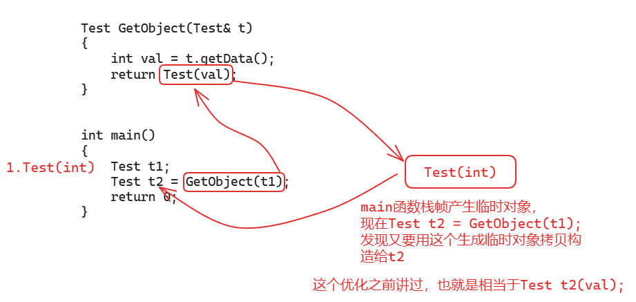
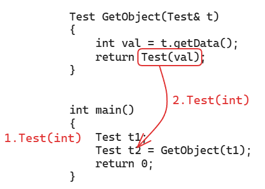
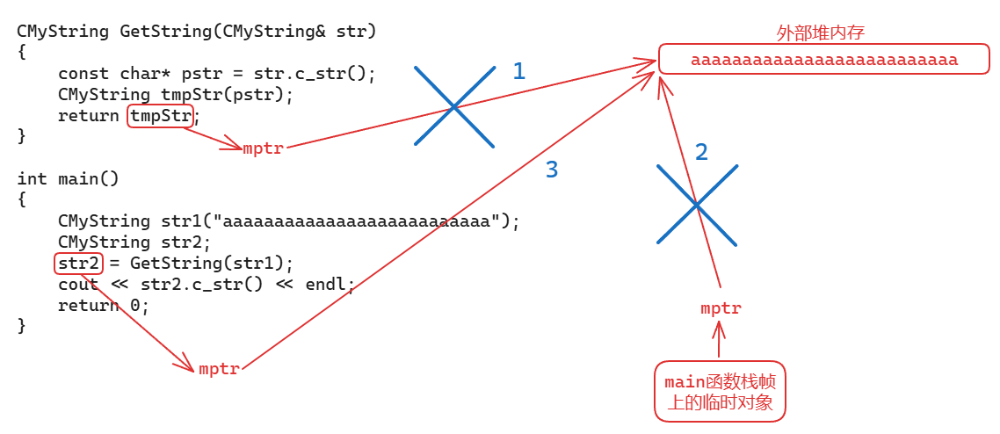

# 对象被优化以后才是高效的C++编程

[TOC]

* * *

## 一、对象会调用哪些方法、对象优化的三个原则

**代码示例1：**

**有一个`Test`类：**

```C++
class Test
{

public:
	Test(int a = 10) :ma(a) {cout << "Test(int)" << endl; }
	~Test() { cout << "~Test()" << endl; }
	Test(const Test& t) :ma(t.ma) { cout << "Test(const Test&)" << endl; }
	Test& operator=(const Test& t)
	{     
		cout << "operator=" << endl;
		ma = t.ma;
		return *this;
	}
private:
	int ma;
};
```


```C++
Test t1;
Test t2(t1);
Test t3 = t1;	// 定义的时候，这也是拷贝构造，不要被迷惑

// 运行结果：
Test(int)
Test(const Test&)
Test(const Test&)
~Test()
~Test()
~Test()
```

```C++   
// 显式生成临时对象，生存周期：所在的语句
// 语句结束，临时对象会析构
Test t4 = Test(20);
cout << "-----------------------" << endl;
// 运行结果：
Test(int)
-----------------------
~Test()
```


这里的运行结果很奇怪，很多人可能认为`Test t4=Test(20);`是临时对象先构造，然后拿临时对象拷贝构造`t4`，然后语句结束，临时对象析构，那为什么这里析构是在横线之后？？

这就是因为 **c++编译器对于对象的构造的优化** ：用临时对象生成新对象的时候，临时对象就不产生了，相当于直接构造新对象

也就是`Test t4 = Test(20);`等价于`Test t4(20);`，所以此时对象的析构析构是在对象生命周期结束时（main函数结束处）

**再来看一些语句：**

```C++
t4 = t2; // 这调用的是t4.operator=(t2)赋值函数，因为t4原本已存在
```

```C++
t4 = Test(30);
/*
Test(30)显式生成临时对象
t4原本已存在，所以不是构造，这个临时对象肯定要构造生成的 
临时对象生成后，给t4赋值，t4.operator=(const Test &t)
出语句后，临时对象析构 
*/
t4 = (Test)30; 
/*
这里是把30强转成Test类型 
把其他类型转成类类型的时候，编译器就看这个类类型有没有合适的构造函数
现在把int转成Test，就看这个类类型有没有带int类型参数的构造函数 int->Test(int)
有的话，就可以显式生成临时对象Test(30)赋值给t4，出语句后，临时对象析构 
*/

// 隐式生成临时对象Test(30)，效果同上，这仨都是一样的效果
t4 = 30; // int->Test(int)   
```

```C++
Test* p = &Test(40);
/*
生成一个临时对象，出语句后，临时对象析构了 
此时p指向的是一个已经析构的临时对象，p相当于野指针了，这是不行的
而且，这段代码也会报错：“&"要求左值
*/
const Test& ref = Test(50);
/*
生成一个临时对象，但是此时是常量左值引用
那么此时 出语句后，临时对象不析构了，因为引用相当于是别名，这块内存起了个名字
所以，引用变量引用临时对象是安全的，临时对象的生命周期就变成引用变量的生命周期了
现在，引用变量是这个函数的局部变量，main函数结束，这个临时对象才析构
*/
```


* * *

**代码示例2：**

```C++
class Test
{
            
public:
	// 这里有默认值，Test() Test(10) Test(10, 10)这三种都行
	Test(int a = 5, int b = 5)
		:ma(a), mb(b)
	{    
		cout << "Test(int, int)" << endl;
	}
	~Test() {
             cout << "~Test()" << endl; }
	Test(const Test& src)
		:ma(src.ma), mb(src.mb)
	{  
		cout << "Test(const Test&)" << endl;
	}
	void operator=(const Test& src)
	{  
		ma = src.ma;
		mb = src.mb;
		cout << "operator=" << endl;
	}
private:
	int ma;
	int mb;
};

Test t1(10, 10);						// 1.Test(int, int)
int main()
{
            
	Test t2(20, 20);					// 3.Test(int, int)
	Test t3 = t2;						// 4.Test(const Test&)

	// 优化了，相当于：static Test t4(30, 30);一次函数的调用。啊，没有生成这个临时对象 ，
	static Test t4 = Test(30, 30);		// 5.Test(int, int)

	// 显式生成临时对象
	t2 = Test(40, 40);					// 6.Test(int, int)  operator=  ~Test()

	// 显式生成临时对象
	// (20, 50)逗号表达式，值是50 逗号表达式最终的结果就是它最后一个表达式n的这个结果
	// 也即(Test)50，去找Test(int)一个参数的构造
//怎么把整型强转成test类类型呢？编辑就会看有没有带整型参数的构造函数。有的话就会给它在这里边显示生成一个临时对象。
	t2 = (Test)(20, 50);				// 7.Test(int, int)  operator=  ~Test()

	// 隐式生成临时对象
	// 去找Test(int)一个参数的构造
	t2 = 60;							// 8.Test(int, int)  operator=  ~Test()

	// new出来的要delete才析构
	Test* p1 = new Test(70, 70);		// 9.Test(int, int)
	Test* p2 = new Test[2];				// 10.Test(int, int) Test(int, int)
	Test* p3 = &Test(80, 80);			// 11.Test(int, int)  ~Test()，报错，别这样用
	const Test& p4 = Test(90, 90);		// 12.Test(int, int)

	delete p1;							// 13.~Test()
	delete[]p2;							// 14.~Test()  ~Test()
}
Test t5(100, 100);						// 2.Test(int, int)
```


* * *

**代码示例3：**

```C++
class Test
{          
public:
	Test(int data = 10) :ma(data) {cout << "Test(int)" << endl; }
	~Test() {  cout << "~Test()" << endl; }
	Test(const Test& t) :ma(t.ma) {cout << "Test(const Test&)" << endl; }
	void operator=(const Test& t)
	{  
		cout << "operator=" << endl;
		ma = t.ma;
	}
	int getData()const { return ma; }
private:
	int ma;
};
//不能返回局部的或者临时对象的指针或引用
Test GetObject(Test t)
{       
	int val = t.getData();
	Test tmp(val);
	return tmp;
}
//由于这是一个函数局部的变量或者对象，这个函数运行完这个对象就没了，这个内存随着整个函数的占被回收，这个变量或者对象它的内存也就没了，所以你不能够返回局部的或者临时的地址或者引用。static Test tmp(val);static修饰可以返回，在数据段
int main()
{       
	Test t1;
	Test t2;
	t2 = GetObject(t1);
	return 0;
}
```


理论运行结果：
```C++
Test(int)			// 1
Test(int)			// 2
Test(const Test&)	// 3
Test(int)			// 4
Test(const Test&)	// 5
~Test()				// 6
~Test()				// 7
operator=			// 8
~Test()				// 9
~Test()				// 10
~Test()				// 11
//第三个很多同学就一下子就跳到我们这个函数里边到tmp了。实参到形参。实参到形参。函数调用实参到形参。啊，==函数调用这个实参。传递给这个形参啊==，是初始化。还是负值呢？==是初始化还是赋值呢==？当然是==初始化==。以前大家可能对于初始化跟赋值可能不加以区分，因为对于我们编辑内置类型来说，初始化跟赋值确实没什么区别啊在。指令上都是一模一样，实参到形参  拷贝构造 在汇编指令上都是一模一样，但是对我们对象不行，所以对象初始化那是调用构造函数的。呃，==所谓赋值==，那是==两个对象都已经存在==了，是在==调用左边儿对象的赋值运算符，重载函数==的。啊，所以它是不一样的
    
//，这是两个不同函数战争上的变量对象。它是不能够直接进行赋值的，对吧啊？这是个不同的范围嘛，

不同的函数。你要对第二进行赋值，你这个函数必须得先执行完，把你返回去拿出来，但是很明显tmp能拿出来吗？==当get object函数完成以后，调用完成以后，这个dmp也没了==。因为它是属于我们这个函数的局部的一个对象嘛，对吧？所以呢，==为了把这个返回值带出来啊，返回值带出来tmp本身是出不来的啊，它出不了这个大括号儿==。所以呢，
    在return tmp这里边，==首先呢，要在我们main函数战帧上。唉，main函数战争上。构造一个。临时对象啊，构造一个临时对象==，目的就是==把tmp这个对象呢带出来==，所以呢？这里边第五个就是调用用啊。拷贝构造函数。由tmp拷贝构造，内函数战争上的一个临时对象。啊，
那这个函数现在的任务呢？就是返回任务就完了啊，这个tmp的职能带出去了，这个对象能带出去了。
```


**来分析一下：**

  1. `t1`构造：`Test(int)`
  2. `t2`构造：`Test(int)`
  3. 实参`t1`拷贝构造到形参`t`：`Test(const Test&)`
  4. 用`val`构造一个临时的`Test`对象`tmp`：`Test(int)`
  5. `tmp`被拷贝构造到返回值（`main`函数栈帧上临时的匿名对象）：`Test(const Test&)`
  6. `tmp`被析构：`~Test()`
  7. 形参`t`被析构：`~Test()`
  8. 返回值（`main`函数栈帧上临时的匿名对象）赋值给`t2`：`operator=`
  9. 返回值（`main`函数栈帧上临时的匿名对象）出了语句`t2 = GetObject(t1);`就被析构了：`~Test()`
  10. `t2`析构：`~Test()`
  11. `t1`析构：`~Test()`

可以看到，这么一段小代码，背后调用了11个函数

但是，我使用的编译器是VS2022，会有 **返回值优化（RVO）或命名返回值优化（NRVO）** ，把上面分析步骤中的5和6进行了优化，因此实际执行结果如下：
```C++
Test(int)			// 1
Test(int)			// 2
Test(const Test&)	// 3
Test(int)			// 4
~Test()				// 7
operator=			// 8
~Test()				// 9
~Test()				// 10
~Test()				// 11
```


我们分析的时候，还是不要考虑这些编译器的优化，按上面那11步进行分析即可

* * *

**总结三条对象优化的规则**

主要针对上面的 **代码示例3** ，总结了三条对象优化的规则

1\. 函数参数传递过程中，对象 **优先按引用传递** ，这样可以省去一个形参`t`的拷贝构造调用，形参没有构建新的对象，出作用域也不用析构了， **优化了3、7**

```C++
Test GetObject(Test& t) {  ... }
```


运行结果：
```C++
Test(int)			// 1
Test(int)			// 2
Test(int)			// 4
Test(const Test&)	// 5
~Test()				// 6
operator=			// 8
~Test()				// 9
~Test()				// 10
~Test()				// 11
```

2\. 函数返回对象的时候，应该 **优先返回一个临时对象** ，而不要返回一个定义过的对象， **优化了5、6**

```C++
Test GetObject(Test& t)
{      
	int val = t.getData();
	// 直接返回临时对象
	return Test(val);
}
//前面儿已经学过了，用临时对象拷贝构造一个新对象的时候呢，我们C++编译器都会去做一个优化。那就是说呢，临时对象就不产生了，而用产生临时对象的方式直接构造我的新对象t就可以了。
//所以在这里边儿不可能说是先构造临时对象。然后再用临时对象拷贝构造一个同类型的test新对象，那么此时这个临时对象就被优化掉了==。没问题吧，所以呢，这个临时对象是不产生的，而这第三个这个构造是直接构造谁就行了是直接构造我们内函数战争上的临时对象就可以了。==
```


运行结果：
```C++
Test(int)			// 1
Test(int)			// 2
Test(int)			// 4
operator=			// 8
~Test()				// 9
~Test()				// 10
~Test()				// 11
```


实际上，VS2022编译器的RVO/NRVO已经把这步给优化了，但由于其他编译器不一定有优化，我们还是要写成返回一个临时对象

3\. 接收返回值是对象的函数调用的时候， **优先按初始化的方式接收** ，不要按赋值的方式接收， **优化了4、8、9**

```C++
int main()
{      
	Test t1;
	Test t2 = GetObject(t1);
	return 0;
}
```


运行结果：
```C++
Test(int)			// 1
Test(int)			// 2
~Test()				// 10
~Test()				// 11
```

这个看起来优化的很厉害，来分析一下：

 
所以，经过一系列优化，现在连这个`main`函数栈帧的临时对象都不产生了，而是直接构造`t2`



**至此，从最先开始的11个函数调用优化成了4个函数调用，所以我们还是要牢记这三个原则！！！ 
（优先引用传递、优先返回临时对象、优先初始化方式接受）**

## 二、用CMyString类来看对象的优化

### CMyString代码的问题

代码示例：
```C++
class CMyString
{          
public:
	CMyString(const char* str = nullptr)
	{    
		cout << "CMyString(const char*)" << endl;
		if (str != nullptr)
		{    
			mptr = new char[strlen(str) + 1];
			strcpy(mptr, str);
		}
		else
		{
			mptr = new char[1];
			*mptr = '\0';
		}
	}
	~CMyString()
	{ 
		cout << "~CMyString()" << endl;
		delete[] mptr;
		mptr = nullptr;
	}
	// 带左值引用参数的拷贝构造
	CMyString(const CMyString& str)
	{    
		cout << "CMyString(const CMyString&)" << endl;
		mptr = new char[strlen(str.mptr) + 1];
		strcpy(mptr, str.mptr);
	}
	// 带左值引用参数的赋值重载函数
	CMyString& operator=(const CMyString& str)
	{    
		cout << "operator=(const CMyString&)" << endl;
		if (this == &str)
			return *this;
		delete[] mptr;
		mptr = new char[strlen(str.mptr) + 1];
		strcpy(mptr, str.mptr);
		return *this;
	}
	const char* c_str() const { return mptr; }
private:
	char* mptr;
};
CMyString GetString(CMyString& str)
{        
	const char* pstr = str.c_str();
	CMyString tmpStr(pstr);
	return tmpStr;
}
int main()
{         
	CMyString str1("aaaaaaaaaaaaaaaaaaaaaaaaaa");
	CMyString str2;
	str2 = GetString(str1);
	cout << str2.c_str() << endl;
	return 0;
}
```


理论运行结果（没有编译器的优化）：
```C++
CMyString(const char*)			// 1
CMyString(const char*)			// 2
CMyString(const char*)			// 3
CMyString(const CMyString&)		// 4
~CMyString()					// 5
operator=(const CMyString&)		// 6
~CMyString()					// 7
aaaaaaaaaaaaaaaaaaaaaaaaaa		// 8
~CMyString()					// 9
~CMyString()					// 10
```


> VS2022的运行结果是没有4、5两个步骤的，这是编译器的返回值优化，之后所说的运行结果也都是不考虑编译器的优化，直接分析最初的样子

**分析：**

  1. `str1`构造：`CMyString(const char*)`
  2. `str2`构造：`CMyString(const char*)`
  3. `CMyString tmpStr(pstr);`构造：`CMyString(const char*)`
  4. `return tmpStr;`，`tmpStr`内部有一个`mptr`指针指向外部堆内存，这里通过拷贝构造函数（内部有`new`操作）把堆内存上的内容复制一份给一个新的字符串对象（`main`函数栈帧上的临时对象）：`CMyString(const CMyString&)`
  5. `tmpStr`析构：`~CMyString()`
  6. `main`函数栈帧上的临时对象给`str2`赋值，又会开辟新空间、数据拷贝、释放旧空间：`operator=(const CMyString&);`
  7. `main`函数栈帧上的临时对象析构：`~CMyString()`
  8. 输出`str2`内部`mptr`指针指向的内容：`aaaaaaaaaaaaaaaaaaaaaaaaaa`
  9. `str1`析构：`~CMyString()`
  10. `str2`析构：`~CMyString()`

这里最大的问题就是 **4、5、6、7** 四个步骤，产生了大量堆内存的复制移动，最重要的是`tmpStr`指向的那块堆内存刚复制给别人，自己就释放了，那你自己不要了就早说，直接给别人就行了，还让别人白白复制一份，损人不利己；其次，`main`函数栈帧上的临时对象也是一样，赋值给了`str2`之后释放了自己指向的堆内存，浪费资源效率低

在本例中，最高效的做法，也就是直接把`tmpStr`内部`mptr`指针指向的堆内存转让给`str2`内部的`mptr`指针

所以，我们期待 **拷贝构造 / 赋值运算** 内部发生的事情是：
```C++
mptr = str.mptr;	// 转让自己指向的堆内存
str.mptr = nullptr;	// 把自己指向置空，一会儿析构不要误把原来的指向清除
```


也就是说，要把即将不需要的资源转让给别人，而不是让别人复制完了自己再释放

* * *

### 添加带右值引用参数的拷贝构造和赋值函数解决上述问题

之前讲过[右值引用]，再复习一下

**左值** ：有内存、有名字

**右值** ：没内存、没名字（临时量）  

**右值引用用来绑定右值、左值引用用来绑定左值！！！**

```C++
int a = 10;
int& b = a;		// 左值a：有内存、有名字	用左值引用
int&& c = a;	// 错误：无法将左值a绑定到右值引用上
int& c = 20;	// 不能用左值引用绑定一个右值20
//20没有内存，在寄存器当中，20也没有名字
/*底层：
int tmp = 20;
const int& c = tmp; 通过这个c不可以改临时量的值
*/
const int& c = 20;	// 正确：可以用常引用来引用右值

/*底层：
int tmp = 20;
int&& d = tmp; 通过这个d是可以改临时量的值
通过查看反汇编，也可以看到这俩操作的汇编代码是一模一样的
区别是是否可以改变临时量的值
*/
int&& d = 20;	// 正确：可以把一个右值绑定到一个右值引用上
```

**一个右值引用变量，本身是一个左值！！!**

```C++
int&& f = d;	// 错误：d虽然是右值引用变量，但本身是一个左值，有内存有名字
int& f = d;		// 正确
```


C++11之后，把常量数字、临时量都当做右值处理，要用 **右值引用或者常引用** 来引用
```C++
CMyString& e = CMyString("aaa");		// 错误
CMyString&& e = CMyString("aaa");		// 正确
const CMyString& e = CMyString("aaa");	// 正确
```


复习完了右值引用，再来看怎么结果刚才`CMyString`的问题

增加带右值引用的 **拷贝构造 / 赋值运算** ：
```C++
// 带左值引用参数的拷贝构造
CMyString(const CMyString& str) { ... }

// 带右值引用参数的拷贝构造
CMyString(CMyString&& str)	// str引用的就是一个临时对象
{     
	cout << "CMyString(CMyString&&)" << endl;
	mptr = str.mptr;
	str.mptr = nullptr;
}

// 带左值引用参数的赋值重载函数
CMyString& operator=(const CMyString& str) {  ... }

// 带右值引用参数的赋值重载函数
CMyString& operator=(CMyString&& str)	// str引用的就是一个临时对象
{      
	cout << "operator=(CMyString&&)" << endl;
	if (this == &str)
		return *this;

	delete[] mptr;

	mptr = str.mptr;
	str.mptr = nullptr;
	return *this;
}
```


运行结果：
```C++
CMyString(const char*)
CMyString(const char*)
CMyString(const char*)
CMyString(CMyString&&)
~CMyString()
operator=(CMyString&&)
~CMyString()
aaaaaaaaaaaaaaaaaaaaaaaaaa
~CMyString()
~CMyString()
```


这时候，就没有外部堆内存的来回复制释放了，这回是同一块内存的转让了，效率很不错



* * *

### CMyString的加法运算符重载


```C++
class CMyString
{         
public:
	...
private:
	char* mptr;
	friend CMyString operator+(const CMyString& lhs, const CMyString& rhs);
	friend ostream& operator<<(ostream& out, const CMyString& str);
};

CMyString operator+(const CMyString& lhs, const CMyString& rhs)
{
//开辟一块足够大小的空间，能容纳呢这两个字符串。           
	char* ptmp = new char[strlen(lhs.mptr) + strlen(rhs.mptr) + 1];
	strcpy(ptmp, lhs.mptr);
	strcat(ptmp, rhs.mptr);
	return CMyString(ptmp);
}

ostream& operator<<(ostream& out, const CMyString& str)
{
            
	out << str.mptr;
	return out;
}
```

 

```C++
int main()
{           
	CMyString str1 = "hello ";
	CMyString str2 = "world";

	cout << "--------------------" << endl;
	CMyString str3 = str1 + str2;
	cout << "--------------------" << endl;

	cout << str3 << endl;

	return 0;
}
```

运行结果：
```C++
CMyString(const char*)
CMyString(const char*)
--------------------
CMyString(const char*)
--------------------
hello world
~CMyString()
~CMyString()
~CMyString()
```


正常运行，那么这段代码有什么问题呢？

`operator+`里的`new`没有对应的`delete`，每做一次字符串的加法都会导致内存泄露，改正一下：

```C++
CMyString operator+(const CMyString& lhs, const CMyString& rhs)
{
            
	char* ptmp = new char[strlen(lhs.mptr) + strlen(rhs.mptr) + 1];
	strcpy(ptmp, lhs.mptr);
	strcat(ptmp, rhs.mptr);
	CMyString tmpStr(ptmp);
	delete[] ptmp;
	return tmpStr;
}
```


可以效率还是不高，`new`出来一块内存，`CMyString tmpStr(ptmp);`的时候又开辟了一块内存，效率低下，再改一下：
```C++
CMyString operator+(const CMyString& lhs, const CMyString& rhs)
{
            
	CMyString tmpStr;
	tmpStr.mptr = new char[strlen(lhs.mptr) + strlen(rhs.mptr) + 1];
	strcpy(tmpStr.mptr, lhs.mptr);
	strcat(tmpStr.mptr, rhs.mptr);
	return tmpStr;	// 直接拷贝构造给外部的str3
}
```


再来运行一下：
```C++
CMyString(const char*)
CMyString(const char*)
--------------------
CMyString(const char*)		// 1
CMyString(CMyString&&)		// 2
~CMyString()				// 3
--------------------
hello world
~CMyString()
~CMyString()
~CMyString()
```


**分析分割线里的内容：**

  1. 构造`tmpStr`
  2. `tmpStr`用右值引用的方式拷贝构造给了外部的`str3`，转让了自己指向的堆内存
  3. 析构`tmpStr`

现在`operator+`效率就比较高了，也没有内存泄露

* * *

### CMyString在vector上的应用


```C++
CMyString str1 = "aaa";

vector<CMyString> vec;
vec.reserve(10);	// 预留空间，防止一开始的扩容（涉及重新构造对象）

cout << "--------------------" << endl;
vec.push_back(str1);
vec.push_back(CMyString("bbb"));
cout << "--------------------" << endl;
```


运行结果：
```C++
CMyString(const char*)
--------------------
CMyString(const CMyString&)	// 1
CMyString(const char*)		// 2
CMyString(CMyString&&)		// 3
~CMyString()				// 4
--------------------
~CMyString()
~CMyString()
~CMyString()
```

**分析分割线里的内容：**

  1. `str1`在`vec`容器里的拷贝构造（调用左值引用参数的）
  2. 临时对象`CMyString("bbb")`的构造
  3. 临时对象`CMyString("bbb")`在`vec`容器里的拷贝构造（调用右值引用参数的）
  4. 临时对象`CMyString("bbb")`的析构

* * *

### move移动语义和forward类型完美转发

  * `move`：移动语义，将一个 **左值变为右值**
  * `forward`：用于实现 **完美转发** 。完美转发允许函数模板将参数转发给另一个函数时，保持参数的原始类型（左值或右值）不变

那么上面`vector`中的`push_back`怎么做的呢？来看一下

之前写的[`vector`【C++模板编程—学习C++类库的编程基础】，拿过来用用
```C++
template<typename T>
class Allocator
{        
public:
	...
	void construct(T* p, const T& val) // 接收左值
	{     
		new (p) T(val);
	}
	void construct(T* p, T&& val) // 接收右值
	{      
		// val本身是个左值，需要用move
		new (p) T(std::move(val));
	}
	...
};

template<typename T, typename Alloc = Allocator<T>>
class vector
{        
public:
	...
	void push_back(const T& val)	// 接收左值
	{    
		if (full())
			expend();
_allocator.construct(_last, val);
		++_last;
	}
	void push_back(T&& val)	// 接收右值。注意，一个右值引用变量本身是一个左值
	{    
		if (full())
			expend();

		// val本身是个左值，需要用move
		_allocator.construct(_last, std::move(val));
		++_last;
	}
	...
};
```


现在实现的效果就和库里的`vector`一样了，`vec.push_back(CMyString("bbb"));`会调用接收右值参数的`push_back`

但是现在的问题是实现的太复杂了，我们用模板来简化一下：
```C++
template<typename Ty>	 // 函数模板的类型推演 + 引用折叠
void push_back(Ty&& val)
{
            
	if (full())
		expend();

	_allocator.construct(_last, std::forward<Ty>(val));
	++_last;
}
```


这里`Ty&& val`可以巧妙的接收左值引用和右值引用，这叫做 **引用折叠**

  * 如果接收的是左值引用参数，本例即`CMyString&`，那么加上自身的`&&`，现在就变成了`CMyString&&&`，引用折叠，这最终等价于`CMyString&`，这就可以用来接收左值。也就是`左 + 右 = 左`
  * 如果接收的是右值引用参数，本例即`CMyString&&`，那么加上自身的`&&`，现在就变成了`CMyString&&&&`，引用折叠，这最终等价于`CMyString&&`，这就可以用来接收右值。也就是`右 + 右 = 右`

空间配置器里的`construct`也改一下：
```C++
template<typename Ty>
void construct(T* p, Ty&& val)
{
            
	new (p) T(std::forward<Ty>(val));
}
```


此时的运行结果：
```C++
CMyString(const char*)
--------------------
CMyString(const CMyString&)
CMyString(const char*)
CMyString(CMyString&&)
~CMyString()
--------------------
~CMyString()
~CMyString()
~CMyString()
```


可以看到和之前一样，很完美

* * *

### vector容器使用对象过程中的优化


```C++
class CMyString {  ... };

vector<CMyString> GetVector()
{     
	CMyString str1 = "aaa", str2 = "bbb", str3 = "ccc";
	cout << "------------------------" << endl;
	
	vector<CMyString> vec;
	vec.reserve(10);

	vec.push_back(std::move(str1));
	vec.push_back(std::move(str2));
	vec.push_back(std::move(str3));
	
	return vec; // 匹配的是容器的右值引用参数的拷贝构造
}
int main()
{
            
	vector<CMyString> vec;

	vec = GetVector();	// 匹配的是容器的右值引用参数的赋值函数

	return 0;
}
```


运行结果：
```C++
CMyString(const char*)
CMyString(const char*)
CMyString(const char*)
------------------------
CMyString(CMyString&&)
CMyString(CMyString&&)
CMyString(CMyString&&)
~CMyString()
~CMyString()
~CMyString()
~CMyString()
~CMyString()
~CMyString()
```
