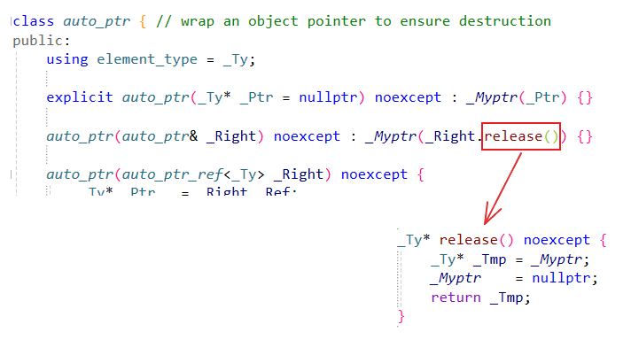
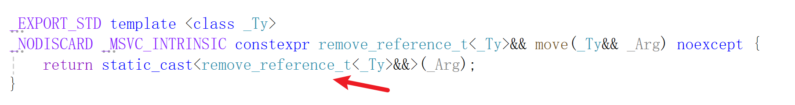
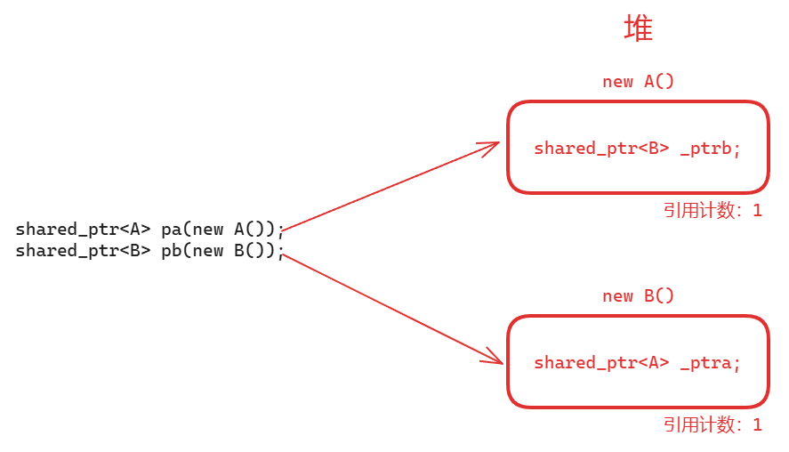
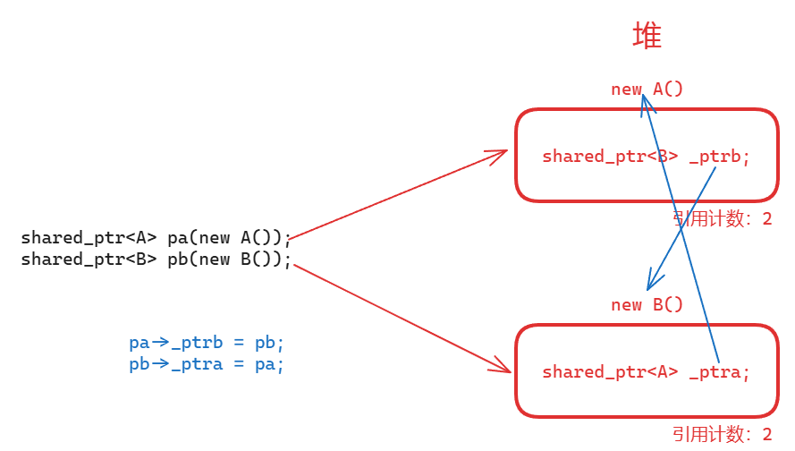
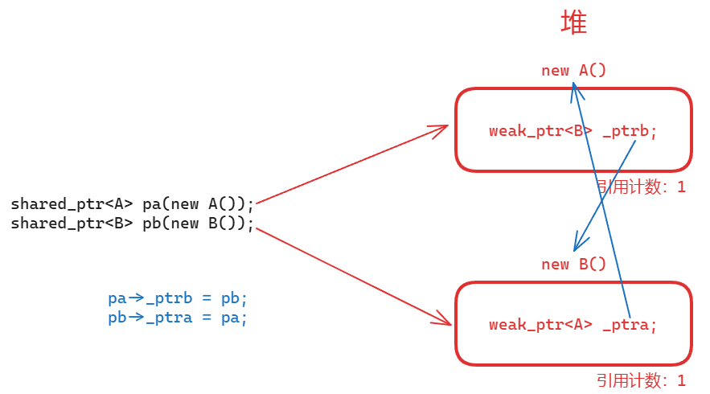
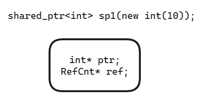
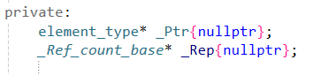
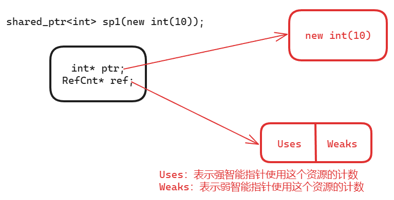
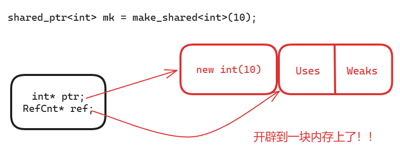

# 体验一下智能指针的强大

[TOC]

* * *

## 一、智能指针基础知识

**裸指针的缺陷：**

  1. 忘记`delete`释放资源，导致资源泄露
  2. 在`delete`之前程序就正常退出（比如满足`if`中的`return`）或者异常退出，还没来得及`delete`，导致资源泄露
  3. 同一资源释放多次，导致释放野指针，程序崩溃

这时，就需要智能指针了。智能指针的智能二字，主要体现在用户可以不必关注资源的释放，因为智能指针会帮你完全管理资源的释放，它会保证无论程序逻辑怎么跑，正常执行或者产生异常， **资源在到期的情况下（函数作用域或程序结束），一定会进行释放**

**我们来自己实现一个简单的智能指针**

```C++
template<typename T>
class CSmartPtr
{
            
public:
	CSmartPtr(T* ptr = nullptr) : mptr(ptr) { }
	~CSmartPtr() { delete mptr; }
private:
	T* mptr;
};

int main()
{
            
	CSmartPtr<int> ptr(new int());
	/*其它的代码...*/

	/*
	由于ptr是栈上的智能指针对象，不管是函数正常执行完，
	还是运行过程中出现异常，栈上的对象都会自动调用析构函数，
	在析构函数中进行了delete操作，保证释放资源
	*/

	return 0;
}
```


  1. 智能指针体现在把裸指针进行了一次面向对象的封装，在构造函数中初始化资源地址，在析构函数中负责释放资源
  2. 利用栈上的对象出作用域自动析构这个特点，在智能指针的析构函数中保证释放资源

所以，由于以上的特点，智能指针一般都是定义在栈上的。同时， **智能指针是一个类对象** ，这个类的构造函数中传入了一个指针，析构函数中释放传入的指针。由于该类对象是在栈上开辟和释放的，所以，当我们的函数（或程序）结束时就会被自动释放

那么，能不能在堆上定义智能指针呢？比如`CSmartPtr* p = new CSmartPtr(new int);`，编译是可以通过的，但是这里定义的`p`虽然是智能指针类型，但它实质上还是一个裸指针，因此`p`还是需要进行手动`delete`，又回到了最开始裸指针我们面临的问题，所以不要这样用

当然，智能指针要做到和裸指针相似，还要提供裸指针常见的`*`和`->`两种运算符的重载函数，使用起来才真正的和裸指针一样，代码如下：
```C++
template<typename T>
class CSmartPtr
{
            
public:
	CSmartPtr(T* ptr = nullptr) : mptr(ptr) {}
	~CSmartPtr() {  delete mptr; }

	T& operator*() { return *mptr; }
	T* operator->() { return mptr; }

private:
	T* mptr;
};
int main()
{       
	CSmartPtr<int> ptr(new int());
	*ptr = 20;	// operator*()一定要返回引用，这样才可以赋值
	cout << *ptr << endl;	// 20

	class Test
	{     
	public:
		void test() {
             cout << "call Test::test()" << endl; }
	};

	CSmartPtr<Test> ptr2 = new Test();

	(*ptr2).test();	// (*ptr2)取出Test对象，用对象调用方法

	// operator->()返回的是一个指针，实现了用指针调用函数
	// 即(ptr2.operator->()) -> test()
	ptr2->test();

	return 0;
}
```


## 二、不带引用计数的智能指针

上一节实现的智能指针，使用起来和普通的裸指针非常相似，但是它还存在很大的问题，看下面的代码：
```C++
CSmartPtr<int> p1(new int());
CSmartPtr<int> p2(p1);	// 拷贝构造
```


运行代码直接崩溃，因为默认的拷贝构造函数做的是浅拷贝，`p1`和`p2`持有的是同一个`new int`资源，`p2`先析构释放了资源，到`p1`析构的时候，就成了`delete`悬挂指针了，程序崩溃

那么，怎么解决浅拷贝带来的问题呢？重写一下`CSmartPtr`的拷贝构造看看
```C++
CSmartPtr(const CSmartPtr<T>& src) { mptr = new T(*src.mptr); }
```


现在代码正常运行，但是，此时`p1`和`p2`管理的是2个不同的资源，用户如果不了解，会误以为`p1`和`p2`管理的是同一块资源

所以，我们这样写拷贝构造是不对的

那么，怎么解决智能指针的浅拷贝问题？两种方法： **不带引用计数的智能指针、带引用计数的智能指针**

这一节我们先来看 **不带引用计数的智能指针**

  1. `auto_ptr`（C++98，现已废弃）
  2. `scoped_ptr`（Boost库）
  3. `unique_ptr`（C++11，推荐使用）

使用的时候包含头文件：`#include <memory>`

### auto_ptr

先来考虑这段代码
```C++
auto_ptr<int> ptr1(new int());
auto_ptr<int> ptr2(ptr1);

*ptr2 = 20;
cout << *ptr1 << endl;
```


运行崩溃，为什么呢，来看一下`auto_ptr`的源码



可以看到拷贝构造会调用传入对象的`release`方法，这个方法也就是把`_Right`指向的资源返回给新`auto_ptr`对象，同时把`_Right`（旧`auto_ptr`）的`_Myptr`置为`nullptr`

简而言之，就是把旧`auto_ptr`指向的资源给新`auto_ptr`持有，旧的置为`nullptr`。因此，上面那段代码使用`*ptr1`就是错误的。 **（`auto_ptr`永远让最后一个智能指针管理资源）**

那么，`auto_ptr`能不能使用在容器当中，看下面这段代码
```C++
int main()
{     
	vector<auto_ptr<int>> vec;
	vec.push_back(auto_ptr<int>(new int(10)));
	vec.push_back(auto_ptr<int>(new int(20)));
	vec.push_back(auto_ptr<int>(new int(30)));
	
	cout << *vec[0] << endl;	// 10
	
	vector<auto_ptr<int>> vec2 = vec;
	/* 这里由于上面做了vector容器的拷贝，
	相当于容器中的每一个元素都进行了拷贝构造，
	原来vec中的智能指针全部为nullptr了，
	再次访问就成访问空指针了，程序崩溃
	*/
	
	cout << *vec[0] << endl;	// 程序崩溃
	
	return 0;
}
```

因此，在C++中不推荐使用`auto_ptr`，除非应用场景非常简单。且`auto_ptr`在C++11中被废弃，并在C++17中被完全移除

**总结：`auto_ptr`智能指针不带引用计数，那么它处理浅拷贝的问题，是直接把前面的`auto_ptr`都置为`nullptr`，只让最后一个`auto_ptr`持有资源**

### scoped_ptr

需要安装Boost库，安装好了包含头文件`#include <boost/scoped_ptr.hpp>`即可使用

看一下`scoped_ptr`的源码：
```C++
template<class T> class scoped_ptr
{         
private:
	scoped_ptr(scoped_ptr const&);
	scoped_ptr& operator=(scoped_ptr const&);
...
};
```


可以看到`scoped_ptr`的拷贝构造和赋值函数都私有化了，这样对象就不支持这两种操作，无法调用，从根本上杜绝了浅拷贝的发生

所以`scoped_ptr`也是不能用在容器当中的，如果容器互相进行拷贝或者赋值，就会引起`scoped_ptr`对象的拷贝构造和赋值函数，编译错误

**`scoped_ptr`和`auto_ptr`的区别**：可以用所有权来解释，`auto_ptr`可以任意转移资源的所有权，而`scoped_ptr`不会转移所有权（因为拷贝构造和赋值函数被禁止了）

> `scoped_ptr`一般也不使用

### unique_ptr

先看看`unique_ptr`的部分源码：

std::move当前这个变量的右值类型。 move的源码也可以看到，它其实就是对变量进行了一个右值引用的一个类型强转。



```C++
template<class _Ty, class _Dx>
class unique_ptr
{
            
public:
	/*提供了右值引用的拷贝构造函数*/
	unique_ptr(unique_ptr&& _Right) { ... }
	
	/*提供了右值引用的operator=赋值重载函数*/
	unique_ptr& operator=(unique_ptr&& _Right) { ... }
	/*
	删除了unique_ptr的拷贝构造和赋值函数，
	因此不能做unique_ptr智能指针对象的拷贝构造和赋值，
	防止浅拷贝的发生
	*/
	unique_ptr(const unique_ptr&) = delete;
	unique_ptr& operator=(const unique_ptr&) = delete;
};
```


从上面看到，`unique_ptr`有一点和`scoped_ptr`做的一样，就是禁用了拷贝构造和赋值重载函数，禁止用户对`unique_ptr`进行显式的拷贝构造和赋值，防止智能指针浅拷贝问题的发生。

由于没有拷贝构造函数了，`unique_ptr<int> p1(new int()); unique_ptr<int> p2(p1);`自然就是错误的

但是`unique_ptr`提供了带右值引用参数的拷贝构造和赋值函数，也就是说，`unique_ptr`智能指针可以通过右值引用进行拷贝构造和赋值操作，或者在产生`unique_ptr`临时对象的地方，例如把`unique_ptr`作为函数的返回值，示例代码如下：
```C++
// 示例1
unique_ptr<int> p1(new int());
unique_ptr<int> p2(move(p1));	// 使用了右值引用的拷贝构造
p2 = move(p1);	// 使用了右值引用的operator=赋值重载函数
// 示例2
unique_ptr<int> test_uniqueptr()
{         
	unique_ptr<int> ptr(new int());
	return ptr;
}
int main()
{      
	/*
	此处调用test_uniqueptr函数，在return ptr代码处，
	调用右值引用的拷贝构造和赋值函数
	*/
	unique_ptr<int> p = test_uniqueptr();	// 调用带右值引用的拷贝构造函数
	p = test_uniqueptr();	// 调用带右值引用的operator=赋值重载函数
	return 0;
}
```


那么使用`unique_ptr`的好处也就是用户通过类似`unique_ptr<int> p2(move(p1));`的语句，可以明显的看出`p1`把资源转移给了`p2`，`p1`不持有资源了，如果用`auto_ptr`的话不会显式的把`move`写出来，用意不明显，不了解底层的话会用错

同时，从`unique_ptr`的名字就可以看出来，其最终也是只能有一个该智能指针引用资源，因此建议在使用不带引用计数的智能指针时，优先选择`unique_ptr`

## 三、带引用计数的智能指针

带引用计数的智能指针主要包括`shared_ptr`和`weak_ptr`，带引用计数的 **好处** 就是多个智能指针可以管理同一个资源，那么什么是带引用计数的智能指针呢？

**带引用计数** ：给每一个对象的资源，匹配一个引用计数

当允许多个智能指针指向同一个资源的时候，每一个智能指针都会给资源的引用计数加1，当一个智能指针析构时，同样会使资源的引用计数减1，这样最后一个智能指针把资源的引用计数从1减到0时，就说明该资源可以释放了，由最后一个智能指针的析构函数来处理资源的释放问题，这就是引用计数的概念。

  * 当引用计数 **减1不为0** 时，当前智能指针不使用这个资源了，但是还有其他智能指针在使用这个资源，当前智能指针不能析构这个资源，只能直接走
  * 当引用计数 **减1为0** 时，说明当前智能指针是最后一个使用这个资源的智能指针，所以它要负责这个资源的释放

### 模拟实现一个带引用计数的智能指针

拿前面实现的`CSmartPtr`进行修改，直接上代码：
```C++
// 对资源进行引用计数的类
template<typename T>
class RefCnt
{
public:
	RefCnt(T* ptr = nullptr) : mptr(ptr)
	{     
		if (mptr != nullptr)
			mcount = 1;
	}
	void addRef() { mcount++; }	// 增加资源的引用计数
	int delRef() { return --mcount; }

private:
	T* mptr;
	int mcount;//库里是用atomic_int定义的
};

template<typename T>
class CSmartPtr
{
            
public:
	CSmartPtr(T* ptr = nullptr) : mptr(ptr)
	{   
		// 智能指针构造的时候给资源建立引用计数对象
		mpRefCnt = new RefCnt<T>(mptr);
	}
	~CSmartPtr()
	{    
		if (0 == mpRefCnt->delRef())
		{
            
			delete mptr;
			mptr = nullptr;
		}
	}
	// 实现拷贝构造
	CSmartPtr(const CSmartPtr<T>& src)
		:mptr(src.mptr), mpRefCnt(src.mpRefCnt)
	{
            
		if (mptr != nullptr)
			mpRefCnt->addRef();
	}
	CSmartPtr<T>& operator=(const CSmartPtr<T>& src)
	{
            
		// 防止自赋值
		if (this == &src)
			return *this;

		// 本身指向的资源减1
		// 如果减1为0释放资源；如果减1不为0直接走
		if (0 == mpRefCnt->delRef()) {  delete mptr; }

		mptr = src.mptr;
		mpRefCnt = src.mpRefCnt;
		mpRefCnt->addRef();
		return *this;
	}
	T& operator*() { return *mptr; }
	T* operator->() { return mptr; }

private:
	T* mptr;	// 指向资源的指针
	RefCnt<T>* mpRefCnt;	// 指向该资源引用计数对象的指针
};
```

```C++
// 那么现在就不会报错了，不会对同一个资源释放多次
CSmartPtr<int> ptr1(new int());
CSmartPtr<int> ptr2(ptr1);
CSmartPtr<int> ptr3;
ptr3 = ptr2;

*ptr1 = 20;
cout << *ptr2 << " " << *ptr3 << endl;	// 20 20
```


这就实现了多个智能指针管理同一个资源

但是我们现在实现的智能指针不是线程安全的，不能使用在多线程场景下。库里实现的`shared_ptr`和`weak_ptr`是线程安全的！

### shared_ptr交叉引用问题

  * `shared_ptr`： **强** 智能指针（可以改变资源的引用计数）
  * `weak_ptr`： **弱** 智能指针（不会改变资源的引用计数）

我们上一节实现的`CSmartPtr`也是强智能指针（可以改变资源的引用计数）

```C++
weak_ptr => shared_ptr => 资源（内存）
```

**可以这样理解** ：弱智能指针 _观察_ 强智能指针，强智能指针 _观察_ 资源（内存）

那么， **强智能指针的交叉引用（循环引用）问题** 是什么呢？来看一下
```C++
class B; // 前置声明类B
class A
{      
public:
	A() {  cout << "A()" << endl; }
	~A() {  cout << "~A()" << endl; }
	shared_ptr<B> _ptrb;	// 指向B对象的智能指针
};
class B
{          
public:
	B() {  cout << "B()" << endl; }
	~B() { cout << "~B()" << endl; }
	shared_ptr<A> _ptra;	// 指向A对象的智能指针
};

int main()
{ 
	shared_ptr<A> pa(new A());	// pa指向A对象，A的引用计数为1
	shared_ptr<B> pb(new B());	// pb指向B对象，B的引用计数为1
	pa->_ptrb = pb;	// A对象的成员变量_ptrb也指向B对象，B的引用计数为2
	pb->_ptra = pa;	// B对象的成员变量_ptra也指向A对象，A的引用计数为2

	cout << pa.use_count() << endl;
	cout << pb.use_count() << endl;

	return 0;
}
```


运行结果：
```C++
A()
B()
```

可以看到，A和B没有析构，也就是这样交叉引用会造成`new`出来的资源无法释放，导致资源泄露！

**分析：**




出`main`函数作用域，`pa`和`pb`两个局部对象析构，分别给A对象和B对象的引用计数从2减到1，达不到释放A和B的条件（释放的条件是A和B的引用计数减为0），因此造成两个`new`出来的A对象和B对象无法释放，导致内存泄露，这个问题就是 **强智能指针的交叉引用（循环引用)问题**

**解决办法：定义对象的时候用强智能指针，引用对象的时候用弱智能指针**

```C++
class B; // 前置声明类B
class A
{          
public:
	A() { cout << "A()" << endl; }
	~A() {  cout << "~A()" << endl; }
	weak_ptr<B> _ptrb;	// 指向B对象的弱智能指针（引用对象时，用弱智能指针）
};
class B
{        
public:
	B() { cout << "B()" << endl; }
	~B() { cout << "~B()" << endl; }
	weak_ptr<A> _ptra;	// 指向A对象的弱智能指针（引用对象时，用弱智能指针）
};
int main()
{     
	// 定义对象时，用强智能指针
	shared_ptr<A> pa(new A());	// pa指向A对象，A的引用计数为1
	shared_ptr<B> pb(new B());	// pb指向B对象，B的引用计数为1

	// A对象的成员变量_ptrb也指向B对象，B的引用计数为1，因为是弱智能指针，引用计数没有改变
	pa->_ptrb = pb;
	// B对象的成员变量_ptra也指向A对象，A的引用计数为1，因为是弱智能指针，引用计数没有改变
	pb->_ptra = pa;

	cout << pa.use_count() << endl; // 1
	cout << pb.use_count() << endl; // 1

	return 0;
}
```


运行结果：
```C++
A()
B()
~B()
~A()
```


可以看到，出`main`函数作用域，`pa`和`pb`两个局部对象析构，分别给A对象和B对象的引用计数从1减到0，达到释放A和B的条件，因此`new`出来的A对象和B对象被析构掉，解决了 **强智能指针的交叉引用（循环引用）问题**


可以看到，`weak_ptr`弱智能指针不会改变资源的引用计数，也就是说弱智能指针只是观察对象是否活着（引用计数是否为0)，也无法使用资源

那么此时如果在A类中增加`void testA() { cout << "非常好用的方法！！" << endl; }`这样一个方法，在B中增加`void func() { _ptra->testA(); }`这样的方法去调用，可以吗？

  * **不可以** ，因为弱智能指针只是一个观察者，不能去使用资源，也即没有提供`*`和`->`运算符的重载函数，不能使用类似裸指针的功能

解决办法：
```C++
class B; // 前置声明类B
class A
{        
public:
	A() {  cout << "A()" << endl; }
	~A() {  cout << "~A()" << endl; }
	void testA() { cout << "非常好用的方法！！" << endl; }
	weak_ptr<B> _ptrb;	// 指向B对象的弱智能指针（引用对象时，用弱智能指针）
};
class B
{         
public:
	B() {   cout << "B()" << endl; }
	~B() { cout << "~B()" << endl; }
	void func()
	{    
		shared_ptr<A> sp = _ptra.lock(); // 提升方法，出函数作用域就自动析构了
		if (sp != nullptr)
			sp->testA();
	}
	weak_ptr<A> _ptra;	// 指向A对象的弱智能指针（引用对象时，用弱智能指针）
};
int main()
{
            
	shared_ptr<A> pa(new A());
	shared_ptr<B> pb(new B());
	pa->_ptrb = pb;
	pb->_ptra = pa;
	cout << pa.use_count() << endl; // 1
	cout << pb.use_count() << endl; // 1

	pb->func();

	return 0;
}
```


> 虽然 `weak_ptr`不拥有对象，但它可以通过`lock()`方法尝试获取一个指向对象的`shared_ptr`，如果对象仍然存活（即还有其他`shared_ptr`指向它），`lock()`将返回一个指向该对象的`shared_ptr`；否则，将返回一个空的`shared_ptr`

> 使用`lock()`方法的一个典型场景是在需要临时访问`weak_ptr`所指向的对象时，同时又不希望增加该对象的生命周期计数

运行结果：
```C++
A()
B()
非常好用的方法！！
~B()
~A()
```

此时可以看到，正确调用了！

**销毁 `shared_ptr`：**

- 当一个 `shared_ptr`的生命周期结束（比如离开作用域）或被手动重置（`reset()`）时，它所管理的对象的引用计数**减少 1**。
- **关键操作：** 如果在减少之后，引用计数 **`use_count`变为 0**：
  1. 调用对象的**析构函数**销毁对象。
  2. 释放对象所占用的**内存**。
  3. **检查控制块：** 如果此时**弱引用计数 (`weak_count`)** 也为 0（即没有 `weak_ptr`指向这个控制块了），**释放控制块的内存**。如果 `weak_count > 0`，控制块会保留下来，供剩余的 `weak_ptr`查询状态（如 `expired()`）。

## 四、多线程访问共享对象的线程安全问题

我们来看一个 **多线程访问共享对象的线程安全问题** ：线程A和线程B访问一个共享的对象，如果线程A正在析构这个对象的时候，线程B又要调用该共享对象的成员方法，此时可能线程A已经把对象析构完了，线程B再去访问该对象，就会发生不可预期的错误

值传递是安全跨线程通信的最可靠方式。

先看如下代码：
```C++
class A
{    
public:
	A() {  cout << "A()" << endl; }
	~A() { cout << "~A()" << endl; }
	void testA() { cout << "非常好用的方法！！" << endl; }
};

// 子线程
void handler01(A* q)
{   
	// 睡眠两秒，此时main主线程已经把A对象给delete析构掉了
	std::this_thread::sleep_for(std::chrono::seconds(2));
	q->testA();
}
// main线程
int main()
{     
	A* p = new A();
	thread t1(handler01, p);
	delete p;
	//阻塞当前线程，直到调用join()的线程结束
	t1.join();
	return 0;
}
```


在执行`q->testA();`这条语句的时候，访问了`main`线程已经析构的共享对象，这明显是不合理的

如果想通过`q`指针想访问A对象，需要判断A对象是否存活，如果A对象存活，调用`testA`方法没有问题；如果A对象已经析构，调用`testA`有问题！也就是说`q`访问A对象的时候，需要侦测一下A对象是否存活，怎么解决呢，需要用强弱智能指针

来看这段代码：
```C++
// 子线程
void handler01(weak_ptr<A> wp)
{    
	// 睡眠两秒
	std::this_thread::sleep_for(std::chrono::seconds(2));
	shared_ptr<A> sp = wp.lock();
	if (sp != nullptr)
		sp->testA();
	else
		cout << "A对象已经析构，不能再访问！" << endl;
}
// main线程
int main()
{     
	shared_ptr<A> p(new A());
	thread t1(handler01, weak_ptr<A>(p));
    //阻塞等待子线程结束
	t1.join();
	return 0;
}
```


运行结果：
```C++
A()
非常好用的方法！！
~A()
```


可以看到运行了`sp->testA();`，因为`main`线程调用了`t1.join()`方法等待子线程结束，此时`wp`通过`lock`成功提升为`sp`

修改一下上面的代码：
```C++
// 子线程
void handler01(weak_ptr<A> wp)
{     
	// 睡眠两秒
	std::this_thread::sleep_for(std::chrono::seconds(2));
	shared_ptr<A> sp = wp.lock();
	if (sp != nullptr)
		sp->testA();
	else
		cout << "A对象已经析构，不能再访问！" << endl;
}
// main线程
int main()
{      
	{     
		shared_ptr<A> p(new A());
		thread t1(handler01, weak_ptr<A>(p));
		t1.detach();
	}
	std::this_thread::sleep_for(std::chrono::seconds(3));
	return 0;
}
```


运行结果：
```C++
A()
~A()
A对象已经析构，不能再访问！
```


可以看到，我们设置了一个作用域，同时设置`t1`为分离线程，让智能指针`p`出作用域把A析构，那么此时就会打印`A对象已经析构，不能再访问！`，也就是`wp`通过`lock`没能成功提升为`sp`

以上，就是在多线程访问共享对象的线程安全问题，这是对`shared_ptr`和`weak_ptr`的一个典型应用。

1. 在main函数中，进入一个作用域块（从{开始）：

   shared_ptr<A> p(new A());

   这里会创建一个A对象，并由shared_ptr p管理。因此，会调用A的构造函数，输出"A()"。

2. 然后，创建了一个线程t1，传递的参数是handler01函数和一个weak_ptr<A>，这个weak_ptr由p构造（此时weak_ptr指向p所管理的对象）。

   注意：这里使用了detach，所以主线程不会等待子线程结束。

3. 主线程执行t1.detach()，将子线程分离，子线程在后台运行。

4. 主线程离开作用域块（即遇到}），此时p作为局部对象被销毁。因为p是管理A对象的最后一个shared_ptr（注意子线程中的weak_ptr不会增加引用计数），

   所以A对象会被销毁，调用析构函数，输出"~A()"。

5. 主线程睡眠3秒（std::this_thread::sleep_for(std::chrono::seconds(3))）。

6. 子线程的执行流程：在创建后，首先睡眠2秒（std::this_thread::sleep_for(std::chrono::seconds(2))）。

   然后，尝试将weak_ptr提升为shared_ptr（shared_ptr<A> sp = wp.lock()）。但是，由于主线程已经销毁了p（在离开作用域时），

   所以此时提升失败，sp为nullptr。因此，子线程会执行else分支，输出"A对象已经析构，不能再访问！"。

7. 主线程睡眠3秒结束后，程序结束。

## 五、智能指针删除器

首先我们知道，智能指针最重要的一个作用就是能够保证资源绝对的释放

我们经常用智能指针管理的资源是堆内存，当智能指针出作用域的时候，在其析构函数中会`delete`释放堆内存资源，但是除了堆内存资源，智能指针还可以管理其它资源。如果管理数组资源，那么就需要用`delete[]`；如果管理文件资源，就需要关闭文件而非`delete`；或者是其他资源，释放的方式不是`delete`。这时我们需要自定义智能指针释放资源的方式，也就是自定义智能指针删除器

`unique_ptr`和`shared_ptr`都是可以自定义智能指针删除器的

```C++
~unique_ptr() { Deleter(ptr); }	// 是一个函数对象的调用

template<typename T>
class Deleter
{          
public:
	void operator()(T* ptr) { delete ptr; }
};
```


可以看出来，如果要实现一个自定义的删除器，实际上就是要定义一个函数对象，我们来实现一下
```C++
template<typename T>
class MyDeleter
{         
public:
	void operator()(T* p) const
	{   
		cout << "call MyDeleter::operator()" << endl;
		delete[] p;
	}
};
template<typename T>
class MyFileDeleter
{
            
public:
	void operator()(T* p) const
	{ 
//当然就不是delete，应该是用fclose ptr，释放文件资源，因为我这个函数对象类型就是专门接收文件指针类型的，对于文件的资源的释放，调用fclose。
		cout << "call MyFileDeleter::operator()" << endl;
		fclose(p);
	}
};
int main()
{      
	unique_ptr<int[], MyDeleter<int>> ptr1(new int[100]);
	unique_ptr<FILE, MyFileDeleter<FILE>> ptr2(fopen("data.txt", "w"));
	return 0;
}
```

运行结果：

```C++
call MyFileDeleter::operator()
call MyDeleter::operator()
```

但是，这种方式需要定义额外的函数对象类型，很麻烦的，我们把这两个类型写在这，别处也用不到了，所以不推荐这样写。可以用C++11提供的函数对象`function`和`lambda`表达式更好的处理自定义删除器，代码如下：

==lambda表达式来定义我们这个之前标准中的这个函数对象==。定义智能指针的时候需要指定删除器的类型，但是我们只拥有lambda表达式的对象，那兰布达表达式的对象的类型如何确定呢？当然，这也是我们C++11标准里边给我们提供的方式，函数对象类型，所以我们通过这个方式--函数对象类型就可以留下我们lambda表达式的类型了。

```C++
unique_ptr<int[], function<void(int*)>> ptr1(new int[100],
	[](int* p)->void {      
		cout << "lambda::[]" << endl;
		delete[] p;
	}
);
unique_ptr<FILE, function<void(FILE*)>> ptr2(fopen("data.txt", "w"),
	[](FILE* p)->void {
		cout << "lambda::FILE" << endl;
		fclose(p);
	}
);
```


运行结果：
```C++
lambda::FILE
lambda::[]
```


## 六、建议用make_shared代替new

先来看下面这段代码：
```C++
shared_ptr<int> sp1(new int(10));
```

对于`sp1`来说，它的内存中包括： **指向资源的指针、指向资源引用计数的指针** 
 
`shared_ptr`的父类`_Ptr_base`中的源码：



继续来看，现在是存在缺陷的，这一句代码就开辟了两块空间

  1. 堆内存的资源

  2. 引用计数对象，也是`new`出来的 

  

如果拿`sp1`拷贝构造一个`sp2`，即`shared_ptr<int> sp2(sp1);`，`Uses`会加1，因为又有一个强智能指针指向这个资源

如果拿一个弱智能指针监视观察`sp1`，即`weak_ptr<int> wp1(sp1);`，`Weaks`会加1，但是`weak_ptr`只是观察的角色，也就是观察`Uses`是否为0，如果为0，则资源已经被释放，如果资源不为0，资源还在。同时注意，`weak_ptr`没有办法直接访问对象，可以通过`lock`方法提升为强智能指针去访问这个资源

那么现在的主要缺陷就是，这是两块内存，如果说资源的堆内存`new`成功了，但是引用计数对象的内存`new`失败了，此时`shared_ptr`对象生成失败，意味着不会再去调用它的析构函数，不会`delete`堆内存，这就造成了资源泄漏

**那么如果使用`make_shared`，会怎么样呢？**

```C++
shared_ptr<int> mk = make_shared<int>(10);
*mk = 20;
cout << *mk << endl;	// 20
```

 
可以看到，这次只`new`了一块内存，不会存在托管的资源`new`成功而引用计数对象`new`失败造成的智能指针对象创建失败的情况，所以在实际开发中，推荐使用`make_shared`

```C++
// make_ptr返回的就是shared_ptr，可以使用auto
auto mk = make_shared<int>(10);
```


也可以用在自定义的类上：
```C++
class Test
{         
public:
	Test(int a) { cout << "Test(int)" << endl; }
	Test(int a, int b) { cout << "Test(int,int)" << endl; }
};
int main()
{      
	auto mk1(make_shared<Test>(10));	 // 相当于 new Test(10);
	auto mk2(make_shared<Test>(10, 20)); // 相当于 new Test(10,20);
	return 0;
}
```


**`make_shared`的优点：内存分配效率高、防止资源泄露的风险**

**`make_shared`的缺点：无法自定义删除器、托管的资源延迟释放**

**托管的资源延迟释放** ：

  * 如果是`shared_ptr`与`new`，那么当`Uses`从1减为0的时候就会释放资源内存（哪怕`Weaks`不是0），简而言之就是只要没有强智能指针了，资源就会立马释放 **（两块内存分立的，资源可以单独释放掉）**
  * 如果用`shared_ptr`与`make_shared`，现在资源内存和引用计数内存在同一块上，假如现在`Uses`为0，`Weaks`不为0，那就不能释放因为还有弱智能指针在其作用域里 **（只有一块内存，资源不可以单独释放掉）**

C++14里也提供了`make_unique`，用法类似

* * *

> 参考文章：[深入掌握C++智能指针](https://blog.csdn.net/QIANGWEIYUAN/article/details/88562935)


---

