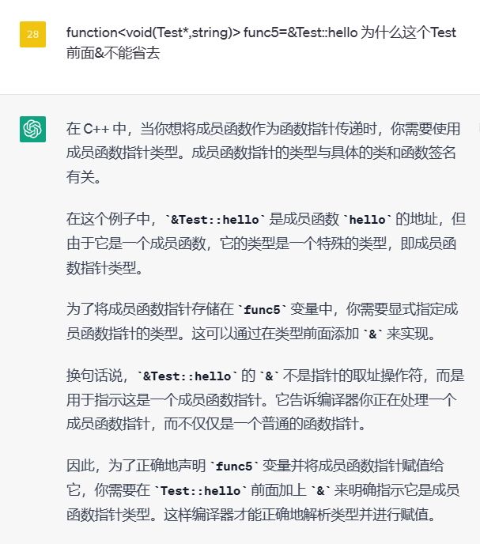
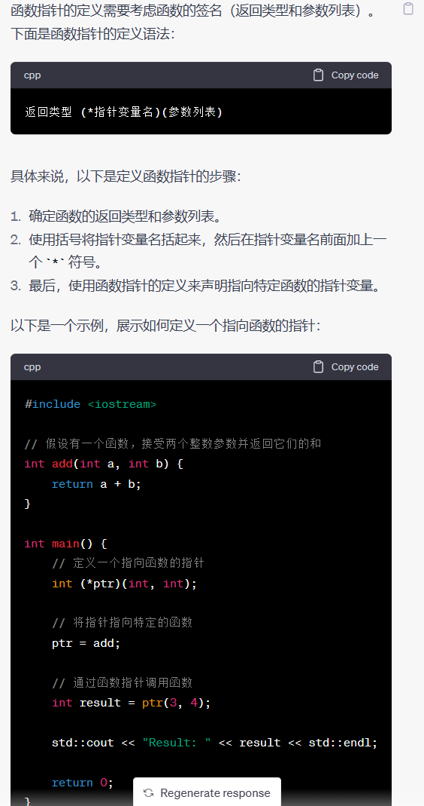
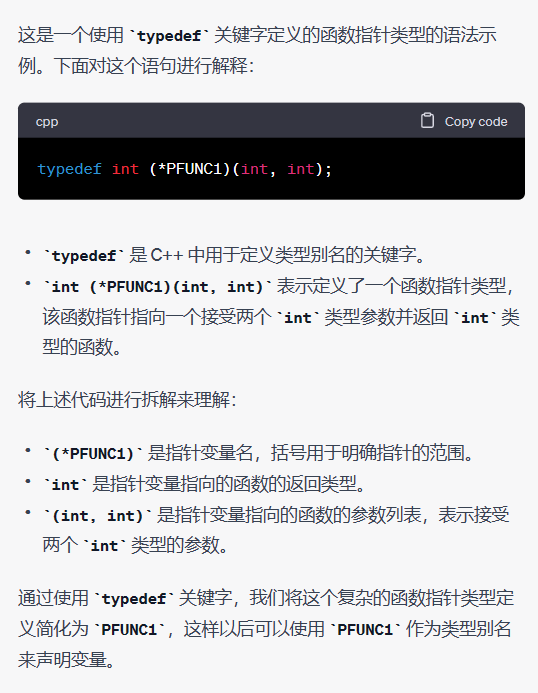
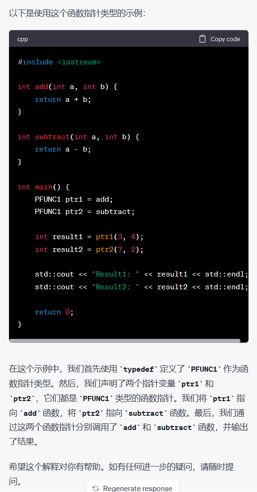

# C++11中引入的bind绑定器和function函数对象

* * *

[TOC]

* * *

### 什么是函数对象？

拥有小括号运算符重载函数（operator()）的对象，我们就称作函数对象，使用起来跟函数调用特别相似。

一个类由于重载了operator()，然后这个类的实例就可以像函数一样被调用。我们可以像调用函数一样使用这个类的对象。

为什么需要函数对象？

1. 函数对象可以有自己的状态（即可以在对象中存储一些数据，这些数据在多次调用之间可以保持）。
2. 函数对象可以作为参数传递给函数（例如，在STL算法中广泛使用）。
3. 函数对象在编译时可以内联，比函数指针更高效。
4. 函数对象可以与其所属的类一样拥有丰富的操作。

decltype是C++11引入的关键字，用于查询表达式的类型。它的名字来源于"declare type"（声明类型），主要作用是在编译时推导表达式的类型而不实际计算表达式的值。

decltype的基本语法：

decltype(expression)

`std::bind(&ThreadPool::threadFunc, this, std::placeholders::_1)`

- 第一个参数：成员函数指针 `&ThreadPool::threadFunc`。注意，成员函数需要和对象一起调用。
- 第二个参数：`this`，即当前 `ThreadPool`对象的指针。它将被绑定作为调用成员函数的对象。
- 第三个参数：`std::placeholders::_1`，这代表一个占位符，表示当调用绑定后的对象时，需要传递的第一个参数。

`std::bind`在这里的作用是创建一个可调用对象，该对象在被调用时，会使用绑定的 `this`（即当前线程池对象）来调用 `ThreadPool::threadFunc`成员函数，并且调用时需要传递一个参数（占位符 `_1`所表示的位置）。

这个可调用对象被用来构造一个 `std::unique_ptr<Thread>`的对象。我们假设 `Thread`类的构造函数接受一个可调用对象，这个对象就是线程将要执行的函数。

1. 当线程启动时，它会调用这个可调用对象，并传递一个参数。这个参数会替换掉占位符 `_1`，因此最终调用的是：

   `this->threadFunc(传递的参数)`

   

## 一、C++STL中的绑定器

绑定器允许我们将一个函数与其参数部分绑定，从而创建一个新的函数。绑定器的主要作用是将函数的部分参数固定，生成一个参数更少的新函数。

`std::placeholders::_1`, `_2`, `_3`... 这些占位符表示新函数中第1、2、3个参数。绑定器会将占位符替换为实际调用时传入的对应位置的参数。

之前在【C++STL 6大组件—你必知必会的编程利器】使用过绑定器，现在再来深入探讨一下

  * `bind1st`：`operator()`的第一个形参变量绑定成一个确定的值
  * `bind2nd`：`operator()`的第二个形参变量绑定成一个确定的值

要用到的头文件：
```C++
#include <functional>	// 包含c++库中的所有的函数对象
#include <algorithm>	// 包含c++库中的所有的泛型算法
```


### bind1st和bind2nd什么时候会用到

直接看代码：
```C++
template<typename Container>
void showContainer(Container& con)
{  
	// typename用于告诉编译器，Container::iterator 是一个类型名，要不然报错
	// typename Container::iterator it = con.begin();
	// 用auto也行
	auto it = con.begin();
	for (; it != con.end(); ++it)
		cout << *it << " ";
	cout << endl;
}
int main()
{     
	vector<int> vec;
	for (int i = 0; i < 20; ++i)
		vec.push_back(rand() % 100 + 1);
	showContainer(vec);

	sort(vec.begin(), vec.end());	//小到大
	showContainer(vec);

	sort(vec.begin(), vec.end(), greater<int>());	//大到小
	showContainer(vec);

	/*
	现在是大到小排序了，目标是把75按顺序插入到vec容器当中：找第一个小于75的数字
	greater   a > b   75绑定给a
	less      a < b	  75绑定给b
	绑定器 + 二元函数对象 -> 一元函数对象
	*/
	auto it1 = find_if(vec.begin(), vec.end(), bind1st(greater<int>(), 75));
	//auto it1 = find_if(vec.begin(), vec.end(), bind2nd(less<int>(), 75));
	if (it1 != vec.end())
		vec.insert(it1, 75);
	showContainer(vec);

	return 0;
}
```

用一个greater，肯定需要一个二元函数对象，因为不管你用什么排序， 那么你在这里边啊，都得需要两个元素之间一一进行比较。

### bind1st和bind2nd的底层实现原理

写一个自己的`find_if`和`bind1st`：
```C++
template<typename Compare, typename T>
//首先我需要定义迭代器类型，还需要 定义一个函数对象，那他返回的是一个迭代器
class _mybind1st    // 绑定器是函数对象的一个应用，bind2nd同理
{
            
public:
	_mybind1st(Compare comp, T val) : _comp(comp), _val(val) {}
	bool operator()(const T& second) { return _comp(_val, second); }
private:
	Compare _comp;
	T _val;
};

template<typename Compare, typename T>
_mybind1st<Compare, T> mybind1st(Compare comp, const T& val)
{       
// 直接使用函数模板，好处是可以进行类型的推演
	return _mybind1st<Compare, T>(comp, val);	// 返回一元函数对象
}

template<typename Iterator, typename Compare>
Iterator my_find_if(Iterator first, Iterator last, Compare comp)
{        
	for (; first != last; ++first)
		if (comp(*first))	// 相当于comp.operator()(*first)
//相当于调用了函数对象的，什么对小括号运算符重载，然后从容器中取一个元素传进来。
			return first;
	return last;
}
//遍历这两个迭代器区间的元素，如果他满足了人家这个函数对象的运算啊，就返回当前这个元素的迭代器。如果都不满足，那么返回end
```


现在，把语句变成`auto it1 = my_find_if(vec.begin(), vec.end(), mybind1st(greater<int>(), 75));`，可以看到程序也正确的插入了75，可以自己打断点分析一下执行过程

## 二、function函数对象类型

使用`function`函数对象类型，需要包含头文件`#include <functional>`

绑定器、函数对象、lambda表达式这些都是函数对象，他们只能使用在一条语句中，如果想要在多条语句多个环境中应用，那就需要用到`function`了，`function`可以将这些函数对象的类型留下来。

```C++
std::function<返回值类型(参数类型列表)> 对象名;
```

看一个`function`的简单应用：
```C++
void hello1() {cout << "hello world!" << endl; }

void hello2(string str) { cout << str << endl; }

int sum(int a, int b) { return a + b; }

int main()
{      
	// 要用一个 函数类型(返回值和参数列表) 来实例化function
//它希望用一个函数类型来实例function。它就是对一个函数或者对函数对象的一个包装
	function<void()> func1 = hello1;
//用函数类型来实例化function。只给出返回值和参数列表就行了
//function<void(*)()>函数类型跟函数指针类型是两个不同的东西，这是函数指针类型。这表示 这是一个指针类型，指向一个返回值是Void的，不带形参的这么一个函数。
	func1();	// 相当于func1.operator() => hello1()

	function<void(string)> func2 = hello2; // 存储一个接受string参数且无返回值的可调用对象
	func2("hello func2!");

	function<int(int, int)> func3 = sum;
//函数对象在包装这个函数的时候呢？这个函数的类型啊，是带有两个整形参数啊，所以呢，你通过函数对象来调用函数调用sum函数的时候需要，把你这两个整形的实参给人家传进去
	cout << func3(20, 30) << endl;
//把我们的函数类型直接给留下来，它不仅仅可以留我们函数类型啊。包括我们函数对象的类型，它依然可以留下来，因为函数对象呢？函数对象的本质是不是就那个小括号运算符的重载函数
	function<int(int, int)> func4 = [](int a, int b)->int { return a + b; };
	cout << func4(20, 30) << endl;

	return 0;
}
```


运行结果：
```C++
hello world!
hello func2!
```

`function`也可以将类的成员方法留下来，但注意， **调用成员方法必须依赖对象** ，比如用函数指针的情况下：

  * 调用普通函数：`void (*pfunc)(string)`

  * 调用成员方法：`void (Test:: * pfunc)(string)`


指向呢，我们全局的c函数的函数指针跟指向我们成员方法的指针。是不一样的，因为我们成员方法跟普通函数不一样，不一样的地方在于普通函数直接通过调用函数名就行了。

==而我们成员方法调用，它必须依赖一个对象在这。==

```C++
class Test
{   
public:
	void hello(string str) {  cout << str << endl; }
};
int main()
{
// 注意成员方法第一个参数是this指针
function<void(Test*, string)> func5 = &Test::hello;
//这个成员方法一经编译都会多一个当前类型的一个this指针，所以它有两个参数，一个是test类型的指针，一个是string。
void (Test:: * func6)(string) = &Test::hello;

Test t;
func5(&t, "hello Test");
(t.*func6)("hello Test 2");

return 0;
}
```

运行结果：
```C++
hello Test
hello Test 2
```


> **总结：**
> 
>   * 用函数类型实例化`function`
>   * 通过`function`调用`operator()`函数的时候，需要根据函数类型传入相应的参数
> 



上面的例子看不出来`function`的好用之处，好像直接调用本来的函数也挺方便呀？那再来看一个例子：

```C++
void happy1() {cout << "1.哈哈哈" << endl; }
void happy2() {cout << "2.嘻嘻嘻" << endl; }
void happy3() {cout << "3.嘿嘿嘿" << endl; }
void happy4() {cout << "4.咯咯咯" << endl; }
void happy5() {cout << "5.嘎嘎嘎" << endl; }

int main()
{ 
//function接受的是返回值是void，不带形参的函数类型的。
	int choice = 0;
	map<int, function<void()>> actionMap;
	actionMap = {{, happy1 },{, happy2 },{, happy3 },{, happy4 },{, happy5 }};
//这种初始化的方式 ，是对于我们公有对象的这个初始化，也叫结构体的初始化
	while (true)
	{ 
		cout << "-------------" << endl;
		cout << "1.哈哈哈" << endl;
		cout << "2.嘻嘻嘻" << endl;
		cout << "3.嘿嘿嘿" << endl;
		cout << "4.咯咯咯" << endl;
		cout << "5.嘎嘎嘎" << endl;
		cout << "-------------" << endl;
		cout << "请选择（按0退出）：";

		cin >> choice; // 接下来本可以用switch case处理，但是无法做到开闭原则（对扩展开放，对修改关闭），不好

		if (choice == 0) break;

		auto it = actionMap.find(choice);
		if (it == actionMap.end())
			cout << "输入数字无效，重新选择" << endl;
		else
			it->second();
	}
	return 0;
}
```


## 三、模板的完全特例化和部分特例化

**完全特例化** ：对一种类型写一个特例化模板 
**部分特例化** ：对某一类的类型写一个特例化模板 
**匹配原则** ：有完全特例化，就匹配对应的完全特例化；有部分特例化，就匹配对应的部分特例化；都没有，就匹配原模板实例化

**示例一：**

```C++
// 原模板
template<typename T>
bool compare(T a, T b)
{     
	cout << "template compare" << endl;
	return a > b;
}

// 模板的完全特例化，注意这里的语法
template<>
bool compare<const char*>(const char* a, const char* b)
{       
	cout << "template compare<const char*>" << endl;
	return strcmp(a, b) > 0;
}

int main()
{     
	compare(10, 20);		// template compare
//它相当于对两个常量字符串做大于比较，这比较的是地址，并不是比较的是字符串的字典顺序
	compare("baa", "bbb");	// template compare<const char*>
	return 0;
}
```

**示例二：**

```C++
// 原模板								#1
template<typename T>
class Vector
{        
public:
	Vector() { cout << "call Vector" << endl; }
};
//有原模板，才能提供特例化。
// 对char*类型提供的 完全特例化 版本		#2
template<>
class Vector<char*>
{          
public:
	Vector() { cout << "call Vector<char*>" << endl; }
};
// 对指针类型提供的 部分特例化 版本		#3
template<typename Ty>
//还写类型Ty，原因：我们类型现在只知道一部分，只知道它是个指针类型，什么类型的指针不清楚
class Vector<Ty*>
{         
public:
	Vector() { cout << "call Vector<Ty*>" << endl; }
};

// 对函数指针类型提供的 部分特例化 版本	#4
// 函数指针：有返回值，有两个形参
template<typename R, typename A1, typename A2>
class Vector<R(*)(A1, A2)>
{          
public:
	Vector() {cout << "call Vector<R(*)(A1, A2)>" << endl; }
};

// 对函数指针类型提供的 完全特例化 版本	#5
// 函数指针：返回bool，两个int形参
template<>
class Vector<bool(*)(int, int)>
{
            
public:
	Vector() {cout << "call Vector<bool(*)(int, int)>" << endl;}
};

// 对函数类型提供的 部分特例化 版本	    #6
// 函数：有返回值，有两个形参，注意与#4区分
template<typename R, typename A1, typename A2>
class Vector<R(A1, A2)>
{
            
public:
	Vector() {cout << "call Vector<R(A1, A2)>" << endl; }
};
int main()
{
            
	Vector<int> vec1;					// call Vector，匹配#1
	Vector<char*> vec2;					// call Vector<char*>，没有#2会匹配#1
	Vector<int*> vec3;					// call Vector<Ty*>，没有#3会匹配#1
	Vector<int(*)(int, int)> vec4;		// call Vector<R(*)(A1, A2)>，没有#4会匹配#3
	Vector<bool(*)(int, int)> vec5;		// call Vector<bool(*)(int, int)>，没有#5会匹配#4
	Vector<int(int, int)> vec6;			// call Vector<R(A1, A2)>，没有#6会匹配#1
	return 0;
}
```



注意区分函数类型和函数指针类型

```C++
int sum(int a, int b) { return a + b; }
```

```C++
int main()
{
            
	// typedef int(*PfUNC1)(int, int);
	using PfUNC1 = int(*)(int, int);	
	PfUNC1 p1 = sum;
	cout << p1(10, 20) << endl;		// 30

	// typedef int PfUNC2(int, int);
	using PfUNC2 = int(int, int);//你比如说这个pf unc 2，你如果是个函数类型。那么，你定义的定义的时候，你必须哎。必须把这个指针你要加上函数类型上的指针，是不是才是函数指针类型啊	
	PfUNC2* p2 = sum;
	cout << (*p2)(10, 20) << endl;	// 30

	return 0;
}
```





## 四、模板的实参推演


```C++
template<typename T>
void func(T a) { cout << typeid(T).name() << endl; }

int sum(int a, int b) { return a + b; }

class Test
{          
public:
	int sum(int a, int b) { return a + b; }
};
int main()
{
            
	func(10);			// int
	func("aaa");		// const char *

	func(sum);			// int (__cdecl*)(int,int) 函数指针类型
	/*
	如果写成 void func(T* a) { cout << typeid(T).name() << endl; }
	推出来的就是函数类型：int __cdecl(int,int)
	*/

	func(&Test::sum);	// int (__thiscall Test::*)(int,int)

	return 0;
}
```


上面直接推导的函数类型范围太大了（直接用`typename T>`全囊括了），我们可以用函数指针的模板 **部分特例化** 来把大类型细分处理
```C++
template<typename R, typename A1, typename A2>
void func(R(*a)(A1, A2))
{
            
	cout << typeid(R).name() << endl;
	cout << typeid(A1).name() << endl;
	cout << typeid(A2).name() << endl;
}

template<typename R, typename T, typename A1, typename A2>
void func(R(T::* a)(A1, A2))
{
            
	cout << typeid(R).name() << endl;
	cout << typeid(T).name() << endl;
	cout << typeid(A1).name() << endl;
	cout << typeid(A2).name() << endl;
}
```


调用`func(sum);`输出：
```C++
int
int
int
```


调用`func(&Test::sum);`输出：
```C++
int
class Test
int
int
```


## 五、function函数对象类型的实现原理

**示例一：**

```C++
void hello(string str) { cout << str << endl; }

template<typename Fty>
class my_function {};

template<typename R, typename A1>
class my_function<R(A1)>
{
            
public:
	using PFUNC = R(*)(A1);
	my_function(PFUNC pfunc) : _pfunc(pfunc) {  }
	R operator()(A1 arg) {  return _pfunc(arg); }
private:
	PFUNC _pfunc;
};

int main()
{        
	my_function<void(string)> func(hello);
	func("hello world");	// 相当于func1.operator()("hello world")
	return 0;
}
```

**示例二：**

```C++
int sum(int a, int b) { return a + b; }

template<typename Fty>
class my_function { };

template<typename R, typename A1, typename A2>
class my_function<R(A1, A2)>
{
            
public:
	using PFUNC = R(*)(A1, A2);
	my_function(PFUNC pfunc) : _pfunc(pfunc) { }
	R operator()(A1 arg1, A2 arg2) { return _pfunc(arg1, arg2); }
private:
	PFUNC _pfunc;
};

int main()
{
            
	my_function<int(int, int)> func(sum);
	cout << func(10, 20) << endl;
	return 0;
}
```


通过上面两个示例，可以看到我们自己写的`function`也能完美运行，但是这两个示例因为形参个数不一样，我们就写了两次，这样岂不是很麻烦，解决办法如下：
```C++
// ...表示可以接受零个或多个参数
template<typename R, typename... A>
class my_function<R(A...)>
{
            
public:
	using PFUNC = R(*)(A...);
	my_function(PFUNC pfunc) : _pfunc(pfunc) {
            }
	R operator()(A... arg) {
             return _pfunc(arg...); }
private:
	PFUNC _pfunc;
};
```

## 六、bind绑定器

绑定器（`std::bind`创建的对象）本质上就是一个**函数对象（Function Object）**，它是通过重载 `operator()`运算符的类实例，因此可以像函数一样被调用。

当你调用 `std::bind`时：

```C++
auto binder = std::bind(target_func, bound_args...);
```

编译器会生成一个**匿名的类**，该类：

- **存储绑定的参数**（值或引用）
- **重载 `operator()`**：将参数转发给目标函数


`bind`是一个函数模板，返回的是函数对象

**示例一** ：`bind`的基本用法

```C++
void hello(string str) {  cout << str << endl; }

int sum(int a, int b) {  return a + b; }

class Test
{        
public:
	int sum(int a, int b) { return a + b; }
};
int main()
{    
	// bind是函数模板，可以自动推演模板类型参数
	// 返回一个函数对象，末尾要加小括号进行调用
	bind(hello, "hello bind!")();	// hello bind!
	cout << bind(sum, 10, 20)() << endl;	// 30
	cout << bind(&Test::sum, Test(), 10, 20)() << endl;	// 30
//返回的绑定器，需要调用它的小括号运算符重载函数 
	return 0;
}
```

**示例二** ：参数占位符

```C++
int sum(int a, int b) { return a + b; }
class Test
{         
public:
	int sum(int a, int b) { return a + b; }
};
int main()
{     
	bind(hello, _1)("hello placeholders!");	// hello placeholders!
	cout << bind(sum, _1, _2)(10, 20) << endl;	// 30
	cout << bind(&Test::sum, Test(), _1, _2)(10, 20) << endl;	// 30
	return 0;
}
```

**绑定器的问题** ：只能在当前语句使用，出了语句无法使用，那如何将绑定器的类型留下来，这就需要`function`了

```C++
using namespace placeholders;

void hello(string str) {   cout << str << endl; }

int sum(int a, int b) { return a + b; }

class Test
{
            
public:
	int sum(int a, int b) {  return a + b; }
};

int main()
{     
	// 此处把bind返回的函数对象（Binder）就复用起来了
	function<void(string)> func1 = bind(hello, _1);
	func1("hello aaa");
	func1("hello bbb");
	func1("hello ccc");
	return 0;
}
```


### bind和function实现线程池


```C++
// 线程类
class Thread
{
            
public:
	// 用function接收绑定器返回的binder，已经绑定了所以没有参数了
	Thread(function<void(int)> func, int no) : _func(func), _no(no) { }
	thread start()	// #include <thread>
	{  
		thread t(_func, _no);	// _func()
		return t;
	}
private:
	function<void(int)> _func;
	int _no;
};

// 线程池类
class ThreadPool
{
            
public:
	ThreadPool() {}
	~ThreadPool()
	{     
		// 释放Thread对象占用的堆资源
		for (int i = 0; i < _pool.size(); ++i)
			delete _pool[i];
	}
	// 开启线程池
	void startPool(int size)
	{   
		for (int i = 0; i < size; ++i)
		{
            
			// 这里如果把i写在bind里面，那么Thread里面就写成function<void()>，且无需_no成员
			// _pool.push_back(new Thread(bind(&ThreadPool::runInThread, this, i)));
			_pool.push_back(
				new Thread(bind(&ThreadPool::runInThread, this, _1), i)
			);
		}

		for (int i = 0; i < size; ++i)
			_handler.push_back(_pool[i]->start());

		for (thread& t : _handler)
			t.join();
	}
private:
	vector<Thread*> _pool;
	vector<thread> _handler;

	// 把runInThread这个成员方法充当线程函数
	// 本身成员方法不能当线程函数，但是可以用bind绑定器来实现
	void runInThread(int id)
	{     
		cout << "call runInThread id: " << id << endl;
	}
};

int main()
{
            
	ThreadPool pool;
	pool.startPool(10);
	return 0;
}
```


## 七、lambda表达式

先来看看 **函数对象的缺点** ：用于泛型算法参数传递，一般用于比较性质/自定义操作的地方，例如优先级队列、智能指针删除器，这往往需要定义一个类，灵活性太差

Lambda表达式提供了一种简洁的方式来创建匿名函数对象（即函数对象）。

lambda表达式本质上就是一个函数对象，编译器会将lambda表达式转换成一个匿名的函数对象类。

Lambda表达式的实例就是该类的对象，可以像函数对象一样使用，也可以存储在`std::function`中。

**`lambda`表达式**：函数对象的升级版

>   * **语法** ：`[捕获外部变量](形参列表)->返回值{操作代码};`
>   * 如果`lambda`表达式不需要返回值，那么 `->返回值` 可以省略
>   * `[捕获外部变量]`： 
>     * `[]`：不捕获任何外部变量
>     * `[=]`：以 **值传递** 的方式捕获外部的所有变量
>     * `[&]`：以 **引用传递** 的方式捕获外部的所有变量
>     * `[this]`：捕获外部的`this`指针，捕获当前对象（`this`指针），使得在Lambda体内可以访问该对象的成员。
>     * `[=, &a]`：以 **值传递** 的方式捕获外部的所有变量，但是以 **引用传递** 的方式捕获`a`
>     * `[a, b]`：以 **值传递** 的方式捕获外部变量`a`和`b`
>     * `[a, &b]`：以 **值传递** 的方式捕获`a`，以 **引用传递** 的方式捕获`b`
>   * lambda表达式是没有办法直接访问lambda表达式外边的变量，我们需要按值或者按引用进行捕获。
>

### 实现原理

`lambda`表达式的实现原理其实就是函数对象，接下来看一些示例

**示例一：**

```C++
template<typename T = void>
class TestLambda01
{
            
public:
	TestLambda01() {
            }
	void operator()() const {
             cout << "hello world!" << endl; }
};

int main()
{
            
	// auto func1 = []()->void { cout << "hello world!" << endl; };
	auto func1 = []() { cout << "hello world!" << endl; };
	func1();	// hello world!
//auto func1 = []()->void { cout << "hello world!" << endl; };相当于就是产生了一个函数对象。类似于这里的t1的角色。就是兰布达对象的这个类型呢，是我们编译器默认产生的。这个类型其实我们根本就没有必要，我们在乎的是这个对象函数对象，不在乎这函数对象叫什么名
	TestLambda01<> t1;
	t1();	// hello world!

	return 0;
}
```


  * `lambda`表达式中的`[]`，相当于函数对象中的构造函数
  * `lambda`表达式中的`()`，相当于函数对象中的小括号运算符重载函数

==几元的是什么意思呢？就是小括号运算符重载函数参数的个数。==

**示例二：**

```C++
template<typename T = void>
class TestLambda02
{
            
public:
	TestLambda02() {
            }
	int operator()(int a, int b) const {
             return a + b; }
};

int main()
{
            
	auto func2 = [](int a, int b)->int {
             return a + b; };
	cout << func2(10, 20) << endl;	// 30

	TestLambda02<> t2;
	cout << t2(10, 20) << endl;	// 30

	return 0;
}
```

**示例三：**

```C++
template<typename T = void>
class TestLambda03
{
            
public:
	TestLambda03(int a, int b) : ma(a), mb(b) {  }
	// 常方法里只能读成员变量，不能修改成员变量
	// 如果非要这样写，需要在成员变量前面加上mutable
	void operator()() const
	{
		int temp = ma;
		ma = mb;
		mb = temp;
	}
private:
	mutable int ma;
	mutable int mb;
};

int main()
{     
	int a = 10;
	int b = 20;
	
	auto func3 = [a, b]()mutable
		{ 
			int temp = a;
			a = b;
			b = temp;
		};
	func3();
		
	// 值传递不改变外部变量本身
	cout << a << " " << b << endl;	// 10 20

	TestLambda03<> t3(a, b);
	t3();

	return 0;
}
```


上面这句`lambda`表达式对应的成员对象如上写了出来，但是这样写即没有达到我们想要的效果，而且还很繁琐，改成下面这种按引用传递的方式：
```C++
template<typename T = void>
class TestLambda03
{
            
public:
	TestLambda03(int& a, int& b) : ma(a), mb(b) { }
	void operator()() const
	{   
		// 这里可以对成员变量操作，因为没有改变ma和mb的本身（本身底层的那4个字节）
		// 只是改变的他们所引用的内存的值
		int temp = ma;
		ma = mb;
		mb = temp;
	}
private:
	int& ma;
	int& mb;
};
int main()
{
            
	int a = 10;
	int b = 20;
	
	auto func3 = [&a, &b]()
		{ 
			int temp = a;
			a = b;
			b = temp;
		};
	func3();

	cout << a << " " << b << endl;	// 20 10

	TestLambda03<> t3(a, b);
	t3();

	return 0;
}
```


### 应用实践

**示例一：**

```C++
int main()
{
            
	vector<int> vec;
	for (int i = 0; i < 20; ++i)
		vec.push_back(rand() % 100 + 1);
	
	sort(vec.begin(), vec.end(),
		[](int a, int b)->bool {
             return a > b; });
	for (int v : vec)
		cout << v << " ";
	cout << endl;	// 96 92 82 79 70 68 65 63 62 59 46 43 42 37 35 28 28 25 6 1
	
	auto it = find_if(vec.begin(), vec.end(),
		[](int a)->bool {
             return a < 66; });
	vec.insert(it, 66);
	for (int v : vec)
		cout << v << " ";
	cout << endl;	// 96 92 82 79 70 68 66 65 63 62 59 46 43 42 37 35 28 28 25 6 1
	
	for_each(vec.begin(), vec.end(),
		[](int a)
		{
			if (a % 2 == 0)
				cout << a << " ";
		});
	cout << endl;	// 96 92 82 70 68 66 62 46 42 28 28 6
}
```


**示例二：**

既然`lambda`表达式只能使用在语句当中，如果想跨语句使用之前定义好的lambda表达式，这就需要用到`function`了
```C++
int main()
{
            
	map<int, function<int(int, int)>> calculateMap;
	calculateMap[1] = [](int a, int b)->int { return a + b; };
	calculateMap[2] = [](int a, int b)->int { return a - b; };
	calculateMap[3] = [](int a, int b)->int { return a * b; };
	calculateMap[4] = [](int a, int b)->int { return a / b; };

	int choice;
	while (cin >> choice && choice != 0)
		if (1 <= choice && choice <= 4)
			cout << calculateMap[choice](100, 10) << endl;

	return 0;
}
```

**示例三：**

```C++
// 智能指针自定义删除器
unique_ptr<FILE, function<void(FILE*)>>
	ptr1(fopen("data.txt", "w"), [](FILE* pf) {
             fclose(pf); });
```

**示例四：**

```C++
class Data
{            
public:
	Data(int a = 10, int b = 10) : ma(a), mb(b) {}
	int ma;
	int mb;
};

int main()
{
            
	// 优先级队列，大根堆
	using FUNC = function<bool(Data&, Data&)>;
	priority_queue<Data, vector<Data>, FUNC>
		maxHeap([](Data& d1, Data& d2)->bool
			{
				return d1.ma < d2.ma;
			});

	maxHeap.push(Data(10, 20));
	maxHeap.push(Data(15, 15));
	maxHeap.push(Data(20, 10));

	return 0;
}
```

---

在 `auto cmp = [](...) {...};` 里的这个 **`auto` 是用来推导 `cmp` 的类型**，必须由编译器来完成，我们自己写不出来。

```C++
auto cmp = [](ListNode* a, ListNode* b) {return a->val > b->val;};
```

这里的 `auto cmp` 是 **变量声明**：

- `auto` 让编译器去推导 `cmp` 的类型；

- 编译器会推导出 `cmp` 的类型是某个 **匿名类**（lambda 对象类型）。
   比如，它可能被编译成类似：

  ```C++
  struct __lambda_12345 {
      bool operator()(ListNode* a, ListNode* b) const { return a->val > b->val; }
  };
  __lambda_12345 cmp;
  ```

`priority_queue` **内部要存一个比较器对象**（用它来比较元素）。这个模板参数是需要一个函数对象实例传进去，否则它没法调用 `operator()` 来比较元素。所以需要传入一个函数对象实例。

如果你的比较器**可默认构造**（比如**无捕获的 lambda**、普通的仿函数 `struct`），你可以**不传**，用默认构造即可：`pq;`

如果你的比较器**有状态**（**有捕获的 lambda**）或**不可默认构造**，那就**必须传入实例**：`pq(cmp);`

**无捕获 lambda** → “空 struct + operator()”，可默认构造、可转函数指针。

**有捕获 lambda** → “带数据成员的 struct + operator()”，构造时必须把捕获变量拷贝/引用进去。

cmp如果是类型名，可以直接写，cmp如果是变量名，则不行。

如果你写的是 `struct cmp { bool operator()(...) const { ... } };`

这种情况下，`cmp` 是一个**类型名**，可以直接写在第三个模板参数里：

```C++
struct cmp {
    bool operator()(ListNode* a, ListNode* b) const {
        return a->val > b->val;  // 小根堆
    }
};
priority_queue<ListNode*, vector<ListNode*>, cmp> minHeap;   // ✅ 没问题
```

这里不需要 `decltype`，因为 `cmp` 已经是个明确的类型。

2. 如果你写的是 `auto cmp = [](ListNode* a, ListNode* b){ ... };`

那 `cmp` 是一个**变量名**，而且是个 lambda 对象的实例。
 此时不能直接写 `cmp`，因为模板参数需要一个类型，而不是一个变量。

这时你必须用 `decltype(cmp)` 来“拿到变量的类型”：
