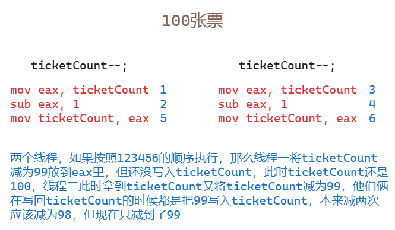
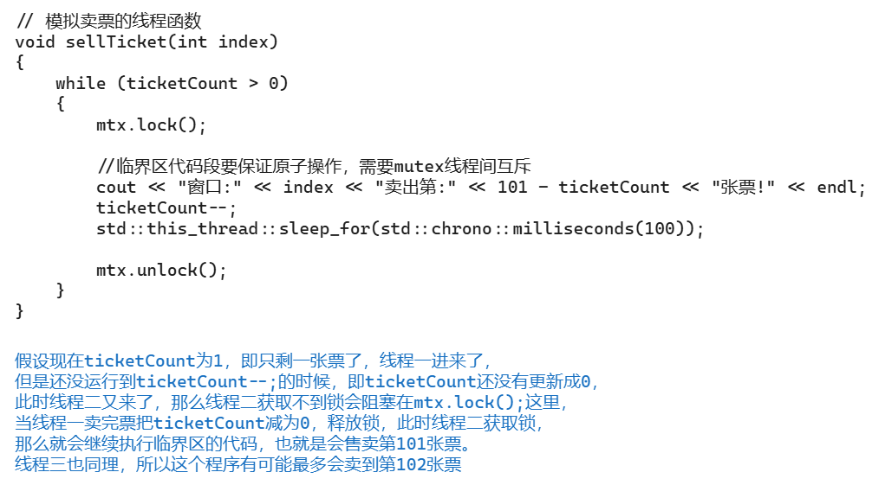
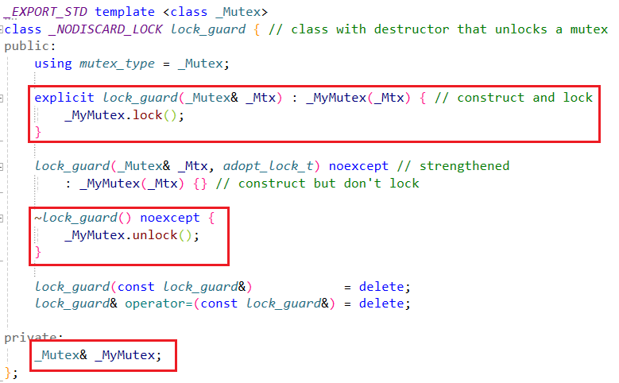

# C++11知识点汇总

* * *

[TOC]

* * *

## 一、C++11常用关键知识点梳理

### 1.1 关键字和语法

  * `auto`：可以根据右值，推导出右值的类型，然后左边变量的类型就已知了
  * `nullptr`：给指针专用（能够和整数进行区别）；之前的`NULL`是一个宏定义`#define NULL 0`，在代码上无法区分整数和指针地址
  * `foreach`语句：可以遍历数组（底层是指针遍历），容器（底层是迭代器遍历）等
    
        for(Type val : container) => 底层就是通过指针或者迭代器来实现的
        	cout<<val<<" ";


  * 右值引用：带有右值引用(`T&&`)参数的成员方法，可以对我们对象的优化，起到非常强大的作用，==尤其是在用临时对象拷贝构造新对象==，或者是==用临时对象给其他对象赋值的时候==，再有==右值引用参数的拷贝构造跟赋值重载函数==，非常强大，可以省了内存，开辟释放以及数据拷贝构造。

    `move`移动语义函数和`forward`类型完美转发函数

  * 模板的一个新特性：`typename... A` 表示可变参（类型参数）

### 1.2 绑定器和函数对象

  * `function`：函数对象
  * `bind`：绑定器
  * `bind1st`和`bind2nd` \+ 二元函数对象   →  一元函数对象
  * `lambda`表达式

### 1.3 智能指针

`shared_ptr`和`weak_ptr`

### 1.4 容器

  * `set和map`：红黑树，增删查O(logn)
  * `unorder_set和unorder_map`：哈希表，增删查O(1)
  * `array`：数组，固定大小，不可扩容。区别于`vector`
  * `forward_list`：前向链表，单链表。`list`是双向链表

## 二、C++语言级别支持的多线程编程

**C++语言级别的多线程编程 → 代码可以跨平台：windows/linux/mac**

```C++
C++语言层面 thread（底层用的还是下面平台的方法） 
   windows        linux：strace ./a.out（程序启动的跟踪打印的命令）
      |             |
createThread    pthread_create
```


需要包含的头文件：`#include <thread>`

### 2.1 通过thread类编写C++多线程程序

  * **Q1：怎么创建启动一个线程？** 
    **A** ：`std::thread`定义一个线程对象，传入线程所需要的线程函数和参数，线程自动开启
  * **Q2：子线程如何结束？** 
**A** ：子线程函数运行完成，线程就结束了
  * **Q3：主线程如何处理子线程？** 
    `t.join()`：等待`t`线程结束，当前线程继续往下运行 
    `t.detach()`：把`t`线程设置为分离线程，主线程结束，整个进程结束，所有子线程都自动结束，类似于守护线程

    
    ​            
    ```C++
    void threadHandle1(int time)
    {	//让子线程睡眠time秒
        std::this_thread::sleep_for(std::chrono::seconds(time));
        cout << "hello threadHandle1!" << endl;
    }
    
    void threadHandle2(int time)
    {
        //让子线程睡眠time秒
        std::this_thread::sleep_for(std::chrono::seconds(time));
        cout << "hello threadHandle2!" << endl;
    }
    int main()
    {
        // 创建了一个线程对象，传入一个线程函数（作为线程入口函数）
        // 新线程开始运行，没有先后顺序，随着CPU的调度算法执行
        std::thread t1(threadHandle1, 2);
        std::thread t2(threadHandle2, 3);
    
        // join：主线程（main）运行到这里，等待子线程结束，主线程才继续往下运行
        t1.join();
        t2.join();
    
        /*
        把子线程设置为分离线程，子线程和主线程就毫无关系了
        主线程结束的时会查看其他线程，但是这个子线程是否运行结束和主线程无关，
        因为子线程从主线程分离出去了
        主线程往下就结束了，子线程还在那里睡眠，没来得及输出，程序结束就看不到任何输出了
        */
        //t1.detach();
        //t2.detach();
    
        cout << "main thread done!" << endl;
    
        /*
        主线程运行完成时，会查看当前进程是否还有未运行完成的子线程
        如果有，那么进程就会异常终止
        */
        return 0;
    }  
    ```

### 2.2 线程间互斥

我们来看一个案例：模拟车站三个窗口卖票
```C++
int ticketCount = 100; // 车站有100张车票，由三个窗口一起卖票

// 模拟卖票的线程函数
void sellTicket(int index)
{
            
	while (ticketCount > 0)
	{
            
		cout << "窗口:" << index << "卖出第:" << 101 - ticketCount << "张票!" << endl;
		ticketCount--;
		std::this_thread::sleep_for(std::chrono::milliseconds(100));
	}
}

int main()
{
            
	list<std::thread> tlist;
	for (int i = 1; i <= 3; ++i)
		tlist.push_back(std::thread(sellTicket, i));

	for (auto& t : tlist)
		t.join();

	cout << "所有窗口卖票结束!" << endl;
	return 0;
}
```


运行上面这段程序，可以看到输出非常的乱，并且还有重复售票的情况

**竞态条件** ：指的是两个或多个进程或线程在并发执行时，其最终的结果依赖于这些进程或线程执行的精确时序。当这些进程或线程试图访问或修改共享资源时，如果它们的执行顺序或时间控制不当，就可能导致最终结果不符合预期，从而产生竞态条件

我们期待的是多线程程序执行的结果是一致的，不会随着CPU对线程不同的调用顺序，而产生不同的运行结果，这就要避免竞态条件



因此，我们要对线程安全进行保障，这就需要线程间的互斥，使用互斥锁，需要包含头文件`#include <mutex>`
```C++
std::mutex mtx; // 全局的一把互斥锁

// 模拟卖票的线程函数
void sellTicket(int index)
{
            
	mtx.lock();
	while (ticketCount > 0)
	{
            
		cout << "窗口:" << index << "卖出第:" << 101 - ticketCount << "张票!" << endl;
		ticketCount--;
		std::this_thread::sleep_for(std::chrono::milliseconds(100));
	}
	mtx.unlock();
}
```


这样加锁是有bug的，可以打印输出看一下，这种情况只能允许一个窗口进行卖票，窗口 1 2 3 谁先抢到`mtx`谁就能卖票，其他线程进来会阻塞到`mtx.lock();`这里

**改进：**

```C++
// 模拟卖票的线程函数
void sellTicket(int index)
{
            
	while (ticketCount > 0)
	{
            
		mtx.lock();

		//临界区代码段要保证原子操作，需要mutex线程间互斥
		cout << "窗口:" << index << "卖出第:" << 101 - ticketCount << "张票!" << endl;
		ticketCount--;
		std::this_thread::sleep_for(std::chrono::milliseconds(100));

		mtx.unlock();
	}
}
```


> 临界区指的是一个访问公共资源的程序片段，这些公共资源又无法同时被多个线程同时访问。当有线程进入临界区段时，其他线程或是进程必须等待，以确保这些公共资源是被互斥获得使用

现在可以看到程序逻辑基本正确，每个窗口都可以进行卖票了，但实际上还是有bug的，可以运行看一下最后卖的票不止100张，会多出来一些，这是为什么呢，来分析一下：



**改进：**

```C++
// 模拟卖票的线程函数
void sellTicket(int index)
{
            
	while (ticketCount > 0)
	{
            
		mtx.lock();

		if (ticketCount > 0)
		{
            
			//临界区代码段要保证原子操作，需要mutex线程间互斥
			cout << "窗口:" << index << "卖出第:" << 101 - ticketCount << "张票!" << endl;
			ticketCount--;
			std::this_thread::sleep_for(std::chrono::milliseconds(100));
		}

		mtx.unlock();
	}
}
```


在里面加一个双重判断，完美解决上述的问题！至此，本程序基本完美

但是，程序还存在一个潜在的问题，就是程序如果在`lock`与`unlock`之间退出，也就是临界区代码段里满足了一些条件返回了，那么锁的释放`unlock`就不会执行到了，那么就死锁了，怎么解决呢？这就需要用到`lock_guard`与`unique_lock`了

  * `lock_guard`：构造会自动上锁，析构会自动释放。拷贝构造与赋值重载函数被删除掉了，可以类比与之前学的智能指针`scoped_ptr`
  * `unique_lock`：构造会自动上锁，析构会自动释放。拷贝构造与赋值重载函数被删除掉了，但是提供了带右值引用版本的，可以类比与之前学的智能指针`unique_ptr`

    ```C++
    // 模拟卖票的线程函数
    void sellTicket(int index)
    {
        while (ticketCount > 0)
        {
    
            {
    
                // 不管因为什么出作用域，都会自动析构，防止出现死锁
                lock_guard<std::mutex> suo(mtx);
                //unique_lock<std::mutex> suo(mtx);
                if (ticketCount > 0)
                {
    
                    //临界区代码段要保证原子操作，需要mutex线程间互斥
                    cout << "窗口:" << index << "卖出第:" << 101 - ticketCount << "张票!" << endl;
                    ticketCount--;
                }
            }
            std::this_thread::sleep_for(std::chrono::seconds(1));
        }
    }
    ```

### 2.3 线程间同步通信-生产者消费者模型

**多线程编程两个问题：**

  1. 线程间的互斥

对临界区代码段要保证其原子操作：添加互斥锁`mutex`、轻量级的无锁实现（CAS）

  2. 线程间的同步通信

- 线程间不通信的话，每个线程受CPU的调度，没有任何执行上的顺序可言，线程1和线程2是根据CPU调度算法来的，两个线程都有可能先运行，是不确定的，线程间的运行顺序是不确定的

通信就是：

  * 线程1和线程2一起运行，线程2要做的事情必须先依赖于线程1完成部分的事情，然后线程1告诉线程2这部分东西做好了，线程2就可以继续向下执行了
  * 或者是线程1接下来要做某些操作，这些操作需要线程2把另外一部分事情做完，然后通知一下线程1它做完了，然后线程1才能做这些操作。

**生产者-消费者** 线程模型：

**注意** ： C++ STL中所有的容器都不是线程安全的，都需要进行封装。在这个例子中把`queue`封装成了`Queue`

**条件变量：**

  * **功能** ：条件变量允许线程等待某个条件为真时才继续执行，通常与互斥锁结合使用。
  * 使用条件变量需要包含头文件`#include <condition_variable>`  

    // 生产者生产一个物品，通知消费者消费一个；消费完了，消费者再通知生产者继续生产物品
    
    
    ```C++
    class Queue
    {
                
    public:
    	void put(int val)
    	{
    	unique_lock<std::mutex> suo(mtx);
    
    	//while (!que.empty())
    	//{
            
    	//	// que不为空，生产者应该通知消费者去消费
    	//	// 等消费者消费完了，生产者再继续生产
    	//	// 生产者线程进入等待状态，并且把mtx互斥锁释放掉
    	//	cv.wait(suo); //传入一个互斥锁，当前线程挂起，处于等待状态，并且释放当前锁
    	//}
    
    	// 使用wait的谓词版本来检查条件
    	// 等待条件满足，继续执行
    	// 捕获this指针是为了让lambda表达式能够访问类的成员变量和成员函数
    	cv.wait(suo, [this] {
             return que.empty(); });
    
    	que.push(val);
    
    	/*
    	notify_one：通知唤醒另外的一个线程
    	notify_all：通知唤醒其它所有线程
    	通知其它所有的线程，我生产了一个物品，你们赶紧消费吧
    	其它线程得到该通知，就会从等待状态变为阻塞状态，之后获取互斥锁继续执行
    	*/
    	cv.notify_all();
    
    	cout << "生产：" << val << endl;
    }
    int get()
    {  
    	unique_lock<std::mutex> suo(mtx);
    
    	//while (que.empty())
    	//{
            
    	//	// 消费者线程发现que是空的，通知生产者线程先生产物品
    	//	// 消费者线程进入等待状态，并且把mtx互斥锁释放掉
    	//	cv.wait(suo);
    	//}
    
    	cv.wait(suo, [this] {
             return !que.empty(); });
    
    	int val = que.front();
    	que.pop();
    
    	cv.notify_all(); // 通知其它线程我消费完了，快生产
    
    	cout << "消费：" << val << endl;
    	return val;
    }
    private:
    	queue<int> que;
    	std::mutex mtx;	// 定义互斥锁，做线程间的互斥操作
    	std::condition_variable cv;	// 定义条件变量，做线程间的同步通信操作
    };
    
    void producer(Queue& que)	// 生产者
    {
        for (int i = 1; i <= 10; ++i)
        {
    
            que.put(i);
            std::this_thread::sleep_for(std::chrono::milliseconds(100));
        }
    }
    
    void consumer(Queue& que)	// 消费者
    {
        for (int i = 1; i <= 10; ++i)
        {
    
            que.get();
            std::this_thread::sleep_for(std::chrono::milliseconds(100));
        }
    }
    int main()
    {
        Queue que;	// 两个线程共享的队列
    
        // 加上std::ref来显式的传递引用，也可以用指针
        std::thread t1(producer, std::ref(que));
        std::thread t2(consumer, std::ref(que));
    
        t1.join();
        t2.join();
    
        return 0;    
    }    
    ```
    

### 2.4 再谈lock_guard和unique_lock


```C++
mtx.lock();
...
mtx.unlock();
```


> 有可能中间走掉了，导致没有`unlock()`，不安全


```C++
lock_guard<std::mutex> guard(mtx);
```

`lock_guard`源码： 


> `lock_guard`不可能用在函数参数传递或者返回过程中，因为拷贝构造和赋值函数都被删除了，只能用在简单的加锁解锁临界区代码段的互斥操作中，出作用域析构自动释放锁


```C++
unique_lock<std::mutex> lck(mtx);
```


> `unique_lock`不仅可以使用在简单的加锁解锁临界区代码段的互斥操作中，还能用在函数调用过程中，因为其虽然删除了拷贝构造和赋值函数，但是提供了带右值引用版本的 
>  条件变量中的`wait`接收参数就需要是`unique_lock`

> 一般就使用`unique_lock`就行了，他俩的关系类似于`unique_ptr`与`scoped_ptr` 
>  简单的地方，比如没有进行线程通信，也可以选择`lock_guard`


```C++
cv.wait(suo); //传入一个互斥锁，当前线程挂起，处于等待状态，并且释放当前锁。它需要别的线程，先做事情 ，所以它要把锁要释放掉，你不释放锁别的线程获取不到锁，没法做事情。
/*
通知在cv上等待的线程，条件成立了，起来干活了！
其它在cv上等待的线程，收到通知，
从等待状态 -> 到阻塞状态（不能直接运行） 
只有当前线程释放锁了，其他线程获取互斥锁了，线程才能继续往下执行
*/
cv.notify_all();
```


### 2.5 基于CAS操作的atomic原子类型

在之前的卖票程序中，多线程操作不安全，票的数量ticketCount加加减减操作会出现问题，我们当时是使用`lock_gard`来解决的

这里存在的问题就是：互斥锁是比较重的，临界区代码复杂时可以使用；但现在我们只是做一个加加减减的操作，还是需要一些轻量级的操作

**解决办法** ：使用CAS保证上面加加减减操作的原子特性就足够了，CAS也叫做无锁操作

> CAS（Compare-And-Swap，比较并交换）是一种原子操作，用于在多线程编程中实现线程安全的操作， **有助于提高多线程操作的效率** 。它是一种底层的同步原语，用于处理并发修改共享变量的问题。CAS 操作通常在实现无锁数据结构和算法时发挥重要作用。 
>  无锁只是这个加锁不在我们的软件层面，并不是说不加锁，一般在硬件层面（系统总线）实现

头文件：`#include <atomic>`

代码示例：
```C++
volatile std::atomic_bool isReady = false;
volatile std::atomic_int ticketCount = 0;

void task()
{
            
	while (!isReady)
		std::this_thread::yield(); // 暂时放弃 CPU 时间片，等待下一次调度

	for (int i = 0; i < 100; ++i)
		ticketCount++;
}

int main()
{
            
	list<std::thread> tlist;

	for (int i = 0; i < 10; ++i)
		tlist.push_back(std::thread(task));

	std::this_thread::sleep_for(std::chrono::seconds(2));
	cout << "ticketCount:" << ticketCount << endl;	// ticketCount:0

	isReady = true;

	for (auto& t : tlist)
		t.join();

	cout << "ticketCount:" << ticketCount << endl;	// ticketCount:1000

	return 0;
}
```


**当一个变量被标记为 volatile 时，编译器会遵循以下规则：**

  1. **禁止优化** ：编译器禁止对`volatile`变量进行缓存。这意味着每次读取或写入`volatile`变量时，编译器都必须访问变量在内存中的真实地址，而不是从寄存器或缓存中使用可能过时的值
  2. **直接访问内存** ：编译器在生成代码时，会确保对`volatile`变量的每一次读写操作直接从内存地址进行。这对于那些可能在硬件、操作系统、或其他线程中被修改的变量非常重要

## 数据库连接池中的知识总结

---

```C++
// 线程安全的懒汉单例函数接口
ConnectionPool* ConnectionPool::getConnectionPool()
{
	static ConnectionPool pool; // lock和unlock
	return &pool;
}
```

为什么说是线程安全的？

对静态对象的初始化，由编译器自动进行lock和unlock，由编译器生成了加锁和解锁指令，静态局部变量第一次运行到它的时候才进行初始化，才构造生成这个对象。

**只会初始化一次**（即使有多个线程同时第一次触达该语句）；

**其他线程要么等待初始化完成，要么直接看到已初始化好的对象**；

**初始化完成后的读写不会发生数据竞争**。

### C++的互斥锁mutex和linux的pthread_mutex

- `pthread_mutex_t`: **POSIX 线程库 (pthreads)** 的一部分。POSIX 是一个操作系统 API 标准（主要针对 Linux系统）。它需要 `pthread.h` 头文件和链接 `-lpthread` (或 `-pthread`) 库。

- `std::mutex`: 设计上**原生支持 C++ RAII (Resource Acquisition Is Initialization) 原则**。

### feof()  fgets() sprintf() snprintf()使用说明

```C
int feof(FILE *stream);
```

判断 *文件流* 的 **EOF 标志** 是否已置位

0 = 否，≠0 = 是

```C
char *fgets(char *s, int size, FILE *stream);
```

从 `stream` 读取 **最多 `size-1` 个字符**，直到遇到 **`\n` 或 EOF**，然后在末尾加 `\0`。

返回值：成功返回 `s`，否则（读不到任何字符即遇 EOF 或出错）返回 `NULL`。

```C
int sprintf(char *str, const char *fmt, ...);
```

将 `printf` 样式的格式化输出写到 `str`，并在末尾自动加 `\0`。

返回 *写入字符数*（不含末尾 `\0`）。

```C
int snprintf(char *str, size_t size, const char *fmt, ...);
```

与 `sprintf` 相同，但只会写入 **至多 `size-1` 字符**，确保不会越界，并写入终止 `\0`。

### <condition_variable>

**作用**：让 *一个或多个线程* **在某个条件满足前挂起等待**，并由 *另一线程* 在条件满足时**发信号唤醒**

- **配合**：必须与互斥量（`std::mutex / std::unique_lock`）一起使用，以原子方式检查/修改共享状态

> 本质上它是一种 **“睡眠-唤醒”** 同步原语：
>  线程 *A* 等待条件 → 线程 *B* 改变共享状态 → `notify_*` → 线程 *A* 被唤醒并重新竞争锁 → 条件满足 → 继续执行。

| 成员函数                                       | 说明                                                         |
| ---------------------------------------------- | ------------------------------------------------------------ |
| `wait(lock)`                                   | 解锁 `lock` 并阻塞当前线程；被唤醒后重新加锁并返回           |
| `wait(lock, pred)`                             | **推荐**：只有 `pred` 为 `false` 才等待；可自动处理“虚假唤醒” |
| `wait_for(lock, dur)` / `wait_until(lock, tp)` | 带超时版本，返回 `cv_status::timeout` 或 `no_timeout`        |
| `notify_one()`                                 | 唤醒 **一个**等待线程（FIFO 与实现相关，不保证公平）         |
| `notify_all()`                                 | 唤醒 **所有**等待线程                                        |

### C++ std::mutex

#### **std::mutex 核心操作**

```C++
#include <mutex>

std::mutex mtx;

void safe_function() {
    mtx.lock();    // 获取锁
    // 临界区操作
    mtx.unlock();  // 释放锁
}
```

### 锁管理器（ `lock_guard`, `unique_lock`）

避免手动 lock/unlock，防止异常导致死锁

| 包装类             | 特性                           | 适用场景                       |
| :----------------- | :----------------------------- | :----------------------------- |
| `std::lock_guard`  | 最简单的RAII包装               | 作用域内锁保护                 |
| `std::unique_lock` | 更灵活（可延迟锁、转移所有权） | 条件变量、需要手动控制锁的场景 |

#### 1. `std::lock_guard` (简单守卫)

- **作用:** 最简单、最轻量级的 RAII 锁管理器。它的**唯一职责就是在构造时获得锁，在析构时（离开作用域时，无论正常还是异常）释放锁**。
- **功能单一：** 只能管理锁的生命周期，**不能手动控制**加锁/解锁时机、**不能尝试加锁**、**不能与条件变量配合**（直接使用时会阻塞条件变量）。

####  2. `std::unique_lock` (灵活守卫)

- **作用:** 功能更丰富的 RAII 锁管理器。它管理 `std::mutex` 的所有权，并提供了对锁状态的精细控制。
- **可与条件变量配合：** 这是 `std::unique_lock` 的一个**关键优势**。`std::condition_variable::wait` 等方法**必须**接受 `std::unique_lock<std::mutex>` 作为参数，因为它在等待条件时需要在内部临时解锁 mutex，并在唤醒后重新加锁。
- 

```C++
// 推荐用法
void safe_function() {
    std::lock_guard<std::mutex> lock(mtx); // 构造时加锁
    // 临界区操作
} // 析构时自动解锁
```

```C++
std::mutex mtx;
int counter = 0;

// lock_guard 用法
{
    std::lock_guard<std::mutex> lg(mtx);
    ++counter;  // 出作用域自动 unlock
}

// unique_lock 用法
std::unique_lock<std::mutex> lk(mtx);  // 立刻加锁
if (counter < 0) {
    lk.unlock();   // 提前解锁
    // … 做些别的事 …
    lk.lock();     // 再次加锁
}
// 还能传给条件变量
cv.wait(lk, []{ return ready; });
```

###  **mutex 类型**

| 类型                   | 特性                                | 适用场景             |
| :--------------------- | :---------------------------------- | :------------------- |
| `std::mutex`           | 阻塞式互斥锁                        | 通用场景             |
| `std::recursive_mutex` | 允许同一线程多次加锁                | 递归函数中的互斥操作 |
| `std::timed_mutex`     | 支持超时锁定 (`try_lock_for/until`) | 避免永久阻塞         |
| `std::shared_mutex`    | 读写锁 (C++17)                      | 读多写少的场景       |

### C++多线程

**线程**：线程是程序执行的最小单元，共享进程的内存空间（堆、全局数据），拥有独立的栈、寄存器和程序计数器。

**`std::thread` 对象**：

- 表示一个操作系统线程（或线程句柄）。
- 本身**不是**可执行实体。
- 构造时**绑定可调用对象** (线程函数) 并（通常）**立即启动**执行新线程。

####  API 与用法

| 接口                         | 功能                                             |
| ---------------------------- | ------------------------------------------------ |
| `std::thread t(f,arg1,arg2)` | 启动一个新线程，执行可调用对象 `f(arg1,arg2)`    |
| `t.join()`                   | 阻塞调用线程，直到 `t` 执行完毕；线程可被回收    |
| `t.detach()`                 | 分离线程，让其在后台独立运行；调用线程不再管理它 |

**关键方法**:

- **`join()`**: **等待**关联线程执行完成。调用线程（通常是主线程）阻塞，直到被 `join()` 的线程结束。**必须对每个可连接(joinable)线程调用 `join()` 或 `detach()` 其中一个。**
- **`detach()`**: **分离**关联线程。被分离的线程成为守护线程 (daemon thread)，其资源由运行时库自动回收。**主线程结束或 `std::exit` 不会等待分离线程。** 使用 `detach()` 需**极度谨慎**，通常只在确保线程任务极其简单、有限并且不依赖主线程生命周期时才考虑。

**线程函数的形式**:

- 普通函数 (`void func();`)
- 函数对象 (重载了 `operator()` 的类实例, `Functor()`/`Functor` 对象)
- Lambda 表达式 (`auto lambda = []{ ... };`)
- 成员函数 (`std::thread t(&Class::method, &obj, arg1, ...);`) - 需要传递对象实例指针/引用和参数。
- 静态成员函数 (等同于普通函数)。

`sleep_for(std::chrono::duration)`： 让当前线程**阻塞**睡眠指定时长。

`sleep_until(std::chrono::time_point)`： 让当前线程**阻塞**睡眠直到指定时间点。

