[TOC]


# 深度优先遍历搜索迷宫路径

### 深度优先遍历搜索迷宫路径

**深度遍历搜索迷宫路径，软件运行要求如下：**

    请输入迷宫的行列数(例如：10 10):5 5
    请输入迷宫的路径信息(0表示可以走，1表示不能走):
    0 0 0 1 1
    1 0 0 0 1
    1 1 0 1 1
    1 1 0 0 1
    1 1 1 0 0
    
    迷宫路径搜索中...
    >>>如果没有路径(左上角的0到右下角的0没有一条通的路径)
    直接输出<<<
    不存在一条迷宫路径！
    
    迷宫路径搜索中...
    0 0 1 1
    0 0 0 1
    1 0 1 1
    1 0 0 1
    1 1 0 0
    >>>如果有路径，直接输出<<<
    * * * 1 1
    0 * 0 1
    1 * 1 1
    1 * * 1
    1 1 * *
    是路径的地方用*代替就可以了

**迷宫和节点的定义如下：**    

    //迷宫
    class Maze
    {	
    private:
    	//定义迷宫节点路径信息
    	struct Node
    	{
    		int _x;   
    		int _y;
    		int _val;//节点的值
    		int _state[WAY_NUM];//记录节点四个方向的状态(左右上下) 
    	};
    
    	Node **_pMaze;//动态生成迷宫路径(动态开辟二维数组) 
    	int _row;//迷宫的行 
    	int _col;//迷宫的列 
    	stack<Node> _stack;//栈结构，辅助深度搜索迷宫路径
    };

**如何深度搜索一个迷宫路径？** 
**非递归实现，需要一个栈** 。 
深度优先遍历就是一个方向能走，就一直朝着这个方向(同一个方向)走。 
**我们给代码定义一下** ：优先是向右边走，然后是向下走，然后是向左走，最后是向上走。 
迷宫的左上角元素坐标（0,0）的值是1的话，根本不存在迷宫通行的路径，入口就是封的了。 
如果是左上角元素坐标(0,0)的值是0的话，把它入栈。 
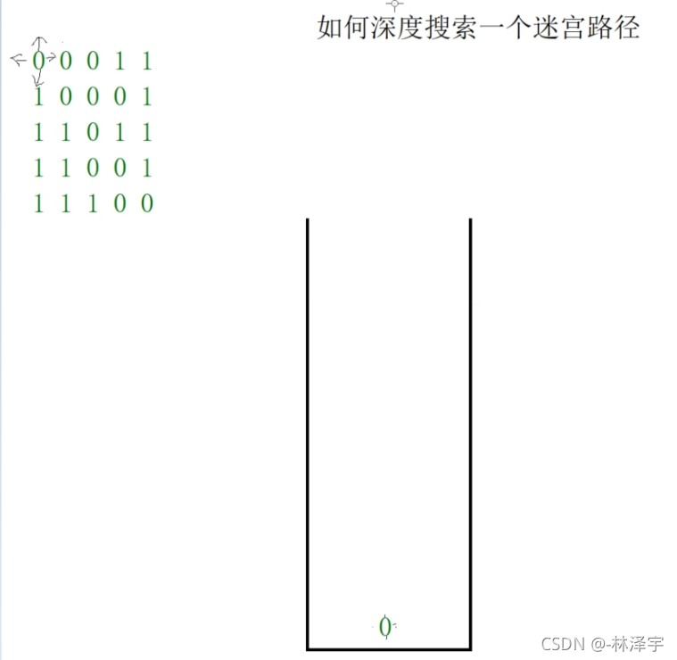

再查看栈顶元素，看它的右边能不能走，假设它的右边和下面的元素值都是1，它左边是0，又走回到入口元素了，然后它的右边是0，就这样，不断来回走了。 
**所以，我们得这么判断：** 
如果栈顶元素的右边可以走的话，我们要把当前节点的右方向改成不能走，把右边节点的左方向改成不能走。 **因为不能走回头路，而且因为路子走不通回退后也不能继续走相同的死路。** 
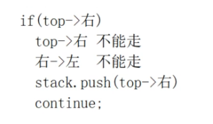

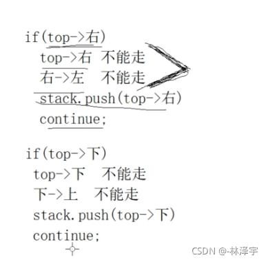

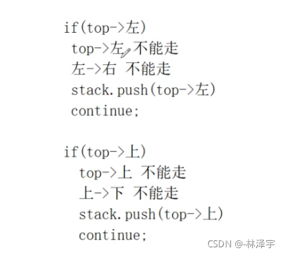

**如果栈顶元素判断完四个方向都不能走，就是到死路了，就把栈顶元素出栈。** 
**然后再取栈顶元素，进行判断，如果它的4个方向都不能走，就出栈，如果栈为空，则迷宫无通路。如果有方向能走，就继续走下去。以此类推下去。**

**但是，都要判断一下此节点是不是右下角的节点，如果是，就是找到通路了。** 
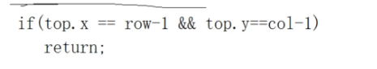

### 代码实现


```C++
#include <iostream>
#include <stack>
using namespace std;

//定义迷宫每一个节点的四个方向
const int RIGHT = 0;//右 
const int DOWN = 1;//下 
const int LEFT = 2;//左 
const int UP = 3;//上 

//迷宫每一个节点方向的数量
const int WAY_NUM = 4;

//定义节点行走状态
const int YES = 4;//当前方向可以走 
const int NO = 5;//当前方向不能走 

//迷宫
class Maze
{
public:
	//初始化迷宫，根据用户输入的行列数，生成存储迷宫路径信息的二维数组
	Maze(int row, int col)
		:_row(row)
		, _col(col)
	{
		_pMaze = new Node*[_row];//注意元素类型是Node 
		for (int i = 0; i < _row; ++i)
		{
			_pMaze[i] = new Node[_col];
		}
	}

	//初始化迷宫路径节点信息
	void initNode(int x, int y, int val)
	{
		_pMaze[x][y]._x = x;
		_pMaze[x][y]._y = y;
		_pMaze[x][y]._val = val;
		//节点四个方向默认的初始化都为不能走 
		for (int i = 0; i < WAY_NUM; ++i)
		{
			_pMaze[x][y]._state[i] = NO;
		}
	}

	//初始化迷宫0节点四个方向的行走状态信息 当前节点右下左上，如果是0，改成可以走 
	void setNodeState()
	{ //二重循环
		for (int i = 0; i < _row; ++i)
		{
			for (int j = 0; j < _col; ++j)
			{
				if (_pMaze[i][j]._val == 1)
				{
					continue;//不用调整了，因为走不到值为1的节点 
				}
				
                //j不能取到最后一列，不然就判断越界了 
				if (j < _col - 1 && _pMaze[i][j + 1]._val == 0)
				//逻辑&，是先计算左边的表达式，左边如果是false，右边就不用计算了 
				{
					_pMaze[i][j]._state[RIGHT] = YES;
				}

				if (i < _row - 1 && _pMaze[i + 1][j]._val == 0)
				{
					_pMaze[i][j]._state[DOWN] = YES;
				}
				
                //j不用取第一类，因为本身就不能走 
				if (j > 0 && _pMaze[i][j - 1]._val == 0)
				{
					_pMaze[i][j]._state[LEFT] = YES;
				}

				if (i > 0 && _pMaze[i - 1][j]._val == 0)
				{
					_pMaze[i][j]._state[UP] = YES;
				}
			}
		}
	}

	//深度搜索迷宫路径
	void searchMazePath()
	{
		if (_pMaze[0][0]._val == 1)
		{
			return;
		}
		_stack.push(_pMaze[0][0]);//左上角节点入栈 

		while (!_stack.empty())//栈不为空 
		{
			Node top = _stack.top();//取栈顶元素
			int x = top._x;//获取栈顶的x，y坐标
			int y = top._y;

			//已经找到右下角出口得迷宫路径
			if (x == _row - 1 && y == _col - 1)
			{
				return;
			}

			//往右方向寻找
			if (_pMaze[x][y]._state[RIGHT] == YES)
			{
				_pMaze[x][y]._state[RIGHT] = NO;
				_pMaze[x][y + 1]._state[LEFT] = NO;
				_stack.push(_pMaze[x][y + 1]);
				continue;
			}

			//往下方向寻找
			if (_pMaze[x][y]._state[DOWN] == YES)
			{
				_pMaze[x][y]._state[DOWN] = NO;
				_pMaze[x + 1][y]._state[UP] = NO;
				_stack.push(_pMaze[x + 1][y]);
				continue;
			}

			//往左方向寻找
			if (_pMaze[x][y]._state[LEFT] == YES)
			{
				_pMaze[x][y]._state[LEFT] = NO;
				_pMaze[x][y - 1]._state[RIGHT] = NO;
				_stack.push(_pMaze[x][y - 1]);
				continue;
			}

			//往上方向寻找
			if (_pMaze[x][y]._state[UP] == YES)
			{
				_pMaze[x][y]._state[UP] = NO;
				_pMaze[x - 1][y]._state[DOWN] = NO;
				_stack.push(_pMaze[x - 1][y]);
				continue;
			}

			_stack.pop();
		}
	}

	//打印迷宫路径搜索结果
	void showMazePath()
	{
		if (_stack.empty())
		{
			cout << "不存在一条迷宫路径！" << endl;
		}
		else
		{
			while (!_stack.empty())//栈不为空，取出节点坐标，相应值调整为* 
			{
				Node top = _stack.top();
				_pMaze[top._x][top._y]._val = '*';
				_stack.pop();
			}

			for (int i = 0; i < _row; ++i)//打印迷宫
			{
				for (int j = 0; j < _col; ++j)
				{
					if (_pMaze[i][j]._val == '*')
					{
						cout << "* ";
					}
					else
					{
						cout << _pMaze[i][j]._val << " ";
					}
				}
				cout << endl;
			}
		}
	}
private:
	//定义迷宫节点路径信息
	struct Node
	{
		int _x;//节点的横坐标 
		int _y;//节点的纵坐标 
		int _val;//节点的值
		int _state[WAY_NUM];//记录节点四个方向的状态(左右上下)
		//4个元素位置(左右上下)，存储yes或者no 
	};

	Node **_pMaze;//动态生成迷宫路径(动态开辟二维数组) 
	int _row;//迷宫的行 
	int _col;//迷宫的列 
	stack<Node> _stack;//栈结构，辅助深度搜索迷宫路径
};

int main()
{
	cout << "请输入迷宫的行列数(例如：10 10):";
	int row, col, data;
	cin >> row >> col;

	Maze maze(row, col);//创建迷宫对象

	cout << "请输入迷宫的路径信息(0表示可以走，1表示不能走):" << endl;
	for (int i = 0; i < row; ++i)//只能获取i,j和data值，节点的4个方向的行走状态还不能初始化 
	{
		for (int j = 0; j < col; ++j)
		{
			cin >> data;
			//可以初始化迷宫节点的基本信息
			maze.initNode(i, j, data);
		}
	}

	//开始设置所有节点的四个方向的状态
	maze.setNodeState();
//迷宫每一个节点的坐标，每一个值，四个方向的行走状态都初始化调整好了
	//开始从左上角搜索迷宫的路径信息了
	maze.searchMazePath();

	//打印迷宫路径搜索的结果
	maze.showMazePath();

	return 0;
}
```

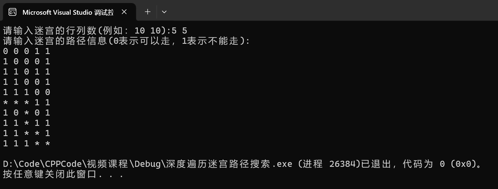

输入：

0 0 0 1 1
1 0 1 0 1
1 1 0 1 1
1 1 0 0 1
1 1 1 0 0

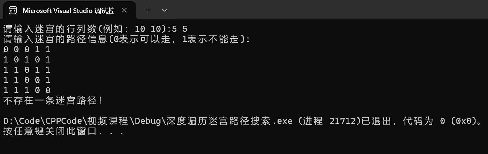

# 广度优先遍历搜索迷宫路径-求最短路径

### 寻找迷宫最短路径

**在迷宫里面怎么找最短的路径？？？** 
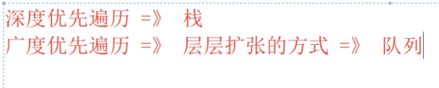

**使用广度遍历迷宫路径搜索最短路径：**

    0 1 1 1 1
    0 0 0 0 1
    0 1 1 0 1
    0 0 0 0 1
    0 1 1 1 1
    0 0 0 0 0


### 广度优先遍历求最短路径

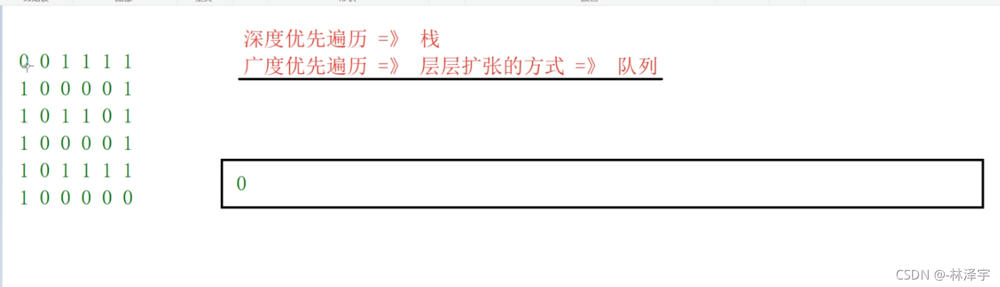

然后还要看(0,0)元素的下边，左边，上边能不能走，不能走，这个(0,0)元素看处理完了，出队。 
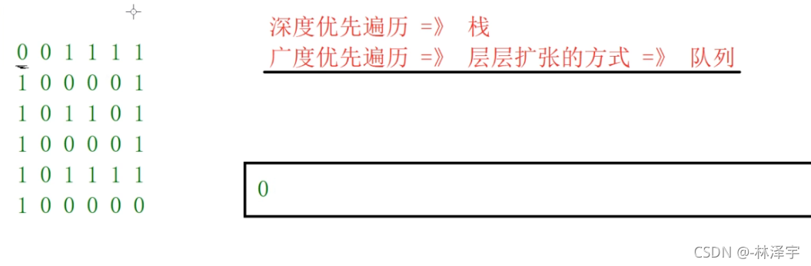

然后现在队头就是第一行的第二个元素了，然后先把它的左边，和(0,0）的右边修改为不能走，然后看这个元素右边能不能走，不能走，看下面能不能走，可以走，然后下面的元素就入队。 
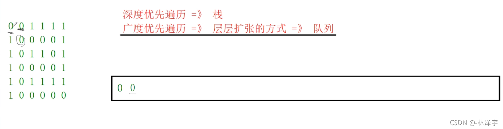

然后队头元素还要看它的左边能不能走，不能走，上面能不能走，不能走，然后处理完了，就出队。

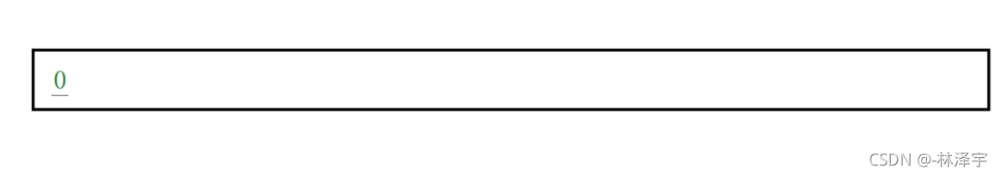

现在新元素是队列的队尾。队头即原来的元素还要继续判断，把所有的方向能走的元素都入队，现在看它的下面能不能走，可以走，下面的元素也入队， 
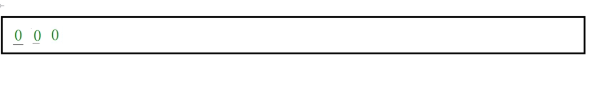

**现在的队头就是第三行的第二列元素，队尾元素就是第二行第四列的元素。** 
**以此类推下去。** 
**层层扩张** 
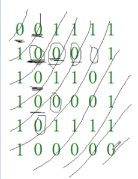 
**在队列里，当把一个节点入队以后，我们发现这个队尾元素如果就是右下角的节点，就证明迷宫通路了，走到右下角的节点了。** 
队列里记录的是所有节点的行走状态，但是前面节点已经出队了，不在队列中。 
**这个队列存在的问题的：** 
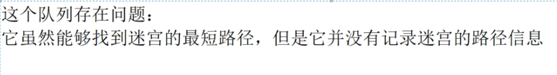

**队列只能找最短路径。但是最短路径的路径信息记录不下来。** 
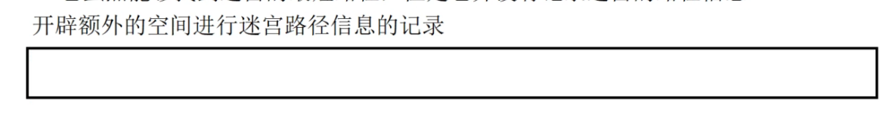 
**开辟多大的空间呢？我们只能使用最坏情况下的空间的大小去开辟。** 
**开辟 行乘以列 的大小的数组** 
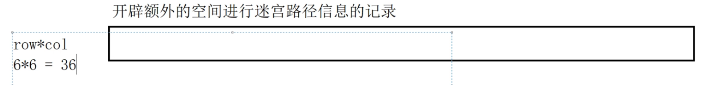 
我们到达右下角的节点的时候，就是找到出口了，我们得在迷宫路径有哪些节点，我们要记录右下角的节点是从它左边这个节点过来的，怎么记录？ 
**迷宫是二维数组，在内存上其实都是一维数组，所以我们把这个二维数组映射到下面这个一维数组当中。** 
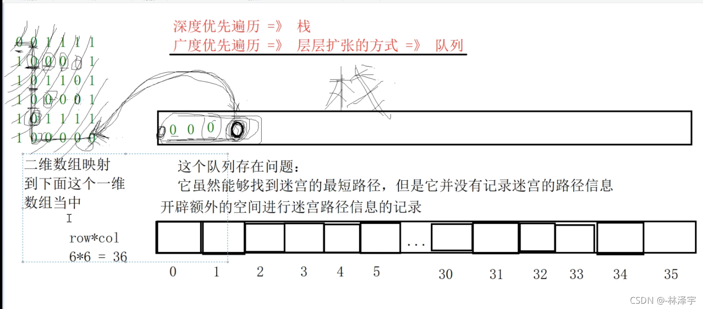  
**二维数组映射到一维数组的下标的公式如下：** 
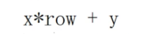 
**然后当前节点向哪个方向走，把这个信息记录一下，记在它要走到的那个节点对应的一维数组位置上，记录：当前节点是哪个节点来的。然后一直往前推，直到找到入口节点(0,0)，最短迷宫路径的路径信息就出来了。** 
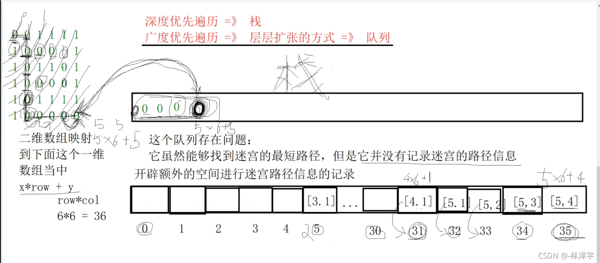

### 代码实现


```C++
#include <iostream>
#include <queue>
#include <vector>
using namespace std;

//定义方向
const int RIGHT = 0;
const int DOWN = 1;
const int LEFT = 2;
const int UP = 3;
const int WAY_NUM = 4;

//定义行走状态
const int YES = 4;
const int NO = 5;

//迷宫
class Maze
{
public:
	Maze(int row, int col)
		:_row(row)
		, _col(col)
	{
		_pMaze = new Node*[_row];//开辟迷宫二维数组 
		for (int i = 0; i < _row; ++i)
		{
			_pMaze[i] = new Node[_col];
		}

		//node._x*_row + node._y
		_pPath.resize(_row * _col);//辅助数组开辟空间 
	}

	void initNode(int x, int y, int val)//初始化为No 
	{
		_pMaze[x][y]._x = x;
		_pMaze[x][y]._y = y;
		_pMaze[x][y]._val = val;
		for (int i = 0; i < WAY_NUM; ++i)
		{
			_pMaze[x][y]._state[i] = NO;
		}
	}

	void setNodeState()//设置迷宫行走状态 
	{
		for (int i = 0; i < _row; ++i)
		{
			for (int j = 0; j < _col; ++j)
			{
				if (_pMaze[i][j]._val == 1)
				{
					continue;
				}

				if (j < _col - 1 && _pMaze[i][j + 1]._val == 0)
				{
					_pMaze[i][j]._state[RIGHT] = YES;
				}

				if (i < _row - 1 && _pMaze[i + 1][j]._val == 0)
				{
					_pMaze[i][j]._state[DOWN] = YES;
				}

				if (j > 0 && _pMaze[i][j - 1]._val == 0)
				{
					_pMaze[i][j]._state[LEFT] = YES;
				}

				if (i > 0 && _pMaze[i - 1][j]._val == 0)
				{
					_pMaze[i][j]._state[UP] = YES;
				}
			}
		}
	}

	void searchMazePath()//广度优先遍历搜索 
	{
		if (_pMaze[0][0]._val == 1)
		{
			return;
		}
		_queue.push(_pMaze[0][0]);//入口节点入队 

		while (!_queue.empty())//队列不为空 
		{
			Node front = _queue.front();//获取队头元素 
			int x = front._x;
			int y = front._y;

			//右方向
			if (_pMaze[x][y]._state[RIGHT] == YES)
			{
				_pMaze[x][y]._state[RIGHT] = NO;//右方向改为不能走
			_pMaze[x][y + 1]._state[LEFT] = NO;//右方向的左方向改为不能走
				//在辅助数组中记录一下节点的行走信息
				_pPath[x*_row + y + 1] = _pMaze[x][y];
				_queue.push(_pMaze[x][y + 1]);
				if (check(_pMaze[x][y + 1]))
					return;
			}

			//下方向
			if (_pMaze[x][y]._state[DOWN] == YES)
			{
				_pMaze[x][y]._state[DOWN] = NO;
				_pMaze[x + 1][y]._state[UP] = NO;
				_pPath[(x + 1)*_row + y] = _pMaze[x][y];
				_queue.push(_pMaze[x + 1][y]);
				if (check(_pMaze[x + 1][y]))
					return;
			}

			//左方向
			if (_pMaze[x][y]._state[LEFT] == YES)
			{
				_pMaze[x][y]._state[LEFT] = NO;
				_pMaze[x][y - 1]._state[RIGHT] = NO;
				_pPath[x*_row + y - 1] = _pMaze[x][y];
				_queue.push(_pMaze[x][y - 1]);
				if (check(_pMaze[x][y - 1]))
					return;
			}

			//上方向
			if (_pMaze[x][y]._state[UP] == YES)
			{
				_pMaze[x][y]._state[UP] = NO;
				_pMaze[x - 1][y]._state[DOWN] = NO;
				_pPath[(x - 1)*_row + y] = _pMaze[x][y];
				_queue.push(_pMaze[x - 1][y]);
				if (check(_pMaze[x - 1][y]))
					return;
			}

			//当前节点出队列
			_queue.pop();
		}
	}

	void showMazePath()//打印迷宫 
	{
		if (_queue.empty())
		{
			cout << "不存在一条迷宫路径！" << endl;
		}
		else
		{
			//回溯寻找迷宫路径节点
			int x = _row - 1;
			int y = _col - 1;
			for (;;)
			{
				_pMaze[x][y]._val = '*';
				if (x == 0 && y == 0)
					break;
				Node node = _pPath[x*_row + y];
				x = node._x;
				y = node._y;
			}

			for (int i = 0; i < _row; ++i)
			{
				for (int j = 0; j < _col; ++j)
				{
					if (_pMaze[i][j]._val == '*')
					{
						cout << "* ";
					}
					else
					{
						cout << _pMaze[i][j]._val << " ";
					}
				}
				cout << endl;
			}
		}
	}
private:
	//定义迷宫节点路径信息
	struct Node
	{
		int _x;
		int _y;
		int _val;//节点的值
		int _state[WAY_NUM];//记录节点四个方向的状态
	};

	//检查是否是右下角的迷宫出口节点
	bool check(Node &node)
	{
		return node._x == _row - 1 && node._y == _col - 1;
	}

	Node **_pMaze;//动态开辟二维数组 
	int _row;//行 
	int _col;//列 
	queue<Node> _queue;//广度遍历依赖的队列结构
	vector<Node> _pPath;//记录广度优先遍历时，节点的行走信息，辅助数组 
};

int main()
{
	cout << "请输入迷宫的行列数(例如：10 10):";
	int row, col, data;
	cin >> row >> col;

	Maze maze(row, col);//创建迷宫对象

	cout << "请输入迷宫的路径信息(0表示可以走，1表示不能走):" << endl;
	for (int i = 0; i < row; ++i)
	{
		for (int j = 0; j < col; ++j)
		{
			cin >> data;
			//可以初始化迷宫节点的基本信息
			maze.initNode(i, j, data);
		}
	}

	//开始设置所有节点的四个方向的状态
	maze.setNodeState();

	//开始从左上角搜索迷宫的路径信息了
	maze.searchMazePath();

	//打印迷宫路径搜索的结果
	maze.showMazePath();

	return 0;
}
```


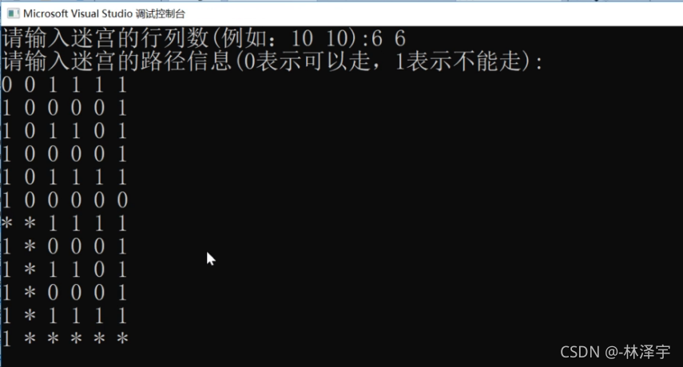

# 大数的加减法

### 大数的加减法

```C++
#include <iostream>
#include <string>
#include <algorithm>//泛型算法 
using namespace std;

//编程题目：请实现以下类的方法，完成大数的加减法
class BigInt
{
public:
	BigInt(string str) :strDigit(str) {}
private:
	string strDigit;//使用字符串存储大整数

	friend ostream& operator<<(ostream &out, const BigInt &src);
	friend BigInt operator+(const BigInt &lhs, const BigInt &rhs);
	friend BigInt operator-(const BigInt &lhs, const BigInt &rhs);
};

//打印函数
ostream& operator<<(ostream &out, const BigInt &src)
{
	out << src.strDigit;
	return out;
}
//大数加法
BigInt operator+(const BigInt &lhs, const BigInt &rhs)
{
	/*
	遍历字符串l，r，从后往前遍历
	同位置的数字相加， 进位 flag  存入一个结果当中 string result
	同时完成
	某个字符串先完成   都要考虑进位
	*/
	string result;//存储计算的结果 
	bool flag = false;//需不需要考虑进位 
	int size1 = lhs.strDigit.length() - 1;//有效字符的长度 
	int size2 = rhs.strDigit.length() - 1;//有效字符的长度 
	int i = size1, j = size2;//下标 

	for (; i >= 0 && j >= 0; --i, --j)//从后往前遍历 
	{
		int ret = lhs.strDigit[i] - '0' + rhs.strDigit[j] - '0';
		if (flag)//有没有进位 
		{
			ret += 1;
			flag = false;
		}

		if (ret >= 10)
		{
			ret %= 10;//取余数 13就是取3 
			flag = true;
		}
		result.push_back(ret + '0');//尾部添加，从个位开始计算 
	}

	//i j
	if (i >= 0)//第一个字符串还没完 
	{
		while (i >= 0)
		{
			int ret = lhs.strDigit[i] - '0';
			if (flag)
			{
				ret += 1;
				flag = false;
			}

			if (ret >= 10)
			{
				ret %= 10;
				flag = true;
			}
			result.push_back(ret + '0');
			i--;
		}
	}
	else if (j >= 0)//第二个字符串还没完 
	{
		while (j >= 0)
		{
			int ret = rhs.strDigit[j] - '0';
			if (flag)
			{
				ret += 1;
				flag = false;
			}

			if (ret >= 10)
			{
				ret %= 10;
				flag = true;
			}
			result.push_back(ret + '0');
			j--;
		}
	}

	if (flag)//进位 
	{
		result.push_back('1');
	}

	reverse(result.begin(), result.end());//翻转字符串 
	return result;//return BigInt(result);编译器生成对象返回 
}

//大数减法
BigInt operator-(const BigInt &lhs, const BigInt &rhs)
{
	/*
	找大的字符串左减数，小的左被减数
	遍历两个字符串，减法，借位（bool flag）， string result存下来
	*/
	string result;
	bool flag = false;//借位 
	bool minor = false;//最终的结果是否输出符号 

	string maxStr = lhs.strDigit;
	string minStr = rhs.strDigit;
	if (maxStr.length() < minStr.length())//确定大小字符串 
	{
		maxStr = rhs.strDigit;
		minStr = lhs.strDigit;
		minor = true;//结果要添加符号 
	}
	
	else if (maxStr.length() == minStr.length())//长度相等 
	{
		if (maxStr < minStr)//比较字符串大小 
		{
			maxStr = rhs.strDigit;
			minStr = lhs.strDigit;
			minor = true;
		}
		else if (maxStr == minStr)
		{
			return string("0");
		}
	}
	else
	{
		;
	}

	int size1 = maxStr.length() - 1;
	int size2 = minStr.length() - 1;
	int i = size1, j = size2;

	for (; i >= 0 && j >= 0; --i, --j)//从后向前，个位开始减起 
	{
		int ret = maxStr[i] - minStr[j];
		if (flag)//借位了 
		{
			ret -= 1;
			flag = false;
		}

		if (ret < 0)
		{
			ret += 10;
			flag = true;
		}
		result.push_back(ret + '0');
	}

	while (i >= 0)
	{
		int ret = maxStr[i] - '0';
		if (flag)
		{
			ret -= 1;
			flag = false;
		}

		if (ret < 0)
		{
			ret += 10;
			flag = true;
		}

		result.push_back(ret + '0');
		i--;
	}

	string retStr;
	auto it = result.rbegin();
	for (; it != result.rend(); ++it)
	{
		if (*it != '0')
		{
			break;//把0过滤掉 
		}
	}
	for (; it != result.rend(); ++it)
	{
		retStr.push_back(*it);
	}
	//100000
	if (minor)
	{
		retStr.insert(retStr.begin(), '-');
	}

	//reverse(result.begin(), result.end());
	return retStr;
}
int main()
{
	BigInt int1("9785645649886874535428765");
	BigInt int2("28937697857832167849697653231243");
	BigInt int3("9785645649886874535428765");
	//28937707643477817736572188660008
	//28937707643477817736572188660008
	cout << int1 + int2 << endl;
	//28937688072186517962823117802478
	//28937688072186517962823117802478
	cout << int1 - int2 << endl;

	BigInt int4("123");
	BigInt int5("99");
	cout << int5 - int4 << endl;

	return 0;
}
```

# 海量数据查重和求topK问题

### 海量数据的综合应用

**查重** ：数据是否有重复，以及数据重复的次数 
**topK** ：有几亿个数字。求元素的值，前K大/小，第K大/小 
**去重** ：去掉重复多次的数字，数字只保留一份。

### 海量数据的查重问题

**1.哈希表(得看有没有对内存的限制，如果没有限制，就是直接用哈希表解决）** 
比如说 50亿（5G）个整数的查重问题， 10亿个整数内存大约是1G，50亿个整数相当于内存是5G，一个整数4个字节，如果要算50亿个整数的查重问题的话，如果要用一个哈希表把这50亿个数据全部存储下来，就得花20G的内存，链式哈希表每个节点还得有一个地址域，又占4字节，所以总共需要（20G+20G=40G） 的内存空间。 
**哈希表就是空间换时间的这么一个结构。**

**2.分治思想** （如果 **对内存有要求** ，就要使用分治思想，对数据的大小进行划分） 
**第1和第2个方法思想是解决查重问题的根本出发点，就是用哈希表。**

除了哈希表，还有下面这2个方式： 
**3.Bloom Filter：布隆过滤器（查重用的，节省内存，但是有点误差）**

**4.如果是字符串类型的查重 除了哈希表，布隆过滤器，还可以使用TrieTree字典树(前缀树)**

**考察点1：** 

```C++
#include <iostream>
#include <unordered_map>//底层是哈希表
using namespace std;
int main()
{
	//#1考察基本的数据查重的思想

	const int SIZE = 10000;//假设对内存没有限制 
	int ar[SIZE] = { 0 };//全部初始化为0 
	for (int i = 0; i < SIZE; ++i)
	{
		ar[i] = rand();
	}

	//在上面SIZE的数据量当中，找出谁重复了，并且统计重复的次数 int
	unordered_map<int, int> map;//键存数据本身，值存它出现的次数 
	for (int val : ar)
	{
		map[val]++;
		//如果val这个键存在，就会返回这个键对应的值，然后对值++
		//如果val这个键不存在，就会创建这个val键值对，值初始化为0，然后对值++
	}

	for (auto pair : map)
	{
		if (pair.second > 1)//数字是重复的
		{
			cout << "数字：" << pair.first << " 重复次数:" << pair.second << endl;
		}
	}

	return 0;
}
```


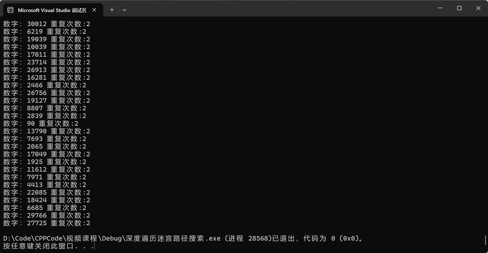

**分治法的思想** ： 把大文件划分成小文件，使得每一个小文件能够加载到内存当中，求出对应的重复的元素，把结果写入到一个存储重复元素的文件当中 

**2.有一个文件，有大量的整数，50亿个整数，内存限制400M，让你找出文件中重复的元素，重复的次数。**

50亿整数相当于5个G，5G*4 =20G = （使用哈希表乘2）=40G

**大文件 =》 小文件的个数（40G/400M = 120个小文件）** 
一个系统默认一个进程使用的文件数不超过1024 

    划分的小文件：
    data0.txt
    data1.txt
    data2.txt
    ...
    data126.txt

遍历大文件的元素，把每一个元素根据哈希映射函数，放到对应序号的小文件当中 
data % 127 = file_index 
值相同的，通过一样的哈希映射函数，肯定是放在同一个小文件当中的 
这样就从小文件里把数据全部读出来放在内存中，进行查重，求重复出现的数字进行输出或者打印或者存储到一个文件中。

**考察点3：** 
#3 a,b两个文件，里面都有10亿个整数，内存限制400M，让你求出a，b两个文件当中重复的元素有哪些？ 
**还是分治思想的策略：**

10亿个整数相当于是 -> 1G _4 = 4G_ 2=8G/400M = 27个小文件

    把a和b两个大文件，划分成个数相等的一系列(27)小文件（分治的思想）
    a1.txt   b1.txt 
    a2.txt   b2.txt
    a3.txt   b3.txt
    ...		...
    a26.txt  b26.txt

从a文件中读取数据，通过 数据%27 = file_index 放到a的其中的小文件中 
从b文件中读取数据，通过 数据%27 = file_index 放到b的其中的小文件中

**a和b两个文件中，数据相同的元素，进行哈希映射以后，肯定在相同序号的小文件当中** 
**一组一组处理。处理a1和b1，然后处理a2和b2。。。直到处理a26和b26**

### 海量数据求top k的问题

**1.求最大的/最小的前K个元素 
2.求最大的/最小的第K个元素**

10000个整数，找值前10大的元素 
**解法1.大根堆/小根堆 =》不用自己实现大根堆/小根堆， 使用优先级队列priority_queue就可以** 
先用前10个整数创建一个小根堆（最小值就在堆顶），然后遍历剩下的整数，如果整数比堆顶元素大，那么删除堆顶元素（出堆），然后再把整数入堆，遍历完所有整数，小根堆里面放的就是值最大的前10个元素了；如果找的是第k小（大根堆堆顶）或者第k大（小根堆堆顶），只需要访问堆顶一个元素就可以了 
大根堆 =》 找top K小的 
小根堆 =》 找top K大的

**解法2.快排分割函数(比优先级队列效率更高)** 
经过快排分割函数，能够在O(lgn)时间内，把小于基准数的整数调整到左边，把大于基准数的整数调整到右边，基准数（index）就可以认为是第（index+1）小的整数了 [0,(index)]就是前index+1小的整数了 
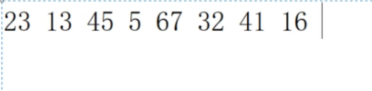

```C++
int main()
{
	/*
	求vector容器中元素值最大的前10个数字
	*/
	vector<int> vec;
	for (int i = 0; i < 100000; ++i)
	{
		vec.push_back(rand() + i);
	}

	//算法的时间复杂度：O(n)
	//定义小根堆  priority_queue<int> maxHeap;
	//优先级队列默认实现是大根堆，所以我们要用greater 
	priority_queue<int, vector<int>, greater<int>> minHeap;
	
	//先往小根堆放入10个元素
	int k = 0;
	for (; k < 10; ++k)
	{
		minHeap.push(vec[k]);
	}

	/*
	遍历剩下的元素依次和堆顶元素进行比较，如果比堆顶元素大，
	那么删除堆顶元素，把当前元素添加到小根堆中，元素遍历完成，
	堆中剩下的10个元素，就是值最大的10个元素
	*/
	for (; k < vec.size(); ++k)
	{
		if (vec[k] > minHeap.top())//O(log_2_10) 常量时间
		{
			minHeap.pop();
			minHeap.push(vec[k]);
		}
	}

	//打印结果  这个是找前K个，如果是找第K个，那么只打印堆顶元素就可以了
	while (!minHeap.empty())
	{
		cout << minHeap.top() << " ";
		minHeap.pop();
	}
	cout << endl;

	return 0;
}
```


**优先级队列的大根堆/小根堆 时间复杂度O(n)**

**快排分割解决topK 问题（效率更高：O(logn)）** 
求vector容器中元素第10小的元素值 前10小的

```C++
/*
快排分割函数，选择arr[i]号元素作为基数，把小于arr[i]的元素
调整到左边，把大于arr[i]的元素调整到右边并返回基数位置的下标
*/
int partation(vector<int> &arr, int i, int j)//划分函数//起始位置，末尾位置 
{
	int k = arr[i];
	while (i < j)
	{
		while (i < j && arr[j] >= k)//从后向前 
			j--;
		if (i < j)
			arr[i++] = arr[j];

		while (i < j && arr[i] < k)//从前往后 
			i++;
		if (i < j)
			arr[j--] = arr[i];
	}
	arr[i] = k;
	return i;
}
/*
params:
.vector<int> &arr: 存储元素的容器
.int i:数据范围的起始下标
.int j:数据范围的末尾下标
.int k:第k个元素
功能描述：通过快排分割函数递归求解第k小的数字，并返回它的值
*/
int selectNoK(vector<int> &arr, int i, int j, int k)
{
	int pos = partation(arr, i, j); 
	if (pos == k - 1)
		return pos;
	else if (pos < k - 1)
		return selectNoK(arr, pos + 1, j, k);
	else
		return selectNoK(arr, i, pos - 1, k);
}
int main()
{
	/*
	求vector容器中元素第10小的元素值  前10小的
	*/
	vector<int> vec;
	for (int i = 0; i < 100000; ++i)
	{
		vec.push_back(rand() + i);
	}

	//selectNoK返回的就是第10小的元素的值
	int pos = selectNoK(vec, 0, vec.size() - 1, 10);
	cout << vec[pos] << endl; // 第10小的
	//如果要找前10小的，[0,pos]
	
	//有一个大文件，里面放的是整数，内存限制200M，求最大的前10个
	/*
	分治的思想了
	计算一下整数文件的大小 / 200M = 要分的小文件的数量

	哈希映射  整数 % 小文件的个数 = file_index

	现在每一个小文件就可以加载到内存当中了，对每一个小文件的整数求top k元素了
	然后再合并所有小文件的结果就可以了 
	*/
	return 0;
}
```


### 海量数据查重和topK的综合应用

 查重：数据是否有重复，以及数据重复的次数 
topK：有几亿个数字。求元素的值，前K大/小，第K大/小

**题目：数据的重复次数最大/最小的前K个/第K个** 
哈希统计(map) + 堆/快排分割

### 在一组数字中 ，找出重复次数最多的前10个


```C++
//在一组数字中 ，找出重复次数最多的前10个
int main()
{
	//用vec存储要处理的数字
	vector<int> vec;
	for (int i = 0; i < 200000; ++i)
	{
		vec.push_back(rand());
	}

	//统计所有数字的重复次数,key:数字的值,value:数字重复的次数
	unordered_map<int, int> numMap;
	for (int val : vec)
	{
		/*拿val数字在map中查找，如果val不存在，numMap[val]会插入一个[val, 0]
		这么一个返回值，然后++，得到一个[val, 1]这么一组新数据
		如果val存在，numMap[val]刚好返回的是val数字对应的second重复的次数，直接++*/
		numMap[val]++;//数字重复次数的统计 
	}

	//先定义一个小根堆  最后要打印数字及其重复的次数，拿重复的次数进行比较，数字只是为了输出 
	using P = pair<int, int>;
	using FUNC = function<bool(P&, P&)>;
	using MinHeap = priority_queue<P, vector<P>, FUNC>;
	MinHeap minheap([](auto &a, auto &b)->bool {
		return a.second > b.second;//自定义小根堆元素的大小比较方式，比较的是重复的次数 
	});

	//先往堆放10个数据
	int k = 0;
	auto it = numMap.begin();

	//先从map表中读10个数据到小根堆中，建立top 10的小根堆，最小的元素在堆顶
	for (; it != numMap.end() && k < 10; ++it, ++k)
	{
		minheap.push(*it);
	}

	//把K+1到末尾的元素进行遍历，和堆顶元素比较
	for (; it != numMap.end(); ++it)
	{
		//如果map表中当前元素重复次数大于，堆顶元素的重复次数，则替换
		if (it->second > minheap.top().second)
		{
			minheap.pop();
			minheap.push(*it);
		}
	}
	//堆中剩下的就是重复次数最大的前k个
	while (!minheap.empty())
	{
		auto &pair = minheap.top();
		cout << pair.first << " : " << pair.second << endl;
		minheap.pop();
	}
	return 0;
}
```


### 有一个大文件，内存限制200M，求文件中重复次数最多的前10个

大文件 =》 小文件 
大文件里面的数据 =》 哈希映射 =》 把数据离散的放入小文件当中 
大文件划分小文件（哈希映射）+ 哈希统计 + 小根堆(小根堆需要遍历所有元素)(快排分割不用遍历所有元素，弱点是当元素本身是趋于有序的话，快排分割的效率也比较慢)
    

```C++
#include <iostream>
#include <unordered_map>
#include <vector>
#include <queue>

#include <functional>
using namespace std;

//大文件划分小文件（哈希映射）+ 哈希统计 + 小根堆(快排分割)
int main()
{
	FILE *pf1 = fopen("data.dat", "wb");
	for (int i = 0; i < 20000; ++i)
	{
		int data = rand();
		fwrite(&data, 4, 1, pf1);
	}
	fclose(pf1);

	//打开存储数据的原始文件data.dat
	FILE *pf = fopen("data.dat", "rb");
	if (pf == nullptr)
		return 0;

	//这里由于原始数据量缩小，所以这里文件划分的个数也变小了，11个小文件
	const int FILE_NO = 11;
	FILE *pfile[FILE_NO] = { nullptr };
	for (int i = 0; i < FILE_NO; ++i)
	{
		char filename[20];
		sprintf(filename, "data%d.dat", i + 1);
		pfile[i] = fopen(filename, "wb+");
	}

	//哈希映射，把大文件中的数据，映射到各个小文件当中
	int data;
	while (fread(&data, 4, 1, pf) > 0)
	{
		int findex = data % FILE_NO;
		fwrite(&data, 4, 1, pfile[findex]);
	}

	//定义一个链式哈希表
	unordered_map<int, int> numMap;
	//先定义一个小根堆
	using P = pair<int, int>;
	using FUNC = function<bool(P&, P&)>;
	using MinHeap = priority_queue<P, vector<P>, FUNC>;
	MinHeap minheap([](auto &a, auto &b)->bool {
		return a.second > b.second;//自定义小根堆元素大小比较方式
	});

	//分段求解小文件的top 10大的数字，并求出最终结果
	for (int i = 0; i < FILE_NO; ++i)
	{
		//恢复小文件的文件指针到起始位置
		fseek(pfile[i], 0, SEEK_SET);

		//这里直接统计了数字重复的次数
		while (fread(&data, 4, 1, pfile[i]) > 0)
		{
			numMap[data]++;
		}

		int k = 0;
		auto it = numMap.begin();

		//如果堆是空的，先往堆放10个数据
		if (minheap.empty())
		{
			//先从map表中读10个数据到小根堆中，建立top 10的小根堆，最小的元素在堆顶
			for (; it != numMap.end() && k < 10; ++it, ++k)
			{
				minheap.push(*it);
			}
		}

		//把K+1到末尾的元素进行遍历，和堆顶元素比较
		for (; it != numMap.end(); ++it)
		{
			//如果map表中当前元素重复次数大于，堆顶元素的重复次数，则替换
			if (it->second > minheap.top().second)
			{
				minheap.pop();
				minheap.push(*it);
			}
		}

		//清空哈希表，进行下一个小文件的数据统计
		numMap.clear();
	}

	//堆中剩下的就是重复次数最大的前k个
	while (!minheap.empty())
	{
		auto &pair = minheap.top();
		cout << pair.first << " : " << pair.second << endl;
		minheap.pop();
	}

	return 0;
}
```
