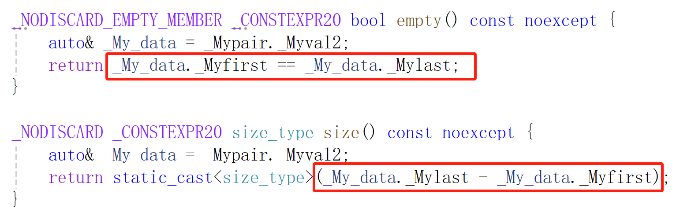
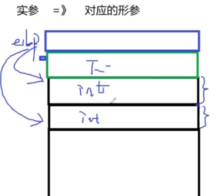
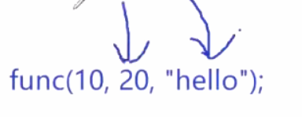
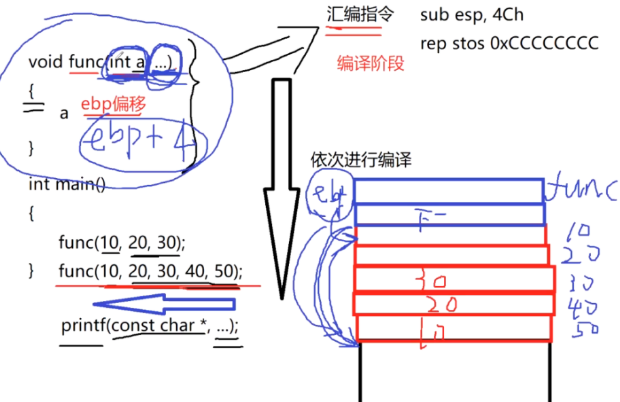
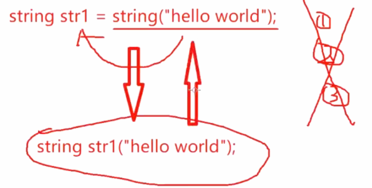
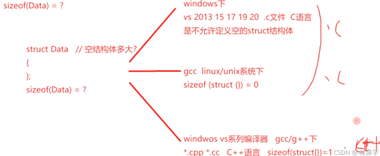
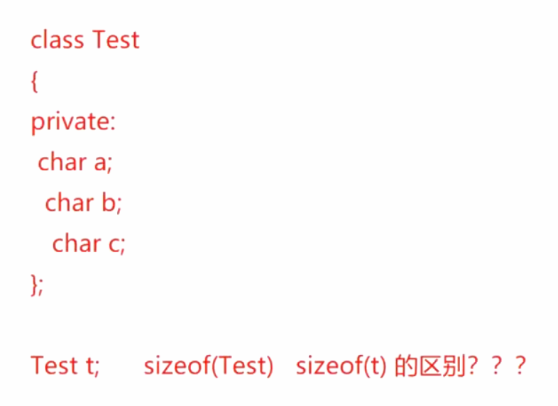

## 常见面经题目

> **重点在设计模式，智能指针，C++STL容器，继承与多态**
>
> 注意回答问题的角度，面试的技巧

## 技术面试过程中回答问题应该注意的事项

1. **当面试官提问问题后，不要着急作答，应该适当停一下，整理一下逻辑思路**
2. **对于简单问题的回答，尽量不要照本宣科，找准问题回答的角度/层次，争取简单问题回答的比较有亮点**
3. **对于相对复杂的问题，比较难以阐述的问题，思考上要花一些时间，整理好逻辑思路，以及问题大致描述的顺序。如果是现常面试(视频面试)，最好用纸笔边画边讲;如果是电话面试，回答问题的过程中，需要和面试官经常沟通，不要自顾自的滔滔不绝。**
4. **对于面试中，被提问到自己不知道的内容，被问到区块链?人工智能，机器人，大数据离线分析，用户行为分析，智能推荐?**
5. **你还有什么问题？（作答：1.我将来在公司可能接触到的技术有哪些？2.在公司，我主要用什么样的技术？我现在掌握的C/C++去公司里需不需要转型？ python/PHP或者go，甚至是JAVA？请面试官能不能对我的技术面试做一个点评？给我一些提出一些宝贵的经验。**

### vector和deque和list的区别

**底层数据结构：**

- **vector：**底层数据结构是 **动态开辟的数组** ，内存是 **连续** 的，以2倍的方式进行扩容。当我们默认定义一个`vector`时候`vector<int> vec;`，容器底层没有开辟空间，当添加元素时候才开始以`0 -> 1 -> 2 -> 4 -> 8...`这种方式进行扩容，用原来老内存上的对象在新内存的空间上进行拷贝构造，再析构老内存上的对象并释放老内存，扩容效率低下。我们可以用`reserve`函数预留空间，但注意`reserve`并未添加元素。
- **deque：**双端队列容器，底层数据结构为 **动态开辟的二维数组** 。deque的第二维是按固定大小开辟的， 内存扩容时，扩容第一维的数组空间，原来的第二维的数组放入新扩容的数组中间，即`oldsize/2`的位置
- **List：**底层数据结构为带头节点的 **双向循环链表** ，节点内存非连续，扩容就是产生新的链表节点，结点中包括`data、pre、next`与`vector`和`deque`不同，`list`允许高效地在任何位置插入和删除元素，但不支持随机访问

**使用特点：**

**vector：**

| 接口名称  | 使用方式                                                 | 功能描述                                       | 时间复杂度 |
| --------- | -------------------------------------------------------- | ---------------------------------------------- | ---------- |
| push_back | push_back(val)                                           | 从尾部添加元素，可能会导致容器扩容             | O（1）     |
| pop_back  | pop_back()                                               | 从尾部删除元素                                 | O（1）     |
| insert    | insert(iterator it, val)                                 | 从迭代器指定的位置插入元素，可能会导致容器扩容 | O（n）     |
| erase     | erase(iterator it)，erase(iterator first, iterator last) | 从迭代器指定的位置或区间删除元素               | O（n）     |

- **查询：**
  - 提供了`operator[]`重载函数，数组下标的随机访问，例如`vec[5]`，时间复杂度 **O(1)**，**随机访问：**给一个下标访问相应下标的元素。
  - `iterator`，迭代器进行遍历，一定要考虑迭代器失效问题（连续的`insert`或`erase`）
    - `find`，`for_each`等泛型算法
    - C++11提供的语法糖`foreach`，其实就是通过迭代器来实现的
- **常用方法：**
  - `reserve();`，为`vector`预留空间，只给容器底层开辟指定大小空间并不添加新的元素，**主要用来解决vector容器初始的内存使用效率低的问题**；
  - `resize();`，扩容，不仅给容器底层开辟指定大小空间，还会添加新的元素

**deque：**

| 接口名称   | 使用方式                                                 | 功能描述                             | 时间复杂度 |
| ---------- | -------------------------------------------------------- | ------------------------------------ | ---------- |
| push_back  | push_back(val)                                           | 从尾部添加元素，可能引起扩容         | O（1）     |
| pop_back   | pop_back()                                               | 从尾部删除元素，                     | O（1）     |
| push_front | push_front(val)                                          | 从首部添加元素，可能引起扩容         | O（1）     |
| pop_front  | pop_front()                                              | 从首部删除元素                       | O（1）     |
| insert     | insert(iterator it, val)                                 | 从迭代器指定的位置插入或区间插入元素 | **O（n）** |
| erase      | erase(iterator it)，erase(iterator first, iterator last) | 从迭代器指定的位置或区间删除元素     | **O（n）** |

**push_front();**，从首部添加元素，时间复杂度 **O(1)** ，vector中没有该方法，需要使用**vec.insert(vec.begin(), 20)，O(n)**

**查询：**

- 提供了`operator[]`重载函数，deque的下标随机访问，例如`vec[5]`，时间复杂度 **O(1)**

- `iterator`，迭代器进行遍历，一定要考虑迭代器失效问题（连续的`insert`或`erase`）

**list：**

| 接口名称   | 使用方式                                                 | 功能描述                                                     | 时间复杂度 |
| ---------- | -------------------------------------------------------- | ------------------------------------------------------------ | ---------- |
| push_back  | push_back(val)                                           | 从尾部添加元素，可能引起扩容                                 | O（1）     |
| pop_back   | pop_back()                                               | 从尾部删除元素                                               | O（1）     |
| push_front | push_front(val)                                          | 从头部添加元素，可能引起扩容                                 | O（1）     |
| pop_front  | pop_front()                                              | 从头部删除元素                                               | O（1）     |
| insert     | insert(iterator it, val)                                 | 从迭代器指定的位置插入元素，但是往往要考虑搜索到指定位置的时间 | O（1）     |
| erase      | erase(iterator it)，erase(iterator first, iterator last) | 从迭代器指定的位置或区间删除元素，但是往往要考虑搜索到指定位置的时间 | O（1）     |

**查询：**

- `iterator`，迭代器进行遍历，一定要考虑迭代器失效问题（连续的`insert`或`erase`）
- **注意：**list底层数据结构是链表，不连续，list没有下标随机访问。**随机访问的本质是计算地址偏移，链表每个节点在堆上随机分配，物理地址随机分布**

**splice成员方法**：链表的每个节点是单独开辟的，所以链表在移动数据，或者两个链表之间移动数据的时候，直接把节点摘下来，接入到新的位置就可以了，效率比较高。


**可能提问：vector与list之间的区别：vector和list如何选择？**

1. **底层数据结构** ：动态开辟的数组 vs 双向循环链表。那也就是数组和链表之间的区别
2. vector底层是二倍扩容的动态数组，内存连续，尾部的插入删除是**O(1)**，但是其它位置的插入删除则是**O(n)**，查找 **O(n)** ，随机访问为 **O(1)**
3. list底层是带头节点的双向循环链表，每一个节点都是独立new出来的，通过指针连接，节点内存不连续。增加删除一个结点本身为 **O(1)** ，其他节点不用改动，但查找某元素的时间为 **O(n)**
4. 那么，如果增加删除使用多，优先使用`list`；如果随机访问使用多，优先使用`vector`（vector实现了[]运算符重载函数）

**可能提问：deque底层的内存是否是连续的呢？** 
并不是！`deque`的第二维都是独立`new`出来的，也就是说，每一个第二维是连续的，并不是所有的第二维连续，可以说是 **分段连续**的，由于deque底层内存不是完全连续的，所以在中间进行插入删除时，缓存局部性不如vector，也就是没有vector效率高（vector底层空间完全连续，数据移动的效率更高）。


**vector和list的区别:**数组和链表，随机访问多(优先级队列基于vector)，list适合增加删除多。

vector底层是一个内存可以二倍扩容的数组。提供了尾部的增加push_back跟删除pop_back。都是**O(1)**的操作。vector适合于随机访问多。随机访问给一个下标访问相应下标的元素。数组内存是连续的。

list是一个循环的双向链表。每一个节点都是new出来的，节点内存不连续。所以它首尾push_back pop_back push_front跟pop_front的时间复杂度都是**O(1)**。增加一个节点或删除一个节点，都是**O(1)**的操作，其他节点不用改动。

优先级队列基于vector，因为优先级队列底层的默认实现的是一个大根堆。把节点想象成一个二叉树，父节点跟孩子节点都是通过下标的偏移来访问的。那父结点是i，左孩子是2i+1，右孩子是2i+2，元素必须得连续，连续才能够用索引（数组下标）来访问，效率非常高，随机访问是**O(1)**。

数组从中间增加一个元素，删除一个元素，是一个**O(n)**的操作，因为数组增加一个元素，增加的位置到后边的元素都要往后挪，删除一个元素。当前位置到后边的元素都要往前挪，涉及数据的移动是**O(n)**的操作。


### 迭代器是什么？为什么会出现迭代器失效的问题？

### map和unordered_map的区别是什么？


### 


### 空间配置器是什么？为什么需要空间配置器？

容器中对象的构造析构，内存的开辟释放，是通过空间配置器`allocator`实现：`allocate(内存开辟)、deallocate(内存释放)、construct(对象构造)、destroy(对象析构)`

### 重载、覆盖、多态


### C++的new和delete和C的malloc和free的区别，什么时候用new[]申请，可以用delete释放?

new和delete 本质上是一个运算符重载 operator new和operator delete， 用new[]来开辟一个数组内存的时候，相应的在释放这个内存的时候用delete []ptr; delete相对于free做两件事，1.调用析构函数；2.释放内存。

自定义类型定义的对象，而且提供了析构函数，当你用new[]，比如new Test[10]。 就一定需要匹配delete []ptr。delete[]知道要释放一个数组内存，那么他就要把这个数组的每一个对象都进行一个析构。实际上除了开辟十个test对象的内存，还需要额外的开辟四个字节的内存。用来记录对象的个数，因为new底层开辟内存是通过malloc来开辟的，malloc是按字节来开辟的。析构的时候要知道每一个对象在哪里，所以开辟的时候就要记录一下对象的个数。调用析构函数的时候，传入每一个对象内存的起始地址。需要知道这个内存上有多少个对象，它需要把ptr指针减个四才能去取到这块内存上存储的对象的个数。

其他的情况互换是没有任何问题的。

### 问题:C++this指针干什么用的?

一个类型定义了很多对象 ，这些对象有各自不同的成员变量，但是它们共享一套成员方法。成员方法里访问访问其他成员变量的时候，用this指针来区分访问的是哪个对象的成员变量。所以C++的一个类的普通成员方法被编译后，都会多出来一个this指针的形参变量，t.test() => test(&t)。把调用方法的对象的地址当做实参传进来。通过this指针就可以区分这个方法现在操作的是哪个对象的成员变量。


### 问题:C++的static关键字的作用(我从elf结构，链接过程来回答)?

**从面向过程:**static可以修饰全局变量、局部变量、函数。

全局变量和函数被static修饰以后，不加static的全局变量和函数在整个工程都可见，其他源文件只要声明一下就能用；但加了static后，这些变量和函数就只能在定义它们的那个源文件中使用了。函数在.text段，全局变量初始化在.data段，未初始化或初始化为0在.bss段。

**因为：**全局变量和函数被static修饰以后，在符号表中，符号的作用域就从global变成local了。（局部变量是存储在栈上的数据，本身不产生符号，编译器生成指令，通过栈指针ebp-偏移量来访问局部变量，现在加上static修饰局部变量，变成数据段，要产生符号了，local，对于链接而言，链接不看local的符号，只看global。）

static修饰局部变量，这个变量的内存位置就变到数据段了。初始化不为零的在data段，没有初始化或者初始化为零的在bss段。

静态局部变量因为在数据段，程序一开始就要开辟内存，但第一次运行到它的时候才进行初始化，而且只初始化一次。

**从面向对象：**static可以修饰成员变量，修饰成员方法，也可以在成员方法里边定义静态的局部变量。

修饰这个成员变量就从对象私有的变成对象所共享的。

static修饰成员方法也一样，变成对象共有的，相当于成员方法不再产生this指针，这些方法就不需要用对象再来调静态方法，直接通过类作用域调就可以了。

---

在计算机程序的执行过程中，程序会被加载到内存中。通常，程序的内存布局包括以下几个主要部分：

1. 代码段（.text）：存放程序的执行代码（即指令）。
2. 数据段（.data）：存放全局变量和静态变量等。
3. 堆（Heap）：动态分配的内存区域。
4. 栈（Stack）：用于函数调用时保存局部变量、返回地址等。

普通的局部变量是定义在函数内部的变量，它们通常存储在栈上。指令是程序代码的一部分，它们被存储在代码段（.text）中，由CPU按顺序读取并执行。

局部变量是**被指令操作的数据对象**，存储在栈上，在栈上的变量是不产生符号的，局部变量本身不产生符号，因为局部变量是通过在栈上ebp减上一个偏移量来访问的。现在static修饰了局部变量，局部变量变成一个数据段上的一个数据，它要产生符号了，但是它的符号也是一个local，对于链接而言，链接不看local的符号，只看global。

### 问题:C++的继承有什么样的好处?

==继承和组合属于类和类之间的关系：==

组合是a part of... 满足谁的一部分，继承是a kind of ...谁的一种组合的关系。

继承有2大好处：1.代码的复用。==通过一个简单的继承，就可以把基类的成员直接复用到派生类里。==

2.通过继承，在基类里面给所有派生类可以保留统一的纯虚函数接口，等待派生类进行重写，通过使用多态，可以通过基类的指针访问不同派生类对象的同名覆盖方法。

写对外的接口的时候，在接口里边放的全部是基类的指针或引用。那么以这样方式，不管这个指针传进来是哪个派生类对象，都可以访问这个派生类对象的同名覆盖方法，这个提供的这个函数接口基本上都可以做到开闭原则。添加新的功能可以添加一个额外的派生类从基类继承而来，重写基类的纯虚函数接口就可以了。

==什么是多态？就是基类指针或引用，指向从这个基类派生的不同的派生类对象，这个基类指向谁？就可以访问谁的同名覆盖方法。==

### 问题:C++的继承多态，空间配置器，vector和list的区别，map，多重map?

多态就是呈现出多种多样的状态。**多态分为:**静态多态(编译时期的多态):函数重载和模板。动态的多态(运行时期的多态):虚函数 指针/引用指向派生类对象。

函数重载：一个函数名展现出来很多不同的状态，因为它参数列表不同。那么到底调用的是哪个函数创建的版本呢？在编译时期就要确定下来了。模板：可以通过不同类型的实例化展现出来。一个类到底用什么类型实例化是在编译阶段就要确定好的。

动多态的好处是可以用统一的基类指针或者引用通过指向不同的派生类对象，访问不同派生类对象的同名覆盖方法。我们在写接口时，全部都是基类的指针或者引用就可以，不放具体的派生类。

---

**空间配置器allocator:**给容器使用的，主要作用把内存开辟和对象构造分开，把对象析构和内存释放分开。

使用new在容器底层开辟空间，不仅仅会开辟空间，还会去构造对象，在容器的析构函数里边直接用delete。也是不仅会进行对象析构还会内存释放。

为什么把它分开？初始化一个容器的时候，这个容器里应该是空的，只需要给容器底层开辟空间。底层只有内存，不应该有对象。如果在容器构造的时候直接用new。不仅仅它会给你开辟内存。还会还会给你构造很多无用的对象。

当从这个容器删除一个元素的时候，应该只是把那个对象析构掉，并不需要释放对象的内存。因为那个内存是我们容器的内存，我们容器后边可能还要用，应该只是把对象的析构函数调用一下。再比如当容器出作用域以后，需要释放一个容器的时候，需要先把容器里面有效对象元素析构一遍，在释放内存。使用delete的话直接会把容器底层所有位置都当作一个对象析构掉。所以在操作容器的过程中，我们需要有选择性的分别去开辟内存，构造对象，析构对象，所以这就是空间配置器存在的意义。allocate/deallocate-construct/destruct

---


---

map(不允许key重复的):映射表[key-value]，什么叫映射表？里面存的元素是键值对。底层实现红黑树（二叉搜索树），multimap(允许key重复的)。

红黑树的一个特点：接收的元素要进行比较，左孩子的值永远小于父节点的值，父节点的值小于右孩子的值。  主要是对key做一个元素比较，通过快速的查找key。来找到key对应的这个value。

红黑树的五个性质：

1. 每个结点要么是红色，要么是黑色
2. 根节点必须是黑色
3. 叶子节点必须是黑色
4. 对每个结点，从该结点到其叶子结点的所有路径上包含相同数目的黑结点
5. 不允许出现两个连续的红色节点

插入3种情况（最多旋转2次），删除4种情况。（最多旋转3次）。

### 问题:C++如何防止内存泄露?智能指针详述?

内存泄漏:分配的堆内存(没有名字，只能用指针来指向)没有释放，也再没有机会释放了。

堆内存没有名字，只能用指针来指向，给指针重新赋一个值，让这个指针指向其他地方去。之前开辟的这个堆内存就再也找不着了。也不可能去释放它了。所以内存就泄露了。分配堆内存没有释放。

```C++
int *p = new int[10000];
if(xxx)
return;//运行抛异常了
delete []p;
```

有时候也并不是没有释放，而是在`delete`之前程序就正常退出或者异常退出，比如开辟的这个空间在后边其实释放了，但是由于中间某些逻辑提前给return掉了。导致我们的这个资源释放代码并没有运行到，或者是我们中间这块代码运行抛异常了。也就是直接结束这个函数的栈帧。返回上一层调用去寻找处理异常的try catch代码，导致释放资源的代码也没有被执行到。都属于内存泄露。

防止内存泄露一个非常有用的方法，就是使用智能指针。

智能指针利用的就是栈上对象出作用域，自动析构的特点。在智能指针的析构函数里，就把资源给释放掉了。

unique_ptr<int> ptr(new int[10000]);

不管代码从哪return抛异常了。只要出函数栈帧，对象就要析构，在这个对象的析构函数里，就会去释放这个资源。

智能指针主要利用对象自动析构，因为析构函数本身就是编译器在指令上添加的，他不会忘的，所以析构函数只要调用，那么就可以保证资源是一定会释放。

 **不带引用计数：**auto_ptr/scoped ptr/unique_ptr 

`auto_ptr`智能指针不带引用计数，那么它处理浅拷贝的问题，是直接把前面的`auto_ptr`都置为`nullptr`，只让最后一个`auto_ptr`持有资源。

`scoped_ptr`的拷贝构造和赋值函数都私有化了，这样对象就不支持这两种操作，无法调用，从根本上杜绝了浅拷贝的发生。

`unique_ptr`有一点和`scoped_ptr`做的一样，就是禁用了拷贝构造和赋值重载函数，但是`unique_ptr`提供了带右值引用参数的拷贝构造和赋值函数，也就是说，`unique_ptr`智能指针可以通过右值引用进行拷贝构造和赋值操作。只能有一个该智能指针引用资源，因此我们在使用不带引用计数的智能指针时，优先选择`unique_ptr`

**带引用计数：**shared_ptr/weak_ptr

当允许多个智能指针指向同一个资源的时候，每一个智能指针都会给资源的引用计数加1，当一个智能指针析构时，同样会使资源的引用计数减1，这样最后一个智能指针把资源的引用计数从1减到0时，就说明该资源可以释放了，由最后一个智能指针的析构函数来处理资源的释放问题，这就是引用计数的概念。

  * `shared_ptr`： **强** 智能指针（可以改变资源的引用计数）
  * `weak_ptr`： **弱** 智能指针（不会改变资源的引用计数）

弱智能指针 观察 强智能指针，强智能指针 观察 资源（内存）

只使用强智能指针会出现循环引用的问题，`weak_ptr`弱智能指针不会改变资源的引用计数，弱智能指针只是观察对象是否活着（引用计数是否为0)，也无法使用资源。

**多线程访问共享对象的线程安全问题** ：线程A和线程B访问一个共享的对象，如果线程A正在析构这个对象的时候，线程B又要调用该共享对象的成员方法，此时可能线程A已经把对象析构完了，线程B再去访问该对象，就会发生不可预期的错误。

如果想通过`q`指针想访问A对象，需要判断A对象是否存活，如果A对象存活，调用`testA`方法没有问题；如果A对象已经析构，调用`testA`有问题！也就是说`q`访问A对象的时候，需要侦测一下A对象是否存活，需要用弱智能指针提升为强智能指针。

除了堆内存资源，智能指针还可以管理其它资源。如果管理数组资源，那么就需要用`delete[]`；如果管理文件资源，就需要关闭文件，需要自定义智能指针释放资源的方式，也就是自定义智能指针删除器。

后续又出现了使用make_shared代替new，对于`shared_ptr`来说，它的内存中包括： **指向资源的指针、指向资源引用计数的指针** ，这两块内存是单独new的，如果说资源的堆内存`new`成功了，但是引用计数对象的内存`new`失败了，此时`shared_ptr`对象生成失败，意味着不会再去调用它的析构函数，不会`delete`堆内存，这就造成了资源泄漏。使用make_shared只`new`了一块内存，将资源的堆内存和引用计数的内存开辟在一起。缺点是资源的延迟释放，无法自定义删除器。

智能指针为什么要分带引用计数和不带引用计数呢？

不带引用计数的智能指针一个指针只能管理一个资源，

这三个不带引用技术的智能指针之间又有什么区别呢？

当使用不带引用计数的智能指针的时候，应该推荐使用哪个呢？

带引用技术能干什么？好处是什么？

强弱智能指针有什么好处，为什么不只使用强智能指针呢？交叉引用问题

带引用计数的智能指针，它们是不是线程安全的？本身是一个线程安全的智能指针，而且还可以很好的解决，多线程访问共享对象的线程安全问题。

**这些问题见进阶C++智能指针章节。**

### 问题:C++如何调用C语言函数接口?

C和C++生成符号的方式不同，C和C++语言之间的API接口是无法直接调用的，C++调用C语言的函数声明必须扩在extern "C" {}

```C++
#ifdef __cp1uscplus //c生成的函数接口，可以在C和C++环境下直接使用
extern "C"
{
#endif
 int sum(int,int);//sum   sum_int_int
#ifdef _cpluscplus
}
#endif
```

#ifdef __cpluscplus 这个宏。**（c生成的函数接口，可以在C和C++环境下直接使用）**

一般在第三方库的这个头文件当中，对于函数的声明，前后都有这么一个修饰，问这是干什么的？C++编译器内置了这么一个宏cplusplus，如果是C语言编译器来编译这个代码，现在是C环境来使用的这个库的话，使用这个sum。C编译器没有这个宏。extent c不会展开。相当于直接使用C接口，如果是C++环境，extent c就会展开，告诉C++编译器这个函数是在C语言下生成，C编译器编译的，你现在b要调用的话，得按照C语言的这个符号规则来去找它。不要按照C++的符号规则去找它。

按照C语言的符号规则去找它 就是sum，按照C++的符号规则去找 就是sum_int_int，因为C++生成函数符号是和函数名还有参数列表都有关系。

没有这个宏，C编译环境下生成的这个接口的话，是无法直接使在C++编译环境下使用的。

### 问题:C++什么时候会出现访问越界?

1. 访问数组元素越界了

访问越界从本质上讲系统给我们分配了既定大小的内存，理应在这个既定大小内存之内访问，但是由于某些原因我们访问的这个内存超过了系统分配给我们的既定内存。

内存的非法访问，

1. vector容器访问 vector<int>vec; vec[2]；因为这个vector是一个空容器，里边任何元素都没有，你直接访问它的第二号位元素，那肯定是越界了。
2. string str; str[2] 这也是空字符串，字符串也提供了下标运算符的重载函数啊，那你这样访问它也越界了。
3. array  内存不可扩容的array也有下标运算符重载函数。 要访问一个太大的下标，超过它范围的下标，那它也是访问越界。
4. 字符串处理，没有添加"\0'字符，导致访问字符串的时候越界了(访问字符串是从指定的地址开始一直访问，直到'\0'才结束。)
5. 使用类型强转，让一个大类型(派生类)的指针指向一块小内存(基类对象)了，然后指针解引用，访问的内存就越界了!（通过派生类指针试图访问派生类的成员的时候，内存里根本就没有派生类的成员，肯定是内存越界访问了。）

### 问题:C++中类的初始化列表?

可以指定对象成员变量的初始化方式，尤其是指定成员对象的构造方式，(这个成员变量是个成员对象的话。那它需要指定相应的构造方式)，一定要放在类的初始化列表当中；因为放在当前类的构造函数中的话，相当于那个成员变量都已经产生过初始化过了，

成员变量的初始化顺序跟它们定义的先后顺序有关，跟它们在初始化列表里边出现的顺序无关。

### 问题:C和C++的区别?C和C++的内存分布有什么区别?

1. 引用 ：引用是一种更安全的指针。形参接收一个对象，都是用常引用来接收。

2. 函数重载 函数名相同，参数列表不同。

3. new/delete malloc/free

4. const, inline,带默认值参数的函数

5. 模板 用任何类型去实例化，就可以产生处理相应类型的代码

6. 类和对象 QOP =》 设计模式了

7. STL

8. 异常 C语言解决代码出错的这个方式是用if判断出错。然后进行相应的出错处理，C++里有try catch throw。防止资源泄露的智能指针，运算符重载：可以让对象的运算表现的和内置类型一样。

9.  user space（用户空间） kernal space（内核空间）

   reserve（保留区：从零开始，不能读，也不能写）

    .text .rodata（常量字符串）【只能读而不能写】

   .data段.bss段【数据区是可读可写】

    heap堆、stack栈（高地址有命令行参数和环境变量）

   ZONE_DMA ZONE_NORMAL（.text .rodata .data .bss heap stack 内核也要运行代码，有指令有数据） ZONE_HIGHMEM

   32位系统下内核空间默认是1g，normal有800多兆.

   系统的每一个进程都有自己的用户空间，而所有进程都共享内核空间。内核空间就是我们操作系统运行的地方

### 问题:int*const p和const int *p区别?

const修饰的是指针p本身，p不能修改，但是*p能修改。

后边这个const修饰的是*p，p是可以修改的，但是 * p是不能修改。

### 问题:malloc和new区别?

1. malloc按字节开辟内存 new底层也是通过malloc开辟内存，但是还可以提供初始化
2.  malloc开辟内存失败返回的是nullptr new开辟失败，抛出bad_alloc类型的异常。得通过捕获异常来判断内存开始失败。
3. malloc C的库函数 operator new new运算符的一个重载函数，底层调用的还是malloc。
4. malloc不管是开辟单个元素内存，还是数组的内存， 方式都一样，你只要给它括号里边指定字节大小就行。【开辟单个】new int(10); 【开辟整形数组】new int[20] () ;开辟一个堆上的20个元素的整形数组，每一个元素都初始化成零。new int[20]; **不能这样开辟** new int[20] (40);

### 问题:map&set容器的实现原理?

set集合，只存储key;map映射表，存储[key,value]键值对，底层数据结构都是**红黑树**

set直接通过key来进行元素比较，map也是通过key进行元素比较的，通过快速的查找key来找到对应的这个value

### 问题:shared ptr引用计数存在哪里?

share_ptr博客。

它有一个指向资源的指针，另外一个指向引用计数的指针，那这个指针指向的引用计数在堆上分配的。

### 问题:STL、map底层、deque底层、vector里的empty()和size()的区别、函数对象?

标准容器=》顺序容器(vector,degue,list)，
容器适配器(stack,queue,priority_queue)，关联容器(有序【set和map，底层是红黑树】和无序【unordered_set和un_ordered map，底层是链式哈希表】)

近容器 数组array，string，bitset
迭代器
泛型算法

deque底层是一个动态开辟的二维数组（每一个二维小段是连续，所有的二维是不连续的）**（记得看STL解析）**



first指向的是vector底层内存的起始地址，last指向的是最后一个有效元素的后继位置，end指向的是内存的这个末尾位置。last-first就是 元素的个数。

函数对象：拥有小括号运算符重载函数的对象。因为这样的对象使用起来和函数一模一样。test()；【test看上去是函数名，其实它不是函数，它是个对象名，实际上是对象调用了它的小括号运算符重载函数】test.operator()(); 

函数对象一般是使用在泛型算法当中 sort、find_if、priority_queue、set、map【有序的这些容  器涉及比较元素的这些容器】都会依赖一个函数对象，一般我们库里边的greater和less用的比较多

### 问题:STL中的选代器失效的问题?

**1>不同容器的迭代器是不能进行比较的**

- 迭代器是不允许一边读一遍修改的

- 当通过迭代器插入一个元素，所有迭代器就都失效了

- 当通过迭代器删除一个元素，当前删除位置都后面所有的元素的迭代器就都失效了（当前删除位置到起始位置的这个元素的叠加器还都有效，因为它没动过）

- 当通过迭代器更新容器元素以后，要及时对迭代器进行更新，insert/erase方法都会返回新位置的迭代器。

  把你的循环变量迭代器更新一下，这样就可以通过更新以后的迭代器继续来遍历。达到一边读一边修改的这样的一个目的。

### 问题:STL中哪些底层由红黑树实现?

  set multiset map multimap

红黑树的实现

### 问题:struct和class的区别?

1. 定义类的时候的区别 struct默认是公有的；class定义的类不写访问限定符是私有的。
2. 继承时，派生类 class B:A 【私有继承】struct B:A【共有继承】
3. 在C语言里边定义的这个空strcut结构体是0。struct在c++里定义的这个空类是1。
4. C++11 struct Data { int ma, int mb} Data data = {10, 20};struct的定义的对象的初始化。用class定义的话是不行
5.  class在template< class T>还可以定义模板类型参数

### 问题:vector和list的区别，还有map的底层实现?

**数组和链表的区别**，**红黑树**

### 问题:vector和数组的区别，STL的容器分类，各容器底层实现?

直接使用数组（需要考虑数组的内存够不够用？是不是需要进行扩容？需要扩容我们代码该怎么写？将会跟我们使用数组的这个业务逻辑的代码混到一块儿，看起来特别乱）， vector是数组的一个面向对象的表示，把数组封装起来了，可以自动扩容的数组。自动扩容，添加，删除，不用担心数组的内存和空间越界。

标准容器里边包含了顺序容器，容器适配器，还有关联容器。

vector: 可扩容的数组。deque: 动态开辟的一个二维数组。list : 双向循环链表。
stack (deque): 容器适配器，它没有自己的数据结构，也没有迭代器，底层操作用的还是deque的方法；把deque的方法封装了一下给外部提供了push pop 跟栈操作相关的方法；

queue (deque) priority_queue(大根堆，vector) 每一个节点是通过下标的计算来访问大根堆里每一个元素的。

set/map 红黑树

unordered_set/unordered_map 链式哈希表

### 问题:编译链接全过程?

 预编译、编译、汇编 =》 二进制可重定向obj文件 *.o 【编译阶段可能涉及代码优化，符号表生成以及obj文件的这个文件的组成格式】

链接:1合并段，符号解析 2.符号的重定向 =》 可执行文件【合并每一个obj文件里的代码段数据段，符号表进行符号解析，让所有符号引用的地方都找到符号的定义。如果没有找到符号定义，那就报错，如果找到多个符号的定义也要报错，符号只能定义一次】

符号解析完成以后，就会给符号生成这个虚拟地址。然后返回到指令上，在指令上那些没有确定符号的地址。就再填上符号分配以后分配好的这个虚拟地址，叫符号的重定项。

### 问题:初始化全局变量和未初始化全局变量有什么区别?

.data(初始化，且初始值不为0) .bss(未初始化，初始化为0)。

### 问题:堆和栈的区别?

堆内存的大小 >>栈内存

当在分配比较大的这个内存块的时候，尽量把它分到堆上，而不要定义到栈上。

在堆上通过 malloc/new 开辟内存，必须手动通过 free/delete 释放内存，否则内存泄露。

栈内存：函数的运行需要在栈上分配栈帧。
函数的局部变量都在栈上定义，通过函数栈帧的ebp指针的偏移来访问。栈内存不需要手动回收，函数运行的时候，系统给函数自动分配栈帧，函数出大括号运行完了以后，系统会自动回收函数的栈帧。

堆的分配是从低地址 =》高地址

栈的分配是从高地址 =》低地址 压栈先进栈的在栈底。

内存增长方向不同，生命周期不同，分配内存方式不同。

### 问题:构造函数和析构函数可不可以是虚函数，为什么?

构造函数不能是虚函数
析构函数可以

虚函数必须把函数地址放在虚函数表里，虚函数表是通过这个虚函数指针来访问的，虚函数指针在对象里，虚函数就是我基类指针指向了一个派生类对象，调用这个方法的时候，调用的不是基类，而是派生类。当我们派生类对象构造的时候，我们要先构造基类，如果基类的构造函数是个虚函数，就直接调用到派生类的这个构造函数了。相当于就是派生类从基类继承来的这个成员无法得到初始化了。因为你的基类构造函数就调不了啊，因为是个虚函数，派生了也实现了构造函数，所以你一定要基类的构造函数。你就调用你就调用到这个派生类的这个构造函数去了。

构造函数也不能实现成虚函数，因为构造函数调用的时候对象还不存在，对象不存在，哪来的虚函数指针，没有虚函数指针？怎么访问虚函数表呢？

Base *p = new Derive();基类指针指向堆上的一个派生类对象

delete p;

基类指针啊，指向堆上的一个派生类对象的时候，如果 基类的这个析构函数是个普通函数。由于delete p的时候，p只是一个基类指针，只调用基类的析构。派生类的析构根本调用不了。把基类的析构函数实现成虚析构函数，在delete p的时候 由于 基类的析构函数是虚析构函数，对析构函数的调用进行了一个动态绑定，访问p指向的对象是derive类型，那就访问derive类型的虚函数表，在derive类型的虚函数表里放的肯定是派生类类型的析构函数，派生类跟基类的析构函数就都可以调用到。

### 问题:构造函数和析构函数中能不能抛出异常，为什么?

**构造函数不能抛异常，对象创建失败，编译器就不会调用对象的析构函数了 。**

【**简单理解：**说不定构造函数 前面几个创建资源的代码都成功了，然后在中间抛除异常。由于构造函数抛除异常对象，创建失败了， 对象的析构函数就调用不了 ，那调用不了的话，那析构函数里边那些释放资源的代码都执行不了，涉及了资源泄露。】

**析构函数不能抛异常，后面的代码就无法得到执行了。**

主要涉及的就是一个资源释放的问题 ，因为都是跟析构函数有关。  把我们分配的这个堆内存用智能指针来代替。用智能指针来代替的好处就是不管抛不抛异常，你抛异常你是不是也出这个函数的栈帧，你出这个函数的栈帧，那栈上的已经创建好的对象 就要进行析构，智能指针析构的时候把资源释放就行了，堆内存，或者是打开的文件可以，

但有一些复杂的 资源释放，比如说数据库 ，缓存服务器 ，这些东西的释放，你用智能指针。它做不了。

你要在构造函数 写一简单的， 然后 把可能会抛异常的代码封装在  init()函数中。你再通过在调用init的地方捕获init这个函数抛出的异常。 保证对象创建是成功的，对象的析构函数就可以保证一定会 调用到了。

### 问题:宏和内联函数的区别?

处理时机不同，处理的方式不同，处理实际的不同。

#define和inline
处理时机不同，宏是预编译阶段处理的， 内联是编译阶段处理的。

处理的方式不同，宏纯粹就是字符串替换。（至于大括号跟大括号之间有没有对齐 ，或者for循环有没有包含相应的这个代码块，它都不管 ）内联函数，相当于是在函数调用点，通过函数的实参把函数代码直接展开调用。节省了函数的调用开销。

处理实际的不同，定义宏可以定义宏的名字 ，不仅仅可以表示一个 常量 ，  表达式 ，或者是一组代码，或者是一个函数。内联内联只是修饰 函数的。简单的这个常量定义的话 可以用宏。宏缺点是 不好维护 。宏定义的这个代码块多了，每一行后边是不都要加一个\，而且斜杠后边是不能空格的。

宏没办法调试，inline函数可以调试（debug版本下inline就和普通函数一样，有标准的函数调用过程） 

### 问题:局部变量存在哪里?

局部变量肯定是在栈stack上，局部变量是通过这个ebp指针偏移来访问的，局部变量不产生符号，局部变量不能叫做数据，它其实是属于 指令的一部分，

int a = 10; 对应的x86指令就是=> mov dword ptr[ebp-4], OAh

函数的运行是需要分配一个栈帧的 或者几个栈帧，在这个函数里边定义的第一个局部变量就是通过ebp- 4 来 访问的， 从ebp的四字节内存的起始地址就属于局部变量a的内存范围。

定义的静态的全局的都在数据段上或是.data或是.bss段。

用malloc或 new开辟的这个内存块 。都在堆上。

### 问题:拷贝构造函数，为什么传引用而不传值?

class Test

{

public:
Test(const Test t);

}

Test t1;

Test t2(t1); // t2.Test(t1)  =》const Test t(t1) => t.Test(t1)=》不行的，直接产生编译错误！！！

函数的传递首先要用实参来初始化形参。为了构造t2需要调用 这个拷贝构造函数，但是要调用拷贝构造函数就得先用t1拷贝构造形参t。形参构造起来 这个拷贝构造函数才能执行,实参对于形参进行拷贝构造，又得先调用拷贝构造函数，相当于t调用拷贝构造函数才能够把t生成起来，在这里实现循环了，

拷贝构造本身就是要通过一个同类型的已经存在的对象，拷贝一个同类型的新对象。构造函数调用完了，新对象才能产生，

### 问题:内联函数和普通函数的区别(从反汇编角度来回答)?

核心:函数的调用开销!

一个函数的调用，要先压实参，然后进入函数。

push ebp
mov ebp, esp
sub esp, 4ch 给当前函数开辟栈帧
rep stos 0xCCCCCCCC(windows) 给当前栈帧初始化
GCC(gcc/g++):分配完栈帧，不做任何栈初始化动作

**回顾基础课程第一讲。**

### 问题:如何实现一个不可以被继承的类?

派生类的初始化过程:基类构造=》派生类构造 基类的构造函数私有化

在继承结构中，基类里私有的成员是可以继承到派生类里，但是派生类是无法访问的，相当于派生类硬是要从基类继承来的话，派生类根本就无法构造。

### 问题:什么是纯虚函数;为什么要有纯虚函数;虚函数表放在哪里的?

纯虚函数：virtual void func() = 0; 有纯虚函数的 抽象类(不能实例化对象的，可以定义指针和引用)
为什么要有纯虚函数？

一般定义在基类里面，基类不代表任务实体，它的主要作用之一就是给所有的派生类保留统一的纯虚函数接口，让派生类进行重写，重写以后，就可以使用多态，可以使用多态用基类指针指向派生类对象调用它们的同名覆盖方法。指向哪个派生类的对象就会调用哪个方法，方便的使用多态机制，因为基类不需要实例化，它的方法也就不知道该怎么去实现!只有派生类才知道怎么去实现。

虚函数表 在 编译阶段产生的! （如果一个类有虚函数，那么在编译阶段就会给这个类产生一个张虚函数表。）运行时，加载到.rodata段，只读数据段。所有类定义的对象 ，它的这个虚函数指针指向的是同一张该类型的虚函数表。

### 问题:手写单例模式

  ```C++
  class Logger {
  public:
      static Logger& instance() {
          static Logger inst;      // C++11 起，静态局部变量初始化是线程安全的
          return inst;
      }
  
      void log(const std::string& msg) { /* ... */ }
  
      Logger(const Logger&) = delete;
      Logger& operator=(const Logger&) = delete;
      Logger(Logger&&) = delete;
      Logger& operator=(Logger&&) = delete;
  
  private:
      Logger() = default;
      ~Logger() = default;
  };
  ```

### 问题:说-下C++中的const，const与static的区别?

const定义的叫常量，它的编译方式是:编译过程中，把出现常量名字的地方，用常量的值进行替换。

```C++
const int a = 10;
int p = (int*) &a;
*p = 20;
cout << a <<" "<< *p << endl;
//*p的值打印出来是20，但是a还是10,实际上这个指针解引用，就是把a的内存给改了。
//也可以退化成不是常量
int b = 10;
const int a = b;//常变量
int *p = (int*)&a;
*p = 20;
cout<<a<<" "<<p<<endl;
//这里边现在a就不能无法替换了。
```

const还可以定义常成员方法，Test *this =>const Test *this，普通对象和常对象就都可以调用了!只能读操作，不能进行写操作。

const:全局变量，局部变量，形参变量 （const只能修饰变量。让它变作一个常量或者常变量，并没有修改它们的 作用域，它还是全局的，只不过不能作为左值了。）
static:全局变量，局部变量

const:不能修饰函数 static:可以修饰函数

它修饰函数的意思是什么呢？是让这个变量或者函数  只能是本文件可见，其实它在符号表对于这个符号的影响就是把符号的作用域从global改成local了 。所以链接的时候，链接器看不见，相当于 只有本文件可见了。

面向对象:
const:常方法/常成员变量 Test *this =>const Test *this 依赖对象

常成员变量不能被修改的变量 ，必须在构造函数的初始化列表中进行初始化，

static:静态方法/静态成员变量 Test *this =》没有了！ 不依赖于对象，通过类作用域来访问。

### 问题:四种强制类型转换?

const cast去掉我们常量属性的

static cast 类型安全安全的这个转换，对于编辑器来说，他认为类型不安全，就不会进行转换，不同的指针类型 进行类型转换，它是不允许的。C语言里边类型强转是没有问题的，指针任何类型的指针都可以随意转换。

reinterpret_cast，这个相当于就是c风格的啊c风格的这个类型转换，没有任何的安全可言，你想转什么就转什么。

dynamic_cast:支持RTTI信息识别的类型转换，把一个基类指针 转成一个相应的派生类类型指针的时候，它会识别你这个积累指针到底是不是指向的，是我相应派生类型的一个对象，

### 问题:详细解释deque的底层原理

动态开辟的二维数组
#define MAP SIZE 2
#define QUE_SIZE(T)4096/sizeof(T)

一维数组的初始大小 MAP SIZE(T*) 相当于MAP SIZE这个一维数组的每一个元素放的是不是都是一个(T *) ，用来动态开辟它的这个第二维

第二维数组默认开辟的大小就是QUE_SIZE(int)1024

双端队列 两端都有队头和队尾 两端都可以插入删除O(1)

扩容:把第一维数组按照2倍的方式进行扩容 2-4-8-16。。。 扩容以后，会把原来的第二维的数组，从新一维数组的第oldsize/2开始存放 2-44/2=2

stack queue =》 degue(内存利用率好，刚开始就有一段内存可以供使用)0-1-2-4 priority_gueue:vector

### 问题:虚函数，多态

一个类 =》 虚函数 =》 编译阶段 =》该类产生一张虚函数表 =》运行时，加载到.rodata用指针或者引用 =》 调用 虛函数 =》指针访问对象的头四个字节vfptr =》vfable中取虚函数的地址，进行动态绑定调用
多态:设计函数接口的时候，可以都是用基类的指针或者引用来接收不同的派生类对象，功能增加，删除，函数接口不需要做任何改变。设计模式是肯定离不开多态的啊，离不开多态的。好吧，都是为了做到代码的这么一个高内聚低偶合，也达到我们软件设计的这个开闭原则

### 问题:虚析构函数、智能指针

Base *p =new Derive(); 用基类指针指向 new出来的派生类对象的时候 ，当delete这个 基类指针的时候，而并没有析构派生类部分的

delete p; 析构函数的调用就是一个动态 绑定调用了

智能指针:管理资源的生命周期

### 问题:一个类，写了一个构造函数，构造函数能不能实现成虚函数？可不可以，会发生什么?

虚函数的调用 首先对象存在 ，因为虚函数调用要访问对象的前四个字节的这个vfptr，进而访问虚函数表 ，取虚函数的地址 ，构造函数没有调用完， 理论上对象还没产生，你是不能够进行动态绑定的。那么第二个就是一个派生类的构造，要先构造基类部分，你所谓的虚函数。派生类，如果把基类的虚函数重写了，那么当你调用基类的虚函数的时候呢 当你用基类指针指向派生类对象。调用基类的这个虚函数的时，这个虚函数的时候，你不是调用的基类的，而是调用派生类的， 这是多态动态绑定的原理，如果定义一个派生类对象。那么，派生类构造先要构造基类，而基类的构造是一个虚函数，那调用基类构造的时候，又构造到派生类了。无法构造一个派生类对象。

在构造函数中，是不会进行动态绑定的!构造函数本身也不能实现成虚函数!

### 问题:异常机制怎么回事儿?

 ```C++
 try
 {
 可能会抛出异常的代码  
 }
 
 catch(const string &err)
 {
 捕获相应异常类型对象，进行处理，完成后，代码继续向下运行
 }
 ```

当前代码抛出异常，如果在当前函数战争上没有找到相应的catch块儿处理它，那它就会把这个异常抛给。调用方函数啊，在调用方函数依然是这样处理的，看有没有处理该异常的开始块儿，如果没有的话，如果处理了，那么继续向下运行。如果没有呢，继续向调用方进行抛出啊，直到到main函数还没有处理，再抛给系抛给系统，系统发现当前这个进程，有一个异常未处理，那么就直接把我们这个进程abort了，他从当前函数栈帧向上。向调用方不断抛异常，抛异常对象的这么一个处理过程。

异常的栈展开!可以把代码中所有的异常抛到统一的地方进行处理!

main函数是所有函数的 祖先函数，在main函数中 统一的去处理这些异常 ，比如说记录相关的日志啊，或者是呃，调整一下相关的一些参数配置啊之类的，我们可以让代码呢继续向下运行啊，这就是异常的一个。非常好的地方。

### 问题:早绑定和晚绑定?

早绑定(静态绑定):普通函数的调用，用对象调用虚函数  call 编译阶段已经知道调用那个函数
晚绑定(动态绑定):月用指针/引用调用虚函数的时候，都是动态绑定 p->vfptr->vftable->virtual addr =>   call eax 

编译阶段只能生成这样的指令，  从指针访问的对象的前四个字节取vfp tr ，再从vfp tr里边儿访问vf table，再从vf table里边  去取我们虚函数的addr ，最后 把addr放到寄存器里边，最后再call寄存器，那么也就是说在编译阶段是不知道最终调用的是什么函数的，因为 最终从虚函数表取的是哪个虚函数的地址，调用的就是那个虚函数 。

### 问题:栈和堆的大小，申请一个整形数组最大可以达到多少(Iinux和windows)

### 问题:指针和引用的区别(反汇编分析) 

指针可以不初始化，引用必须初始化，
指针有一级指针，二级指针，多级指针，引用只能有一级引用。又没有多级引用，

```C++
int a = 10;
int *p = &a;把a的地址放到寄存器，然后move dword ptr 
    lea eax, [a] mov dword ptr[ebp-8], eax
    lea eax, [a] moy dword ptr[ebp-0Ch], eax
int &b = a;

这两行源代码生成的汇编指令 ，是一模一样， 没有任何区别的， 都是 先把a的内存拿出来放到寄存器，再把寄存器的值 放到 底层的一个四字节的指针变量里。
*p = 20;
mov eax, dword ptrlebp-8] mov dword ptr[eax], 14H
b = 20;
mov eax, dword ptr[ebp-0ch]
mov dword ptr[eax], 14H
通过这个指针减引用。然后通过引用变量改变它所引用内存的值，这两个呢唉，生成的指令呢也都是一样的指令.
    先从呢，底层四字节的指针里边儿拿出来，它所指向或它所引用内存的地址，再把20呢写到那个地址所表示的四字节的内存里边。
```

引用是一种更安全的指针，因为引用最起码是需要初始化的。我使用一个引用，
我可以保证它肯定引用一块内存，但是使用指针，它是不是野指针？那我就不知道了。

### 问题:智能指针交叉引用问题怎么解决?

 定义对象的时候用强智能指针shared_ptr，而引用对象的时候用弱智能指针weak_ptr，强智能指针是可以引起我们对象引用技术的改变的，而弱智能指针不会。

当通过weak ptr访问对象成员时，需要先调用weak ptr的lock提升方法，把weak ptr提升成shared ptr强智能指针，再进行对象成员调用。

所谓的提升，就是看我们对象的引用技术还有没有？引用技术如果为零了，那就肯定提升失败了，因为对象呢，已经被吸购了啊，引用技术如果不为零，那就说明对象还在，那就能够提升成功

### 问题:重载的底层实现，虚函数的底层实现

重载，因为C++生成函数符号，是依赖函数名字+参数列表编译到函数调用点时，根据函数名字和传入的实参(个数和类型)，和某一个函数重载匹配的话，那么就直接调用相应的函数重载版本(静态的多态，都是在编译阶段处理的)

虚函数 =》 对象 指针/引|用 =》 vfptr => yftable =>虚函数的地址 call eaX

### `union`（联合体）和 `struct`（结构体）的区别？

**Struct**: 编译器为结构体中的**每个成员**分配**独立且连续**的内存空间。

**Union**: 编译器为联合体分配**一块内存**，这块内存的大小足以容纳其**最大的成员**（同样考虑对齐）。**所有成员都从这块内存的起始地址开始存储**。

**Struct**: 给一个成员赋值**不会影响**其他成员的值。所有成员的值可以同时存在且独立。

**Union**: 给**任何一个成员**赋值，都会**覆盖**这块共享内存中之前存储的任何值（无论之前存储的是哪个成员的值）。读取一个成员时，你得到的是**最后一次写入**到共享内存中的值（无论写入的是哪个成员）。**同时只有一个成员的值是有效的**。

**Enum (枚举)：为整数赋予名字**，创建一组命名的整数常量，使代码更清晰。

## 2019面经

沟通的方式，谈论这个技术内容的一些技巧，

### 问题:讲一下map的底层实现，avl和rbtree有什么区别?

红黑树 avl(平衡树 维护平衡 旋转)和rbtree(不是一颗平衡树)

### 问题:你常用哪些STL容器?

如上

### 问题:假如map的键是类类型，那么map底层是如何调整的?

红黑树 [key,value]，对key进行比较的，less< key 类类型
operator<运算符的重载函数

 map默认用的是less，也就是在比较小于那也就是说如果我们k用的是类类型那么一定要给这个类型提供 小于运算符运算符的重载函数。

### 问题:内存泄漏你会怎么处理?讲讲智能指针

防止这个内存泄露。我们最好啊。是使用智能指针来这个智能的来管理这个资源。

程序运行过程中存在这个内存泄露存在这个内存泄露。 会怎么去处理？也就是怎么定位内存泄漏的？通过工具进行这个检测。

### 问题:如果让你实现一个内存池，要求获取资源和插入资源时间花费0(1)，你会怎么设计?

直接照搬sgi stl 2级空间配置器的内存池的 实现就可以了， 获取资源跟插入资源的时间花费都是o1，那个内存池长得像哈希表，

### 问题:编写一个C/C++程序你个人感觉需要注意一些什么?

首先要分析需求，是不是啊？你不可能说是一边看需求一边写代码，对吧？这样的代码呢？可维护性不好。啊，需求做任意一些的改动源码呢，就要大量的进行改动，分析完了以后呢，要进行这个概要设计跟详细设计，对不对？简单来说就是。看一看我们都有哪些功能点要实现啊，这些功能点呢，可以分成哪些模块儿啊，模块儿与模块儿之间有没有共性的一些东西，那可以指导我们使用这个指指导我们在用c跟CA加编编程的时候呢？如何设计一些基础的啊？基础的，
比如说函数接口啊嗯，基础的这个类，为了让我们的这个后边的这个。程序的这个扩展性更好一点，当然，在分析这个具体的问题的时候呢，包括我们设计的函数接口类，要考虑呢呃，那么。是否需要考虑线程安全的问题呀？是不是啊？是否需要在多线程，多线程环境下运行啊？为了考虑代码的可一致性是直接调用我们当前系统的这个线程。接口呢，还是使用我们语言级别的，是不是线程。

那如果碰见合适的这个分析需求的时候，
碰见合适的场景哦，我们也在用CA加代码写的时候还可以。借助现有的一些代码框架，比如说设计模式。

让你用c跟CA加去解决的话，我们应该做些什么？肯定是先从需求分析开始。
对不对？然后考虑我们都要创建什么样的类啊？都要封装什么样的函数接口对吧？是一个模块呢，还是多个模块啊？模块与模块之间 ，需要通过哪些函数接口进行 调用。

需不需要注意现场安全，设不设计多线程，能不能直接使用我们现有的代码框架设计模式，

### 问题:讲一下红黑树以及它的特性

红黑树以及它的这个特性啊。红黑树的这个五种特性啊呃根节点是黑色啊。呃，每个节点都要有颜色，黑色或者是红色，第三个是它的叶子，节点是黑色，第四个是不能出现连续的红色节点。第五个是。根节点到叶子节点的任意一个路径上，黑色节点的数量是相同的啊，

### 问题:设计模式知道哪些?具体讲一下

单例工厂适配器

### 问题:C++设计模式-工厂模式 


### 问题:讲一下智能指针


### 问题:C++中vector和list的区别，stack和queue的底层实现，智能指针，C++11特性，迭代器失效的原因以及如何解决?


stack和queue的底层实现:容器适配器，底层没有实现任何数据结构，底层直接依赖一个现有的顺序容器。

auto ，for each ， 还有我们的兰布达表达式 还有这个线程类 ，  绑定器，函数对象，

### 问题:输出单例模式


### 问题:智能指针


### 问题:解释动多态?


### 问题:为什么析构函数要是现成虚析构函数?


### 问题:如果构造函数里面抛出异常会发生什么?内存泄漏?怎么解决?

构造函数发生异常。 会发生什么？那就是对象没构造成功吧，对象没有构造成功，析构函数就不会调用那么析构函数里边儿写的那些资源的释放的代码就都不会得到执行。当然，就资源泄露了对吧？内存泄露属于资源泄露的一种，怎么解决？那我们采用智能指针 ，只要开辟成功的资源，那么智能指针对象析构的时候，就一定会去释放资源，构造函数抛异常 导致我们析构无法调用资源泄露。

```C++
class Test
public:
Test()
{
    pl = new int;
	p2 = new int;
	throw "xxxx";抛了一个字，符串异常，对象没构建成功。
}
~Test()
{
    delete p1;
    delete p2;
}
private:
int *p1;
int *p2;
};
Test t;对象没构建成功析构函数是不会去调用的。那么析构函数这里边呢？这两块儿对内存呢，就全部被丢失了.
处理方式：
class Test
public:
Test()
{
    pl = new int;
	p2 = new int;
	throw "xxxx";抛了一个字，符串异常，对象没构建成功。
}
~Test()
{
}
private:
unique_ptr<int> *p1;
unique_ptr<int> *p2;
};    
Test t;
```

### **3、函数调用参数是怎么传递的？**

函数调用，参数压栈：
从右向左，先压右边的实参入栈，压完实参后，就该压下一行指令的地址，然后把调用方（main函数的栈底地址ebp）压过来，然后访问形参，然后通过ebp指针的偏移访问相应的实参
ebp+4，访问到第一个实参，ebp+8访问到第二个实参


### **4、为什么函数调用的参数要从右向左压栈**



先压”hello“的地址，在压20的地址，在压10的地址。

C C++要支持可变惨函数，所以要从右向左压栈。

我们写可变参，最前面左边得有一个参数，后面才能加…表示可变参

```C++
void func(int a,...)
{
    
}
int main()
{
    func(10,20,30);
    func(10,20,30,40,50);
}
```

**这两次func调用，第一个参数10都是传给a，后面传几个参数无所谓，是可变的，类型不一样也可以。**
我们的printf就是一个可变参：

```C++
printf(const char*,...);
```

第一个参数（格式化字符串）里面有多少个%d,%c等等，后面就写对应的参数个数。
我们知道，代码是从上到下依次进行编译的，在编译到func函数的时候，高级源代码都要编译成汇编指令，这个汇编指令一进入这个函数的左括号{，执行push ebp，把调用方main函数的栈底地址ebp压到当前函数栈的栈底，也就是func函数的栈底，然后执行mov ebp esp，把esp的值赋给ebp，让ebp刚才指向main函数的栈底，现在指向func函数的栈底，
然后sub esp,4ch 就是给func函数开辟栈帧，调用一个函数就开辟栈帧
在VS下，还有一个指令操作：rep stos 0xCCCCCCC，gcc下是没有这个操作的。
然后，我们这个func函数里面，有这个参数，它要访问这个参数a，
假如说这个参数是从左向右压栈的，10就是在最底，然后20,30,40，50
但是指令是在编译时生成好的，它运行的时候是不会自己选择的，怎么样生成的指令，怎么样运行就可以了，关键是func函数在编译的时候，取参数，取a是怎么取的？栈上取这个局部变量都是通过ebp的偏移来取的，func函数在编译的时候，根本就没有办法访问到这个a了，因为现在是从左向右压的，第一个参数肯定是在栈底，后面的参数在栈顶，紧接着压下一行指令地址和func函数的ebp，func函数在编译阶段，不知道它会有多少个参数，不知道用户传几个参数，根本不知道，它在访问a，不知道把ebp偏移多少，所以是没有办法生成指令去访问它的参数的，因为编译阶段不知道用户会传多少个参数。
所以它必须把左边的这个已知的参数必须放在离ebp最近的地方，反着压！
已知的这个参数就在栈顶了，所以它就永远知道ebp+4就是这个已知的参数的内存！！！！在以后运行的时候，不管用户在这里传的是多少个参数，就是可以通过ebp+4来访问第一个参数，然后接着往下访问，就是可变参的参数了，在编译阶段，就可以给可变参数生成指令了！！！它生成指令就可以把下面的所有参数都可以访问完了


所以说，从右向左压参数，意味着第一个参数是最后压的，最后压的肯定在栈顶，最后在func函数生成指令的时候，ebp+4就可以访问到这个第一个参数a了。
如果编译的时候是从左向右压的，意味着左边的先压的在栈底，右边先压的在栈顶，在编译阶段，不知道参数有多少个，怎么通过ebp偏移访问第一个参数a呢？没有办法访问啊！
也就是说，从右向左压，才能合理的确定参数的个数。

我们看printf，通过可以访问第一个参数：格式化字符串，能访问这第1个格式化字符串，就根据里面的%d%c之类的就可以往下继续取其他的参数了。
如果看到有一个%d，就向下访问，如果又看到有一个%c，也继续向下访问，直到访问到这个格式化字符串的\0了，停止向下访问。

### 6、有一个函数

```C++
string fun(string sl, string s2)
{
    string tmp=sl+s2;
    return tmp;
}
```

主函数里面通过:strings=fun(s1，s2);调用，依照代码执行顺序分析一下调用了string对象什么构造函数和顺序 以及析构函数的调用顺序。

参数是从左向右压的，从实参到形参，我们看到这是既没有用指针传递，也没有用引用传递，所以都是要生成新的string对象，实参s2,s1到形参s2,s1，调用的是拷贝构造函数，1、这里调用2次拷贝构造函数，先构造s2，然后构造s1
string tmp=s1+s2;这里s1+s2会产生一个新的string对象，然后拿这个新的string对象拷贝构造tmp对象。
然后tmp对象返回，通过C++11的优化，调用右值的拷贝构造函数（移动构造函数），拿tmp直接拷贝构造main函数的s对象
然后出fun的右}，析构tmp对象，然后析构s1, 然后析构s2，最后析构s

任意的C++编译器都会去做优化，什么优化??? 如果用临时对象拷贝构造新对象，那么临时对象就不产生了，直接构造新对象就行了

```C++
string str1 = string("hello world");
```



```C++
string s;
s = func(s1,s2);
```

s先定义出来了，这种就不叫拷贝构造了，这个s对象已经存在，前面没有类型代表已经存在，没有调用拷贝构造，临时对象就要生成，这就叫赋值，临时对象要存在才能赋值。

如果我fun函数内写成return s1+ s2 有什么区别?

**现在是s1+s2的结果直接拷贝构造主函数的s对象了。省去了刚才tmp的拷贝构造和析构函数的调用。**

1、参数传对象按引用传递2、返回对象时，直接返回结果，不要先定义再返回

### 7、一个结构体里面定义了一个char和double，它的内存布局？  

```C++
struct Data
{
    char a;
    double b;
};
sizeof(Data)?
```

**答案是16**
C语言的结构体和C++的类都是要内存对齐，方式是一样的
第一行：char占1个字节，剩下的7个字节补位的
第二行的8个字节就是double
**我们看下面的：**

```C++
struct Data
{
    char a;
};
sizeof(Data)?
```

**找里面最长的分量，就是1，按1个字节对其**

**我们看看下面这个：**

```C++
struct Data
{
    char a;
    char b;
    char c;
};
sizeof(Data)?
```

**都是char，最长的分量是1个字节，按1个字节对齐，总共3**

**空结构体多大？**

```C++
struct Data
{
};
sizeof(Data)?
```



为什么在gcc下，C语言的空结构体大小是0，C++的空结构体大小是1？
1、空结构体，不需要访问什么东西，啥也改干了，所以C语言中，定义空结构体的大小是0
2、而在C++中，struct定义的东西不叫变量，叫做对象。对象和变量的本质区别是：定义一个变量只需要内存就可以了，但是C++生成对象时得先有内存，然后还得要有构造，构造函数编译的时候会生成this指针，所以，要生成对象，必须要有一块内存，给this传地址，才能调用构造，创建对象。
所以创建一个空的结构体（空类），大小是1，因为内存的最小单位是字节，就是1个字节大小。
构造函数只有知道内存地址，才会去这个内存地址上做构造对象。

**类型本身是不占内存的**

**只有空结构体大小是1，或者结构体中只有一个char类型的变量，大小是1
其他的都是按照变量大小内存对齐**

```C++
struct Data1{};
struct Data2
{
    char a;
};
struct Data3 : public Data1
{ 
};
sizeof(Data3)是多大？
```

**基类和派生类都是空类，但是只是继承关系，Data3就是空类，大小就是1**

```C++
struct Data3 : public virtual Data1
{
};
```

**在32位系统下，如果是空类虚继承空类，多了一个vbptr指针，所以大小是4字节。64位系统下是8字节**

```C++
struct Data1
{
    virtual void func(){}
};
struct Data3 : public virtual Data1
{
};
```

**如果基类中有虚方法，就会产生虚函数表，则派生类虚继承这个基类，又多了一个vfptr，所以此时，大小是8字节。**

**不管多少个虚函数，都是只有一个vfptr哦，影响的只是虚函数表vftable的大小而已，不影响对象的大小，都是只有一个vfptr**
