## 面试经验

### 系统复习

> **不知道怎么复习、复习一段时间后到达瓶颈**

- 语言- C++ 语言的类对象、继承和多态（虚函数表）、STL六大组件（空间配置器，容器，迭代器，仿函数，算法）、allocator、智能指针、设计模式（单例模式、工厂模式、适配器模式、代理模式、装饰器模式）、编译原理（一个可执行文件到真正运行起来中间发生了那些事情？Obj文件长什么样？可执行文件长什么样？编译、链接）
- 数据结构 - 数组、链表、栈、队列、BST、AVL、红黑树、排序算法、经典五大算法、leetcode刷题 
- 操作系统 - 操作系统原理包括进程以及通信、线程以及通信、内存管理、性能分析命令，Linux多进程、多线程和高并发网络编程、协议 
- 项目 - 涉及网络高并发、集群、分布式、微服务、服务器中间件（缓存，消息队列），数据库 
- 开源 - 网络库muduo、libevent，缓存redis、memcached，nginx等 
- 收集面经 - 复习一段时间后到达瓶颈，可以根据面经上的问题，以问题来驱动学习，提升各学科知识综合解决问题的能力

### 准备简历

- 简历模板 - 下载合适的简历模板  **注意不同岗位不同描述：岗位名称** 
- **注意：简历不要有错别字，语句要通顺。**
- 简历内容 - 个人简介、IT技能、项目经验、自我评价、在校经历
  - 侧重点 - 简历的内容描述需要花心思，能够真实体现自身的学习水平，切忌流水描述（不要描述业务），使得简历容易筛掉
- 链接一下GitHub地址。

### 投递简历

> **积极投递简历，快速累积面试经验，重组简历描述薄弱处，熟悉简历上能被提问的问题**

- 内推 
- 论坛 
- 校招群 
- 公众号 
- 公司官网

### 面试过程

- **笔试** - 系统的复习、刷面经、公司往年的笔试题、leetcode数据结构算法题 
- **电话面试**  
- **现场面试**  注意沟通技巧，你会照本宣科，别人也会，难问题能够回答出来，简单问题，角度不同。很多问题你可以说上一部分，然后再提出一部分问一下面试官是否需要继续说。

- **技术面最后的问题** - 对自己面试的表现进行点评，尤其是自己技术栈的薄弱环节，面试完及时总结  
- **HR面的问题** - 多表达积极向上的情绪，个人职业短期、中期规划、期望薪资（先去网上看对硕士的起薪是多少，然后根据你自己面试的情况来进行浮动，HR只是确定你对自己价值的认可，薪资早已定好，浮动不大）学习经历，家庭情况。

你为什么要来我们公司呢？我认可公司的企业文化，价值观很好，品牌影响力很好。

**职业规划：**短期来说，我进公司以后，我希望在一年内把我负责的模块完完全全了解，从产品的角度，从业务的角度，从技术栈的角度我都要深度探索，这样我的成长才会更上一层楼，然后三年内我希望通过自己的努力，成为项目组的核心，早日带上新人，同时把自己的评级提升上去。

**注意：**面试官问完一个问题，思考十几秒，把回答问题的角度，逻辑思路整理一下。深呼吸缓和情绪，整理自己对这个问题的思路。

你还有什么问题呢？技术面就问跟技术相关的。

**请您对我的今天的面试做一个点评可以吗？可以给我关于技术栈上的一些建议吗？ 公司需要的技术栈的深度和广度和我在学校自己学习的肯定不一样，这样未来我真正投入工作了有所准备。**

谢谢您，我下来针对我薄弱的地方继续强化，希望自身的能力能够匹配公司的要求。

### 面试总结

面试某一个公司，在网上查一下它的面试题，面经题分享。

- **输出面经** - 及时总结上一场面试的问题（把回答OK的标识出来，回答不满意的，当时没想出来的都标识出来，把答案列出来，这样已经回答的问题，是否还有其他可回答的，回答不好的问题，以后遇到这样的问题的话，不要着急，注意思考的角度，注意表达的角度，），快速积累面试技术经验
- **问题分类** - 通过问题分类（语言类，操作系统类，数据结构类，协议类，智力题类），找到技术薄弱环节，重点补齐。每一次面试是下一场面试，面完以后要有提升。

### 自我介绍

尊敬的面试官您好，我是但月森，今年24岁，我的求职意向是C++软件开发，我目前是西南交通大学**-**信息与通信工程专业的一名在读硕士，在校园经历方面，我以第一作者身份发表了一篇关于目标检测和信号识别相结合的**EI**论文。同时我担任信息学院人工智能课程本科生和研究生的课程助教。

实习经历上，在研一研二的时候，我主动申请日常实习，过去一年多在成都华日通讯公司担任算法工程师，并获得“优秀实习生”称号。这段经历让我深入参与了深度学习项目的全流程，从前期立项、算法测试到项目结题。**独立负责了基于目标检测的无线电信号识别和基于CNN的干扰信号分类算法的设计、工程化实现，（主要是使用C++编写深度学习推理算法并封装动态库提供给客户端软件）**。我熟练在**Windows、Linux、麒麟OS及嵌入式平台（如RK3588）上部署深度学习模型**，擅长**ONNXruntime、OpenVINO、TensorRT等推理框架**，其中TensorRT部署的时候，在WSL上面利用**CUDA编写核函数，实现了YOLO C++ CUDA的推理算法，并将推理时间控制在7ms内**。在RK3588开发板上，为了利用3核NPU加速推理，我还深入实践了**多线程编程**，该算法部署在公司的客户端软件上，作为产品卖出，为公司在人工智能算法上实现了突破。

同时，我也具备扎实的**C++后端开发能力**。我的第一个C++项目是基于**muduo和Protobuf的轻量级RPC聊天服务器项目**，学习这个项目的目的是想系统学习高性能网络库，分布式。主要特点有采用 **Protobuf** 实现高效序列化和自定义通信协议。集成 **Zookeeper** 作为注册中心，实现服务注册、发现和服务状态动态感知。同时我为了强化自己的能力我在里面引入了mysql连接池，sqlite本地存储聊天信息，redis作为缓存，此外，为了强化C++、网络编程的能力，我系统学习了muduo网络库的源码。

我对C++后台开发非常感兴趣，接触的时间比较长，我的技术栈集中在**C++、Linux网络编程、Python、PyTorch深度学习、CUDA、MySQL/Redis及Linux系统编程**。我具备良好的问题解决能力和团队协作精神，具备良好的英文文档阅读能力，期望能在贵司发挥所长。

以上就是我的自我介绍，谢谢您的聆听。

## 项目问题总结

你在这个项目中，你遇到过什么问题？ 你是怎么思考的？怎么排查的？以及最终你的解决这个问题的方法思路是什么？

你学到了什么东西？

你为什么要实现这个项目？你的项目在那些场景下可以使用？

面试流程是从项目开始问，从项目问你的实际操作，问你遇到的问题，问你的操作系统、数据结构语言。

后台项目所用的一些中间件，接触到了，没接触到（说一下大概会做什么事情）

什么样的项目能够写到简历上？通过这个项目学到了很多技术，包括一些大的技术栈，小的细节设计对你有一些启发。

比如：单例模式，多态。

**网络高性能，锁，死锁。**

项目主要考虑：

1. 项目名称、开发工具、开发环境、项目描述、项目问题、问题分析及解决方案。

**常见错误：**头文件没包含，名字写错了，没有提前声明，库的链接问题。

**当你遇到错误的时候，你是怎么定位分析的？**

**C++程序常见错误总结：**C++程序错误类型一般分为三类：第一类编译错误，g++ -c的时候出错，这种错误一般是由语法错误造成的，常见的：比如头文件没包含，名字写错了，没有提前声明，漏了分号括号，大小写等等之类的。这种错误的解决方式是通过报错提醒，编译器会指出在哪一行出错，修改即可。第二类是链接错误，报错的信息主要是symbols not found，常见的错误有符号未定义，符号重定义，类成员函数未定义，在C++中使用C语言不当，静态库或动态库未链接上等，常见的解决方法是看那个符号没链接上，然后在顺腾摸瓜去查找错误的原因。第三类错误是运行时错误，成功的编译了，成功了链接了，但是可执行程序的时候出错了。这个时候我首先会看日志输出，看 __ LINE __  定位到哪一行，**Segmentation fault**主要是检查有没有内存越界访问，有没有内存泄漏等。还是解决不了我就会进行调试，GDB调试主要有三种。

gdb有三种调试，第一种是调试一个新程序，第二种调试正在运行的这个进程，第三个就是调试Core Dump程序挂掉以后，我们调试这个堆转储文件。主要通过gdb attach到正在运行的进程，通过info threads，thread tid，bt等命令查看各个线程的调用堆栈信息，结合项目代码，定位到发生死锁的代码片段，分析死锁问题发生的原因。

**你阅读过那些源码？你阅读的思路是什么？**

如何去查看这个源码，如何去分析这个源码。如何去归纳出源码中涉及的一些重要的组件，然后理清楚组件之间的一些重要的关系和交互，组件里边重要的一些内容成员。不管是什么系统，它里边肯定涉及很多模块，每一个模块它有自己做的事情以及模块之间的交互。


### 实习C++深度学习部署项目

推理框架，CUDA编程。 

TensorRT：TensorRT是NVIDIA推出的深度学习推理SDK，能够在NVIDIA GPU上实现低延迟、高吞吐量的部署。TensorRT包含用于训练好的模型的优化器，以及用于执行推理的runtime。也就是它是一个推理框架。它可以与TensorFlow、PyTorch等训练框架相辅相成地工作。可以把TensorRT看成是只有前向传播的深度学习框架，也就是只能用来推理。常见的TensorFlow、Pytorch主要用于训练。训练好的模型经过TensorRT的优化就能在NVIDIA的GPU上进行高性能的推理。

docker run使用`TensorRT` docker容器，有两种量化方式，INT8、FP16量化对比。

GPU的特点：GPU与CPU的区别：

1、CPU强调单线程的极限性能，所以需要花费更多的晶体管在cache上 ；2、而GPU强调成千上万个线程的并行计算上，所以往往会设计更多晶体管在ALU上，例如cuda core

CUDA的编程步骤是：CUDA 编程本质上是基于 C++ 的扩展。深度学习框架（如 PyTorch、TensorFlow）的后端均基于 C++/CUDA 实现。可以理解为设备与主机程序之间的桥梁。CUDA编程中重要的概念是：Thread线程，Block线程块。

还有他自定义的C++关键词：__ global __ CPU和GPU均可见，__ device ：设备端(GPU)，  host__：主机端(CPU)。TensorRT的核心在于对模型算子的优化，比如合并算子，利用GPU的特性来选择特定的核函数。

要生成一个可以进行推理的`Engine`，一般需要以下三个步骤：- 创建一个网络定义 模型长什么样？有什么参数 - 填写`Builder`构建配置参数，告诉构建器应该如何优化模型  -调用`Builder`生成`Engine`  落到磁盘上，序列化一下。然后是编写runtime推理，主要是创建一个runtime，反序列化权重文件生成一个cudaEngine，创建上下文推理。

主要有两个关键的核函数，完成是主要是：归一化，BGR转RGB，NHWC转NCHW。

还有一个核函数完成仿射变换：这是letterbox的核心，不然就要利用CPU和opencv来配合，核心是读取变换矩阵，用指定值填充超出边界的像素值，这里有一个双线性插值实现图像的放大和缩小。调用这个核函数的时候，首先计算图片的宽乘高计算总线程数，一个线程处理一个像素点，定义一个线程块包含多少个线程，然后算出需要多少个线程块，就可以在核函数中进行调用。

-数据流转：host--> device --->inference ---> host

CUDA编程的基本步骤可以概括为以下几个部分：1.定义kernel核函数；2.分配内存并初始化数据；3.启动kernel函数；4.将结果从GPU上复制回主机端；5.释放内存。

CUDA：letterbox、归一化、BGR2RGB、NCWH通道转换。

不仅可以实现TensorRT C++信号识别，还可以用于人员检测，人流量分析主要是使用DeepStream进行读流推流，人脸识别，人体姿态估计，车牌检测识别，modnet抠图等。

**RK3588介绍：ARM、8核，有GPU、有三核NPU，兼容Pytorch、TensorFlow。有视频编解码**

对浮点型效果不好，对INT8量化效果好。

RK3588：编程思路，自己封装了一个engine虚基类，可以实现不同的引擎接口一致，主要是几个成员函数：加载模型文件，获取输入张量，获取输出张量，运行模型。然后在rknn_engine类重写方法，我的这个运行模型函数，封装了它的rknn_run就得到了输出，我再解析输出。

主要是得按照RKNN的开发文档，它定义了张量的格式，比如是NCHW还是NHWC。是INT8还是FLOAT16量化。

还封装了一个日志系统，宏定义里面有：错误，警告，信息，调试信息。

前处理：letterbox函数(获取图片的大小，把原图根据放缩比例放在中间，然后进行边界填充），opencv读取图片是BGR按照RKNN的Tensor格式，使用memcpy进行张量的填充，它自己实现了一个RGA，想弄成OpenCV那样，但是BUG有点多。

后处理：实现IOU函数（获取2次检测结果的4个坐标，算交际和并集），get_top（从目标检测模型的输出中提取前 `topNum` 个最大概率值及其对应类别），解析输出函数（从Tensor中解析边界框，非极大值抑制去重（重复加检测）。最后将符合条件的检测结果存储到Dection这个结构体中。

用户使用：传入图片路径（后续可以改接口），传入文件路径，实例化YOLO类，调用loadModel和执行run就可以获取结果。也可以读取视频，视频流VideoCapture类然后读取视频帧，进行推理。

加载模型文件就说fopen，和fseek来读取模型文件的有多大，然后给他malloc开辟内存。然后使用RKNN给的API，就像Linux下的socket编程API调用一样，按照步骤来。

和mysql、redis的API一样，rknn也有一个自己的上下文对象。

RK3588 C++推理加速。实现了一个线程池，进行多线程编程，利用RK3588多核的特性，人体关键点姿态估计，示例分割。

线程池：当输入是视频流，或者是文件夹里面有很多图片。使用多线程执行推理。

YOLOv8类：加载模型函数（里面封装了前处理实现的模型加载函数），先分别定义推理函数，前处理，推理，后处理。封装到了Run函数下。

在初始化线程池里：

`Yolov8ThreadPool` 类主要管理了线程池，任务队列和检测结果，并提供了并行处理的接口。

工作线程worker函数：传入任务ID，通过这个任务ID获取YOLOv8推理的模型实例，while循环，只要stop不为false，获取互斥锁，条件变量调用wait，当任务队列非空或stop为true时继续

**任务队列**：`tasks` 是一个存储待处理任务的队列，每个任务由一个图像和一个任务 ID 组成。任务是以图像为单位进行处理的。

**模型实例**：`Yolov8_instances` 存储了多个 YOLOv8 模型实例，用于在不同线程中并行推理。每个线程将使用其中一个模型实例来进行目标检测。

**结果存储**：

- `results`: 存储每个任务对应的检测结果（`Detection`）。结果按任务 ID 存储，方便在任务完成后通过 ID 获取。
- `img_results`: 存储每个任务对应的图像结果（图像经过处理后带有检测框）。同样以任务 ID 为键值存储。

**线程池**：`threads` 用于存储管理的线程，每个线程会执行目标检测任务。这里详细理解。

基于条件变量condition_variable和互斥锁mutex实现任务提交线程和任务执行线程间的通信机制，使用map和queue容器管理线程对象和任务。

首先是实例化线程池对象，实例化线程池setUP，此时线程池就启动了，然后模型运行，主要是初始化，加载模型，创建线程，我这里单独设置一个成员函数的目的主要是我不想把加载模型设置为成员变量，这样的话我的模型变量要传很多次，其实只用传一次，根据指定的线程数创建模型实例，然后放入vector中，然后线程池里面的线程和线程函数绑定在一起，接下来就是线程间的通信，通过条件变量来实现。比如进来获取锁，然后wait，从queue队列中获取首元素，然后弹出元素。之后在调用封装好的run方法执行推理。在map里面保存推理后的结果，保存结果的时候首先获取锁，防止其他线程进来抢到锁，然后就是正常是insert，之后就是绘制结果。出作用域释放锁，其他执行推理的线程就可以竞争这把锁了。

单开一个线程1：读取视频帧，提交任务到线程池中，调用读取视频帧的线程提交任务主要是把opencv获取的视频帧和视频帧的ID传给封装好的submitTask，这个函数进来首先会获取锁，然后在queue中push 视频帧的ID和图片，保存完后出作用域释放锁，通知notify_all通知消费者任务队列中有任务了。

线程2：拿到结果，绘制结果。

**锁和条件变量**：

- `mtx1`：用于保护任务队列的互斥锁，确保线程安全地访问和修改任务队列。
- `mtx2`：用于保护检测结果的互斥锁，确保线程安全地访问和修改检测结果。
- `cv_task`：条件变量，用于线程间的同步，主要用于等待任务队列中的任务。

析构函数：

停止所有线程，并等待线程结束，首先将stop 设置为true;然后notify_all() 唤醒所有等待的线程。

然后判断joinable()等待线程结束。

**日志系统：**

定义了一个Logger日志类，通过枚举enum定义日志的级别，INFO（正常的日志输出）  ERROR（错误信息，不影响软件继续向下执行）  FATAL（毁灭性的错误，系统无法正常向下运行）  DEBUG（调试信息，一般是关闭的）然后我将这个日志类写成了一个单例（构造函数私有化），定义一个instance，获取日志唯一的实例对象，然后定义了4种宏，里面设置了用宏来接收可变参参数。实现使用格式化字符串进行日志输出。

**OpencvMat类的源码刨析：**首先mat.hpp中定义了opencv中最重要的mat类，这个类设计的非常复杂，mat有非常多的**构造函数**，（比如说明几行几列、什么数据类型）。拷贝复制，拷贝构造，还有大量的模板编程，为了适应不同的场景。里面的成员变量有很多，但是我们主要关注的是两个，一个是`data`指针： **指向矩阵数据块的指针**，另外一个是**引用计数**`int* refcount指针`： **是实现高效内存管理和浅拷贝的关键**，和shared_ptr的思想有异曲同工之妙。

当多个 `Mat`对象共享同一块数据时，它们都指向同一个 `refcount`。

**拷贝构造/赋值**：不复制数据，只复制指针 (`data`, `refcount`)，并对 (`*refcount`) 进行 `++`。

**析构函数**：对 (`*refcount`) 进行 `--`，如果减后为0，才真正释放 `data`指向的内存。

你有一个 1000 万像素的高清图像，其 `Mat`对象内部的图像数据可能占用几十甚至上百兆字节。如果每次进行函数传参、赋值或者返回一个 `Mat`对象时，都进行一次彻底的 **深拷贝**（复制所有数据），程序的性能会急剧下降，内存也会被快速消耗。

不同的cpu有不同的指令，针对不同的平台有不同的实现，把指令集加一个宏定义，根据编译时平台的不同转成不同的指令。矩阵运算本来就适合多线程和优化，所以OpenCV中使用了SIMD指令集和OpenMP来对代码进行优化。同时OpenCV中定义了inline函数来优化简短的代码。还有我记得一点OpenCV中的算法对于高性能设计，比如OpenCV中ROI（Region of Interest，感兴趣区域），**创建一个ROI并不会立即分配新内存并拷贝数据，而是创建一个新的“矩阵头”，这个头指向原始图像数据内存中的某个子区域。**如果你想独立的创建，你需要显示的调用clone()函数。

### Linux网络编程：

本地字节序，网络字节序，大端模式，小端模式。

Linux下TCP编程常见步骤：1、创建socket，2、bind()，3、listen()、4、accept()然后监听客户端的连接，然后是read、write，之后就是send、receive。

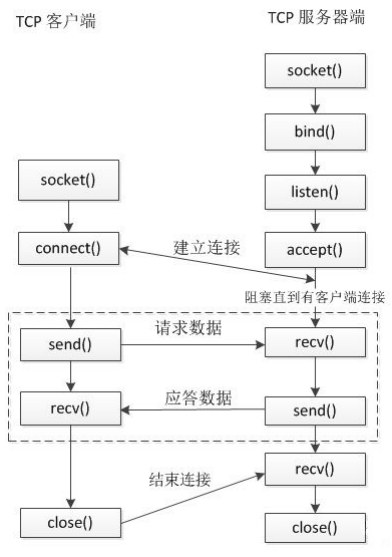

**服务器端（被动接收连接）**

1. 创建一个用于监听的套接字
   - 监听：监听有客户端的连接
   - 套接字：这个套接字其实就是一个文件描述符 
2. 将这个`监听文件描述符`和**本地的IP和端口绑定**（IP和端口就是服务器的地址信息）
   - 客户端连接服务器的时候使用的就是这个IP和端口
3. 设置监听，`监听的fd`开始工作 
4. 阻塞等待，当有客户端发起连接，解除阻塞，接受客户端的连接，会得到一个`和客户端通信的套接字(fd)`
5. 通信
   - 接收数据
   - 发送数据
6. 通信结束，断开连接

**客户端**

1. 创建一个用于通信的套接字(fd)
2. 连接服务器，需要指定连接的服务器的 IP 和 端口 
3. 连接成功了，客户端可以直接和服务器通信 
   - 接收数据
   - 发送数据
4. 通信结束，断开连接

#### 请你解释阻塞非阻塞，同步异步

一个典型的网络IO接口调用，分为两个阶段，分别是“数据就绪”和“数据读写”，数据就绪阶段分为阻塞和非阻塞，表现得结果就是，阻塞当前线程或是直接返回。

同步表示A向B请求调用一个网络IO接口时（或者调用某个业务逻辑API接口时），数据的读写都是由请求方A自己来完成的（不管是阻塞还是非阻塞）；

异步表示A向B请求调用一个网络IO接口时（或者调用某个业务逻辑API接口时），向B传入请求的事件以及事件发生时通知的方式（比如通过信号，回调函数，在C++里面体现在通过绑定器绑定一个回调函数。），A就可以处理其它逻辑了，当B监听到事件处理完成后，会用事先约定好的通知方式，通知A处理结果。

同步阻塞 int size = recv(fd, buf, 1024, 0)
同步非阻塞 int size = recv(fd, buf, 1024, 0)

异步非阻塞（Node.js)

阻塞，非阻塞，同步，异步描述的都是I/O的一些状态，一个典型的网络I/O包含2个阶段：数据准备（数据就绪）和数据读写，
比如说recv，传一个sockfd，buf，buf的大小，数据就绪就是远端有没有数据过来，就是内核相应的sockfd对应的TCP接收缓冲区是否有数据可读，当sockfd，当I/O工作在阻塞模式下的话，当我们调用recv的时候，如果数据没有就绪，recv是会阻塞当前的线程的。如果这个sockfd是工作在非阻塞模式下的话，当我们去调用系统I/O接口recv的时候，recv会直接返回的，我们都是这么判断，如果size==-1的话，表示错误
1、真的错误，是系统的内部错误，可能要close(sockfd)
2、如果size==-1&&errno==EAGAIN，表示正常的非阻塞返回，sockfd上没有网络事件发生。

如果size= =0，表示网络对端关闭了连接，对端直接close(sockfd)
如果size>0，就是表示有数据过来了。

如果是同步I/O，数据就绪的时候，远端有数据过来了，数据准备好了，开始进行读写了，应用程序调用recv这个接口，recv会继续，相当于应用程序花自己的时间，把数据从内核的TCP接收缓冲区拷贝到给recv传的buf（应用程序的缓冲区），拷贝数据的过程中，应用程序是一直等待数据拷贝完成后，recv才返回，应用程序才自己向后走。

如果是异步I/O的话，调用系统给我们提供异步I/O接口的时候，我们要传入sockfd（对应一个TCP接收缓冲区，从远端接收数据的），buf（如果有数据，要把内核缓冲区的数据搬到应用程序的缓冲区中）和通知方式（通过信号或者回调，告诉操作系统异步I/O，到时候内核负责监听sockfd上是否有数据可读，有的话把数据从内核的TCP缓冲区搬到应用程序传的buf上，内核最后通过应用程序告知他的通知方式来通知应用程序，应用程序就可以处理这些事情，而且数据已经拿到手了。

#### 你是怎么理解Linux的IO模型的？你都知道Linux上的那些IO模型？

记得复习一下操作系统的IO接口。


#### 什么是I/O多路复用？

I/O 多路复用使得一个进程或线程能同时监听多个文件描述符的就绪状态，比如套接字，文件等，能够提高程序的性能，Linux 下实现 I/O 多路复用的 系统调用主要有 select、poll 和 epoll。  select、poll基于轮询，epoll基于事件驱动，只关心那些活跃的文件描述符，可以减少一些不必要的CPU开销。

select：主旨思想： 1. 首先要构造一个关于文件描述符的列表，将要监听的文件描述符添加到该列表中。 2. 调用一个系统函数，监听该列表中的文件描述符，直到这些描述符中的一个或者多个进行I/O 操作时，该函数才返回。 a.这个函数是阻塞 b.函数对文件描述符的检测的操作是由内核完成的 3. 在返回时，它会告诉进程有多少（哪些）描述符要进行I/O操作。

poll：

epoll：

#### 同步和异步

一个典型的网络IO接口调用，分为两个阶段，分别是“数据就绪”和“数据读写”，数据就绪阶段分为阻塞和非阻塞，表现得结果就是，阻塞当前线程，直到满足条件 。 非阻塞：直接返回，等满足条件时再通知。

同步表示A向B请求调用一个网络IO接口时（或者调用某个业务逻辑API接口时），数据的读写都是由请求方A自己来完成的（不管是阻塞还是非阻塞）；

异步表示A向B请求调用一个网络IO接口时（或者调用某个业务逻辑API接口时），向B传入请求的事件以及事件发生时通知的方式，A就可以处理其它逻辑了，当B监听到事件处理完成后，会用事先约定好的通知方式，通知A处理结果。  

#### 好的网络服务器设计  

one loop perthread，事件循环就是IO复用。一个线程里面有一个IO复用是一个好的服务器。Epoll IO复用+非阻塞+线程池。线程池的线程个数和CPU的核数一样。

多线程服务端编程问题转换为如何设计一个高效的IO复用，每个线程运行一个IO复用。

事件驱动是事件回调。

IO复用是非阻塞编程的核心，非阻塞是和IO复用一起使用的，一般IO复用我们注册的都是非阻塞的socket。

IO复用一般和非阻塞一起使用，一个线程调用一个IO复用接口，一个epoll会监听多个套接字。套接字都是工作在非阻塞模式下，epoll返回一个可读事件发生的socket的话，为了把socket数据读完，会不断的读。

- 没有人真的会用轮询 (busy-pooling) 来检查某个 non-blocking IO 非阻塞IO操作是否完成，这样太浪费CPU资源了。  

非阻塞不会阻塞当前线程。

#### Reator模型和Preactor模型

I/O 多路复用epoll这个系统调用函数使可以在一个线程里面监听很多的连接。在获取事件时，先把我们要关心的连接传给内核，再由内核检测：通过epoll_wait设置非阻塞， I/O 多路复用监听事件，收到事件后，根据事件类型分配（Dispatch）给某个进程 / 线程。

- Reactor 负责监听和分发事件，事件类型包含连接事件、读写事件；
- 处理资源池负责处理事件，如 read -> 业务逻辑 -> send；

Reactor 对象的作用是监听和分发事件；

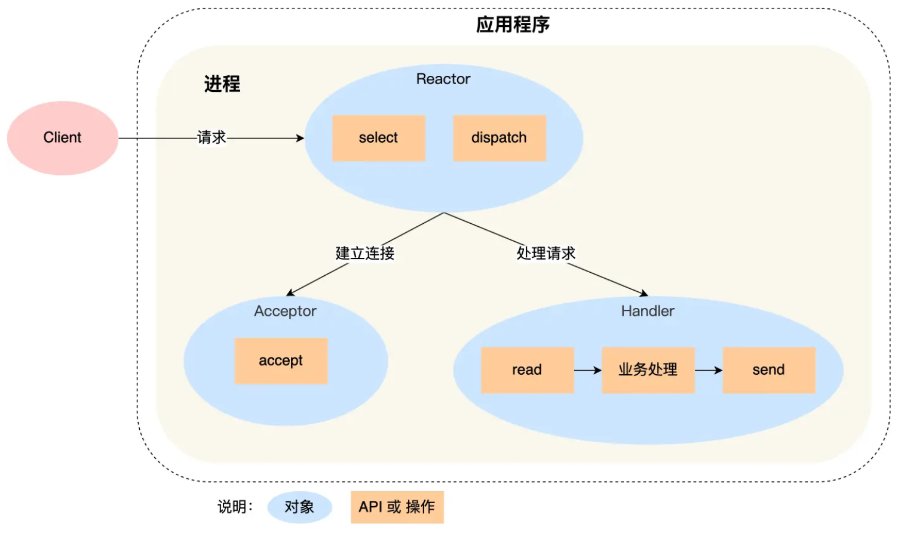

这里主要涉及了反应堆、事件分发器、还有一个服务处理器。平时在学习的时候仅仅只是向上注册了一个套接字，然后当这个套接字发生事情的时候，你才去解决它，并没有进行一个合理的一个oop的封装，实际上，我们可以给每一个epoll上注册的这个fd就是socket。匹配一个任务处理器，就是相当于一个回调，当这个epoll监听到socket或者是我们注册的这个fd，有事件发生的话，我们可以匹配到这个fd所对应的这个任务处理器 ，业务处理器直接把它处理掉。


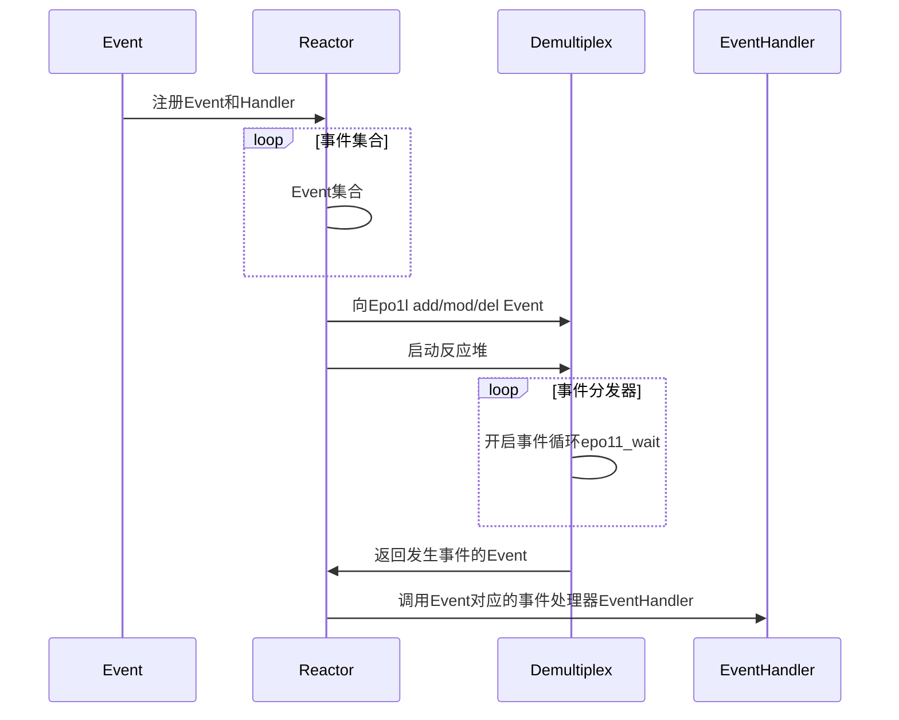


#### select/poll/epoll

1. 单个进程能够监视的文件描述符的数量存在最大限制，通常是1024，当然可以更改数量，但由于select采用轮询的方式扫描文件描述符，文件描述符数量越多，性能越差；(在linux内核头文件中，有这样的定义：#define __FD_SETSIZE    1024  
2. 内核 / 用户空间内存拷贝问题，select需要复制大量的句柄数据结构，产生巨大的开销  
3. select返回的是含有整个句柄的数组，应用程序需要遍历整个数组才能发现哪些句柄发生了事件  
4. select的触发方式是水平触发，应用程序如果没有完成对一个已经就绪的文件描述符进行IO操作，那么之后每次select调用还是会将这些文件描述符通知进程  
5. 相比select模型，poll使用链表保存文件描述符，因此没有了监视文件数量的限制，但其他三个缺点依然存在。  

epoll

epoll的设计和实现与select完全不同。epoll通过在Linux内核中申请一个简易的文件系统。把原先的select/poll调用分成以下3个部分：  

1）调用epoll_create()建立一个epoll对象（在epoll文件系统中为这个句柄对象分配资源）  

2）调用epoll_ctl向epoll对象中添加这100万个连接的套接字  

3）调用epoll_wait收集发生的事件的fd资源  

LT模式  :内核数据没被读完，就会一直上报数据。  

ET模式：（从不可读到可读，或者从不可写到可写，这个状态的变化上报一次，你如果不读完不写完就不会再触发了。不会再触发EPOLL_IN和EPOLL_OUT事件）内核数据只上报一次。  

主要解释一下epoll的非阻塞返回：`timeout = 10`，调用 `epoll_wait`的线程会**最多阻塞 `timeout`毫秒**。在这 `timeout`毫秒内，以下情况会导致 `epoll_wait`**提前返回**：至少有一个被监控的 `fd`上发生了你感兴趣的事件。

如果 `timeout`毫秒过去了，**仍然没有任何感兴趣的事件发生**，那么 `epoll_wait`会**超时返回 `0`**。

**​返回值：​**​

- `> 0`： 在超时前有事件发生，返回就绪的 `fd`数量。
- `= 0`： **表示在 `timeout`毫秒内，没有任何被监控的 `fd`发生感兴趣的事件。超时了！**
- `-1`： 出错。

**`epoll_wait(..., 10)`返回 `0`的含义：** 这 **明确表示** 在过去的 10 毫秒内，你注册在 `epoll`实例上的**所有**被监控的文件描述符 (`fd`)，**没有任何一个**发生了你感兴趣的事件（比如 `EPOLLIN`可读、`EPOLLOUT`可写）。

### 线程池

1. **互斥锁（mutex）**：用于保护共享资源，防止多个线程同时访问。
2. **条件变量（condition_variable）**：用于线程间通信，当某个条件不满足时，线程可以进入等待状态，直到其他线程通知条件满足。

在生产者-消费者模型中，通常有一个共享的队列（或其他数据结构），生产者将数据放入队列，消费者从队列中取出数据。队列的操作需要在互斥锁的保护下进行。

就绪状态 通过调用wait直接进入等待状态  （首先获取锁：通过`unique_lock`锁定互斥量（进入临界区），调用`cond.wait(lock)`1、自动释放互斥锁，2、线程进入**阻塞状态**（等待通知）。

等待状态 通过被别的线程notify_all()进入阻塞状态

阻塞状态 在抢到这个mutex之后又可以达到就绪状态


如果队列为空：调用`wait`，释放锁，进入阻塞状态。

当被生产者通知后，线程从阻塞状态变为就绪状态（等待获取锁）。

当锁可用时，线程获取锁（从就绪状态变为运行状态），并检查条件（队列不为空），然后继续执行消费。

#### 死锁出现的问题点：怎么分析，怎么定位， 怎么排除

线程池里边线程在notempty，这个条件变量上wait了，却没有人再去给这个not empty去notify唤醒了。

更重要的是，你要把我左边这列的线程池线程的这个逻辑跟我们线程池里边每个线程的这个逻辑啊。列出来就像我这样一样。

设计:当线程池ThreadPool出作用域析构时，此时任务队列里面如果还有任务，是等任务全部执行完成，再结束;还是不执行剩下的任务了? ? ?  **把所有的任务都执行完，Pool对象才能析构。**

线程池的代码开发是在WINDOWS下开发的，在VS下跑的好好的，当我去想把它编译成动态库，放在linux上放。变成动态库的时候，发现它又有问题了。程序又死锁了。

怎么看？gdb attach上，gdb可以直接调试，gdb的三种调试。

gdb有三种调试，第一种是调试一个新程序，第二种调试正在运行的这个进程，第三个就是调试Core Dump程序挂掉以后，我们调试这个堆转储文件。

主要通过gdb attach到正在运行的进程，通过info threads，thread tid，bt等命令查看各个线程的调用堆栈信息，结合项目代码，定位到发生死锁的代码片段，分析死锁问题发生的原因。

注意了解一下协程池。协程是纯粹的用户态线程。协程是怎么切换的？为什么有对称式协程，还有非对称式协程。协程的调度还要自己来实现。

多线程的单例是怎么样的？静态的知识点

### 连接池

连接池嘛，对吧啊？我们这个池无非就是为了解决当我们服务已经起来了，以后呢，我再去创建进程啊，再去创建线程，又去销毁进程，又去销毁线程。再去呃不断的创建连接销毁连接，纯OOP语言的封装，用到了MySQL数据库的封装，智能指针，C++语言方面的线程以及队列管理。互斥操作，线程间通信。

以前学智能指针，那我只是觉得它自动释放资源，但是当我在设计连接池的时候，设计线程池的时候，设计聊天服务器的时候用到了，是非常具有实践意义的。在一个实际的软件模块中，真正体会到了它的好处。

### 内存池

内存池就是我们不断的涉及小块内存的分配释放分配释放那gla BC里边给我们提供了malloc跟free。是不是它的它对于小块内存频繁的开辟释放，已经影响到我们的这个性能了，而我们希望以一种池的概念出来。给他提升之前的效率低的地方。

### muduo网络库

可能问到的点：1、Epoll请你解释；2、主从Reactor模型请你解释；3、网络库的意义请你解释；

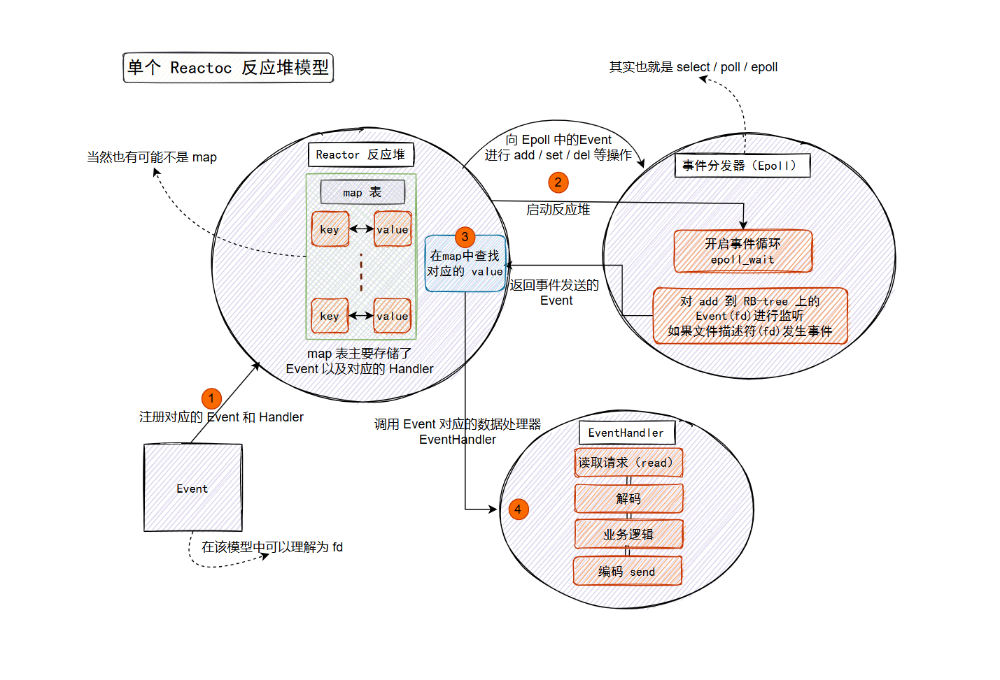

**你做这个项目的意义是什么？你写这个项目都用了那些东西？**

**项目过程中你遇到了什么问题？**

我的方向是基于C/C++的高性能服务器开发，后台开发就一定会涉及高并发，在Linux上开发一个网络程序，应用最多是三方库就是Libevent和Muduo网络库，使用网络库的目的就是将网络代码和业务代码分开，可以做到模块的解耦，软件的高内聚低耦合。这是软件设计的一个思想。

muduo网络库底层就是epoll+非阻塞IO+线程池的经典Reactor模型。学习这个项目可以系统学习网络编程，和其中类与类之间是如何交互的重要提升。

要实现高并发，要求主线程（I/O处理单元）负责监听文件描述符上是否有事件发生，有的话就立即将该事件通知工作线程（逻辑单元），将 socket 可读可写事件放入请求队列，交给工作线程处理。除此之外，主线程不做任何其他实质性的工作。读写数据，接受新的连接，以及处理客户请求均在工作线程中完成。  

它们都是支持epoll+线程池的基于IO多路复用的epoll网络模型。

做到高并发，首先有一个IO线程，IO线程里面有一个epoll，称为mainReactor主反应堆，做新用户的连接，连接上了之后通过负载算法分发到不同的工作线程。工作线程处理已连接用户的读写事件。

一般来说， 线程的数量和CPU的核数对等，做到高并发。I/O复用的好处就是一个线程可以监听多个套接字。对于连接量大活跃量少的场景。
工作线程会单独开一个线程做耗时的I/O操作，传送文件，音频之类的，这样当前的工作线程就可以及时做其他的依然注册在epoll上的socket的读写事件。
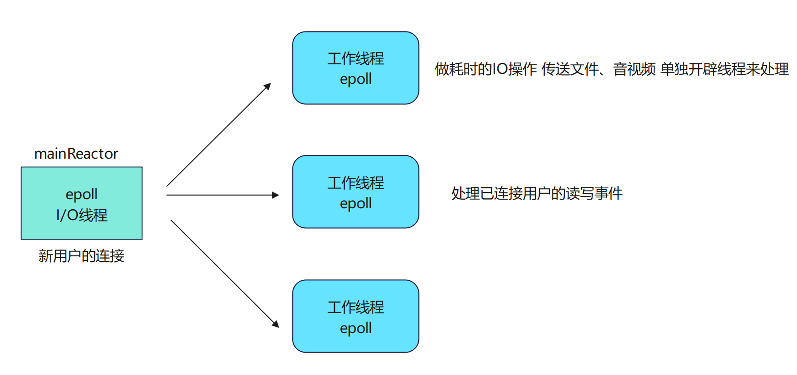

方案的特点是one loop per thread，有一个main reactor负载accept连接，然后把连接分发到某个subreactor（采用round-robin的方式来选择sub reactor），该连接的所用操作都在那个sub reactor所处的线程中完成。多个连接可能被分派到多个线程中，以充分利用CPU。  

Reactor poll的大小是固定的，根据CPU的数目确定。

```C++
// 设置EventLoop的线程个数，底层通过EventLoopThreadPool线程池管理线程类EventLoopThread
_server.setThreadNum(10);  
```

一个Base IO thread负责accept新的连接，接收到新的连接以后，使用轮询的方式在reactor pool中找到合适的sub reactor将这个连接挂载上去，这个连接上的所有任务都在这个sub reactor上完成。  

如果有过多的耗费CPU I/O的计算任务，可以提交到创建的ThreadPool线程池中专门处理耗时的计算任务。  

**muduo的主要编程**

muduo网络库给用户提供了两个主要的类
TcpServer： 用于编写服务器程序的
TcpClient： 用于编写客户端程序的

epoll + 线程池
好处：能够把网络I/O的代码和业务代码区分开
业务代码就是：用户的连接和断开，用户的可读写事件
我们只需要关注业务代码，什么时候发生和如何监听这些事情的发生由muduo库去做 
回调：是我们在进行模块设计、模块解耦的时候一个非常重要的东西。普通函数的调用func();是因为我知道要在这发生这件事了，我还知道这件事该怎么做，所以，这两件事情如果都知道就是在什么地方发生以及发生以后我该怎么做？那这两件事情是在同一个全部都知道，那我就是直接指名道姓的去调用这个函数就行了。但是有些时候，函数什么时候发生，跟发生了该怎么做，没有在一起。比如我现在知道新用户的连接或者已连接用户的断开，我该怎么做，但是这两件事情什么时候发生，我是不知道的。我得通过网络对端发送相应的数据，给我上报上来，我才知道有用户的这个连接创建或者有用户的连接断开了，网络库帮我监听的这件事情的发生。这件事情什么时候发生我是不知道的，它发生的时候，网络库收到对端发送过来相应的业务请求。它就给我上报。

发生这个事情发生的时间点，跟发生以后该做什么事情这两件事没在同同一时刻发生。

用户有读写事件也是通过网络库给我上报，我现在只知道读写事件发生的时候，我该怎么做，比如去解析字符串，拿到消息类型等。读写事件什么时候发生是不知道的，所以我得给它注册回调。当相应的事件发生以后，他就会去帮我调用这个回调函数。我只关注在这个回调函数里边去开发我的业务就可以了。

先写model net，因为model base里边也依赖了这个so库  


EventLoop 事件循环，相当于多路事件分发器，相当于Epoll

**异步日志系统：**流式输出

1. 如果是同步日志，那么每次产生日志信息时，就需要将这条日志信息完全写入磁盘后才会执行后续程序。而磁盘 IO 是比较耗时的操作，如果有大批量的日志信息需要写入就会阻塞网络库的工作。
2. 如果是异步日志，那么写日志消息只需要将日志的信息先进行存储，当累计到一定量或者经过一定时间时再将这些日志信息批量写入磁盘。而这个写入过程靠后台线程去执行，不会影响处理事件的其他线程。

经过对比可以得到，异步日志的方式对性能更加友好，而且可以减少磁盘 IO 函数的操作，一次写入更多的数据，提高效率。

异步日志通过**生产者-消费者模型**解决这些问题：**生产者**：应用程序线程生成日志消息；**消费者**：专用后台线程负责实际写入磁盘。主要就是通过线程间的同步机制，mutex互斥锁和condition_variable条件变量来实现。当缓冲区写满或超时时，通过调用wait_for()通知后台线程

#### Channel类的编写

**TcpServer相当于是**muduo库提供给外部编写服务器程序的入口的一个类，相当于一个大箱子，把muduo库有关服务器的编程相关的东西，包括反应堆，事件分发器，事件回调都打包一块了。**eventloop事件循环相当于是一个epoll，管理socket**，里面最重要的就是poller和channel，pooller相当于是[epoll]抽象的概念，用poller当做1个基类，在派生类中实现了epoll，channel我们理解成通道，相当于就是fd和它所绑定的感兴趣的事件 和实际上发生事件，我要向poller里面进行注册，发生的事件poller给我channel进行通知，epoll_wait返回以后在fd上发生的事件。channel得到相应的事件通知以后调用预制的回调函数，用户就知道了。
tie_防止我们手动调用remove channel以后，我们还在使用这个channel，所以进行的一个跨线程的生存状态的监听，shared_ptr 和weak_ptr配合使用使用，既可以解决只是用shared_ptr 循环引用的问题，还可以在多线里面用week ptr来监听他所观察的这个资源的生存状态，使用的时候，可以把这个弱智能指针提升成强智能指针。提升成功访问，提升失败，那就不访问了，说明他所观察的这个资源已经被释放掉了。

  因为channel通道里面能够获知fd最终发生的具体的事件revents，所以它负责调用具体事件的回调操作    

这些回调是用户设定的，通过接口传给channel来负责调用 ，channel才知道fd上是什么事件

一个线程有一个eventLoop，一个eventLoop里面有一个poller，也就是epoll，一个poller可以监听很多的事件，channel。每一个channel应该都是属于一个event loop的。但是一个eventloop它可以有很多的这个channel。

EventLoop是epoll，处理客户端的连接和处理连接的请求。

poller这个成员变量包含一个channelmap，poller所监听的channel从哪里来？EventLoop里面有channellist以及一个poller，所以poloer监听的肯定是eventLoop里面保存的channel，所以poller里面也存储下来了。所以这个poller类是主要复杂监听事件也就是epoll_wait，开启事件循环。

既要关注网络层的架构，缓冲层的架构这种大方向的设计，也要关注类与类实现之间，组件与组件之间比较小的细节设计，小模块的优化，比如我记得很清楚的一点是：Poller是基类，基类里面有一个成员方法，获取具体的IO复用，比如是poll还是epoll来实现IO复用的，传入是的EventLoop，返回一个基类指针，基类指针指向派生类对象，所以需要生成一个具体的IO复用对象，并返回一个基类的指针，如果在虚基类引用了派生类对象，这样的设计就不合理。所以在一个公共的源文件来实现这个成员方法。通过这个公共的文件分解poller跟epollpoller的强耦合。

EventLoop里面有一个用vector封装的channelLists，所有的channel都是在eventLoop里面管理的，channel创建以后，向poller里面注册的还有未注册的全部放在EventLoop里的channelLists，如果某些channel向poller里面注册过了，那么这些channel会写到poller里面的成员变量里面的channelMap里边，

poller的这个poll方法，还是通过EventLoop来调用的。第二个参数是用指针进行传递的，EventLoop会把创建好的ChannelLists的地址通过形参传给poll。

poll通过epoll_wait监听到哪些fd发生了事件，把真真正正发生事件的channel通过形参发送到eventloop提供的实参里面，通过这个channelLists这个指针告知给EventLoop。

Epoll的第二个参数是传存放发生事件fd的那个event数组的起始地址，是一个传出参数，但是为了方便扩容，EventLoop里面装epoll_event用的是vector，vector底层就是数组，如何拿到vector底层数组的起始地址？首先events的begin()，返回的是首元素的迭代器，也就是返回了首元素的地址，但是用的是面向对象的iterator来表示的，解引用取值，得到了首元素的值，然后取地址，得到数组的起始地址。

通过poller抽象基类里边，规定了这些纯虚函数的接口在我派生类里重写一下。

可以达到在event loop里边站在抽象的层面，去访问我们epoll的具体实现了。这个EpollPoller的构造函数，这里边儿对应的就是epoll_create1,析构函数就代表的是Epoll的这个fd的一个close。

另外epoll_ctl对应的就是epollpoller里的updatechannel跟removechannel，这里还是channel调用的，因为channel得到自己注册到poller上，或者在poller上更改已经注册过的自己的是感兴趣的事件，比如读事件变为写事件，写事件变为读事件。但是channel跟poller之间是无法直接通信的，channel调用的是父类EventLoop的unpdateChannel和removeChannel，最终还是调用到了epollPoller上的updateChannel和removechannel上，通过具体的epoll操作实现。

 \* Channel::update => EventLoop::updateChannel => Poller::updateChannel

 \* Channel::remove => EventLoop::removeChannel => Poller::removeChannel

EventLoop对应的是mainReactor这个反应堆这个组件，EpollPoller对应的是多路分发器的组件，向Epooll add/mod/del Event 然后开启epoll_wait，获知发生的事件Event，Reactor调用事件分发器相应的操作对应的是EventLoop调用poller相应的操作， Channel通过调用Loop相应的方法， Loop相应的updateChannel和removeChannel，最终还是调用了EventLoop调用了poller相应的方法，在事件分发器EpollPoller上针对不同的channel进行修改，删除。

channel调用的就是loop的update channel remove channel，来间接调用polar相关的update channel跟remove channel。来更改在polo上China相关的fd的事件

#### **EventLoop类的编写--对应mianReactor主反应堆**

TcpServer有一个setThreadNum，也就是服务器有很多的eventLoop，Reactor相当于是EventLoop，每一个线程都有一个EventLoop，每一个EventLoop都有很多的channel，自己channel上发生的事件，要在自己的这个event loop线程里边去处理。

首先需要获取当前线程的线程ID。

ps -ef | grep mysqld 查看Linux mysql server服务进程，它的PID是961，也就是进程ID

top -Hp 961 查看mysql服务器进程里面的所有线程，也不是大家用pthread_self打印出来的，而是线程ID。

我们看到是全局变量， 所有线程共享的，每个线程看到的都是同一个全局变量，在数据段存储，加了__thread，或者是C++11的thread_local来定义的话，就是：虽然是全局变量，但是会在每一个线程存储一份拷贝，这个线程对这个变量的更改，别的线程是看不到的。
第一次访问，就把当前线程的tid存储起来，后边如果再访问就从缓存取。
其实就是用了一个系统调用获取当前线程的ID值。因为tid()是一个系统调用，总是从用户空间切到内核空间的话。会比较浪费效率，所以第一次访问以后，就把当前这个线程的tid给它存储起来，后边如果再调用访问的话，直接从缓存里边这个变量里边拿就行了。

EventLoop相当于reactor模型的reactor反应堆的角色
poller和epollpoller相当于是多路分发器的角色，掌控epoll的所有操作

最起码得有一个线程来支撑。

TimerQueue有关时间的回调，在那个时间点运行一个回调，多长时间之后再进行一个回调，每隔多少时间执行一次回调。

如果我们设置了setthreadnumber的多线程的反应堆类型，mainreactor就是处理新用户的连接，accept，拿到新用户通信的fd，把fd感兴趣的事件打包成channel，然后唤醒某个工作线程workreactor（subreactor）（轮询的方式），代表eventloop。每个工作线程subreactor都监听一组channel，每一组channel都得在自己的eventloop去执行。
mainReactor给subReactor如何分配新连接的时候？所采用的负载算法就是一个轮询操作，mainreactor和subreactor
如果没有事件发生的话，他们loop所在的线程都是阻塞的。
假如现在mainreactor监听到一个新用户的连接，得到了表示新用户连接的fd，以及感兴趣的事件的channel，它把这个channel怎么扔给subreactor呢？
如何叫醒？？？
**统一事件源的原理。**
**在libevent库中，采用的是socketpair**创建了一个本地socket的数组，这2个socket都是可读可写的。

**在muduo库中，采用的是linux提供的eventfd**

**这就是线程间的通信机制**。这个线程可以notify通知其他线程起来做事情。eventfd是系统API，在内核可以直接notify应用空间的应用程序，让它的线程起来做事情，效率高。

 int wakeupFd_;

linux内核的eventfd创建出来的

主要作用，当mainLoop获取一个新用户的channel，通过轮询算法选择一个subloop，通过该成员唤醒subloop处理channel。

**EventLoopThread**

**现在我们看Acceptor**
主要运行在mainReactor中baseloop ，Acceptor就是处理accept，监听新用户的连接，拿到跟客户端通信的clientfd，打包成channel，根据muduo的轮询算法找一个subloop，把subloop唤醒，把接收的channel给subloop。

#### **TcpServer代码讲解**

TcpServer构造时候，涉及很多回调操作，需要强化理解。

监听了自己的eventfd定义的wakeupfd，然后subLoop就被唤醒了，被唤醒了以后去执行IoLoop上设置相应的回调操作。这也是为什么总是要判断当前这个Loop在不在他自己的线程，

在muduo库中mainLoop跟subLoop之间没有加同步队列。没有利用生产者-消费者的这个模型mainLoop，只管生产Channel，往同步队列里边放，subLoop从同步队列里边拿Channel进行一个消费，并不是这个样子。它的效率更高，它直接通过这个wakeupfd，自己监听自己的wakeupfd。你是想唤醒我，给我的这个eventloop里边的wakeupfd去写一个数字。我当前这个线程就会被唤醒。

如果是在TcpServer被构造的时候，去唤醒SubLoop，当前线程Id和主线程的ID不相等，现在执行的回调不是在SubLoop所在的线程，所以需要把subLoop加入queueInLoop，queueInLoop在wakeup把thread1唤醒。

#### TcpConnection讲解

TCP connection主要负责连接的。那一个连接说的就是服务器跟这个客户端，客户端跟服务器之间建立的一条连接。所以 它肯定表示的是连接成功的用户在服务端的一些数据的这个封装的一种表示，这个MainLoop，通过acceptor获取一个新用户的这个连接以后，就会把相应的socket、Chanel，都给它封装在TCPconnection里边，通过轮巡算法交给一个subLoop，

所以我们看到这个TCPconnection的成员，它就包含了这个socket，包含了这个channel，实际上这个channel里边也有一个fd就是socket里面封装的fd，他们表示的都是一个角色的东西。更重要的是给这个TcpConnection连接成功设置的回调。

#### Buffer封装

**是一个缓冲区**
**8字节长度（解决粘包问题）+读数据+写数据**

头八个字节里面放一个这一次我要解析的这个包的长度，后边就放的是数据，

根据下标进行读或者写

当在构造函数创建一个TcpServer的时候，接收一个mainLoop，创建一个acceptor（创建一个socket，设置非阻塞，绑定IP地址和端口号，然后进行listen，创建EventLoop事件循环线程池。绑定一个回调，Acceptor也有一个channel，也是属于对listenfd的封装，也有一个回调，当有新的事件连接后，就会执行Acceptor里的handleRead这个成员函数，HandleRead的主要作用就是调用Linux的API accept接收新的连接，返回一个跟客户端通信用的新的连接，这个connfd要进行封装成channel分发到subLoop里面让subReactor对这个连接进行处理，在handleRead中执行TcpServer预先设置的回调，把客户端通信用的fd以及客户端的Ip和端口传给这个回调，这个回调是TcpServer给Acceptor的。TcpServer的newConnection收到了Acceptor的调用和传递过来的已连接用户的fd和IP和端口，就会执行这个newConnection这个函数，这个newConnection通过轮询算法分发给subLoop去处理。

用户设置onConnection和onMessage这个两个函数，绑定给TcpServer，TcpServer又设置给TcpConnection，TcpConnection又设置给channel，channel注册到poller上去。poller最后notify通知channel调用回调。

在newConncetion里面设置了如何关闭连接的回调绑定removeConnection，直接调用Tcp的connectionEstablished方法，只要有一个新的客户端连接，就会生成相应的TcpConnection对象，就会直接调用connectionEstablished方法，修改连接的state状态，从开始的connecting变为已连接，然后tie一下， 然后把当前跟客户端通信的channel enableReading，向poller注册channel的EPOLLIN读事件，poller就开始监听poller上的事件。监听事件以后，在执行新连接用户的回调，我们用户预制的那个onConnection就会调用到，我们在onConnection调用connected，连接已经建立成功。

最终的核心也就会调用到socket的shutdownWrite()，关闭写端以后，poller就会给底层的channel上报epollHuP事件，channel调用的closeBack是谁给的？就是TcpConnection给的handleClose，TcpConnection的Callback是TcpServer给的setClosecallBack，执行的是TcpServer的removeConnection，底层的channel被调用callback以后，调用的就是connection。

### muduo库梳理总结

**做这个项目你有那些收获？**

代码优化上的策略，首先在涉及很大的计算时，要选择合适的算法；代码简洁，让编译器好进行优化，考虑内存，缓存命中，避免内存拷贝，使用智能指针，在循环里不加打印，输入到日志中，三角函数等的计算是比较慢的，需要泰勒展开，因此使用查表法，把常用的三角函数的值放在一个数组里，减少频繁的算三角函数的值。

**muduo库为什么采用固定数量的线程池？**

muduo库的线程池不动态扩容，数量和CPU的核数相同，（设置4个线程，最大的利用CPU进行并行的处理）muduo只是一个网络库，它只关注IO线程，接受新连接以及工作线程监听已连接这个客户端的这个发生的读写事件，至于这个事件是什么事件？耗不耗费服务端的资源它不管。

mainReactor就是我们代码中的mainloop（baseloop），subReactor是我们代码中的工作线程进行读写事件的处理，read是底层做的，decode是我们自己做的。compute和encode也是我们自己做的。从网络上read数据，然后从网络上send数据，这些是由muduo库帮我们做的。decode compute encode是我们用户在OnMessage处理的业务逻辑。每一个线程都是一个独立的Reactor


channel主要做的事情是：
封装了fd，events和revents，还有一组回调方法
fd就是表示要往poller上注册的文件描述符
events就是事先设置的fd所感兴趣的事件（读事件或者写事件）
revents就是poller最终给我们channel通知的这个fd上发生的事件，channel根据相应的发生的事件来执行相应的回调。
对于上层来说，如果有一个fd的话，它就会把fd打包成channel通道，然后下发到poller上。

poller有一个成员变量channels，是一个map表，键就是channel打包的sockfd，值就是包含fd对应的channel，也就是说如果poller检测到哪个fd有事件发生了，就可以通过发生事件的fd和这个map表，找到这个fd对应的channel，这个channel里面就记录着详细的对应事件的回调方法。 
但是channel和poller是独立的，它们是不能直接互相通信的，它们都是依赖eventloop来通信的。
不管是channel还是poller，都有一个成员变量记录它所在的事件循环（loop成员变量）。 

muduo库不管监听的listenfd还是accept返回，客户端连接成功返回跟客户端专门通信的connectionfd，都会把这个fd打包成channel，给它写入fd感兴趣的事件（读或者写事件），然后注册到相应的loop的poller上去。
poller，我们在项目中实现的主要就是epollpoller，底层就是epoll，意味着底层就是通过epoll_ctrl把相应的channel里面包含的fd注册到epoll上，当epoll返回以后，因为poller上有map表channels，通过sockfd找到它所对应的channel来调用相应的回调。
channelcallbacks回调是上层设置的。
我们总共就有2种channel，因为就2种fd:listenfd（依赖于accptor）和已建立连接的客户端专门通信用的connectionfd，channel在调用相应的回调，比如说是listenfd发生的事件，那么它所调用的回调函数就是acceptor塞给它的，如果是已建立连接的客户端专门通信用的connectionfd，肯定就是TCPconnection塞给它的。channel和poller之间不能互相访问。
它们2个都是依赖eventloop事件循环的
eventloop相当于是reactor
poller和epollpoller相当于是多路事件分发器  

我们看到，它有一个activeChannels_，这是一个vector，包含了所有的channel，因为上层交给反应堆的不只是单纯的fd，因为反应堆获取fd，还要执行相应的回调，所以塞给反应堆的都是channel，我们不要忘记，它还有weakupfd!
wakeupfd也是被封装成wakeupchannel_，主要作用是一个wakeupfd，是隶属于一个loop，也就是说，每个loop都有一个wakeupfd，因为loop最后执行触发底层的事件分发器，是epoll_wait，只要没有事件发生，相应的loop线程阻塞在epoll_wait上，如果我们想唤醒loop所在线程的阻塞状态，我们直接通过loop对象获取其wakeupfd，直接在这个wakeupfd上写个东西，相应的loop就会被唤醒。因为每个loop的wakeupfd也被封装成一个channel，注册在自己loop底层的epoll事件分发器上。
**从大体上看，eventloop管理的就是一堆channel和一个poller，和自己的wakeupfd**

这样一来，channel想把自己注册到poller上，或者是在poller上修改自己感兴趣的事件，channel都是通过eventloop获取poller的对象，来向poller设置，同样的，如果poller监测到有socketfd有相应的事件发生，就通过eventloop调用channel相应的fd所发生事件的回调函数。
**我们看到，eventloop上有一个vector（pendingFunctors），存了一堆的回调函数。**

因为这些回调，每一个回调在执行的时候都应该是在loop自己所在的线程执行，如果说当前线程调用了loop，让这个loop执行回调，在程序逻辑上会进行个判断，如果当前线程就是这个loop那么直接执行回调，否则的话，就把它存到pendingFunctors这个vector里面，然后唤醒相应的loop，然后在vector里拿相应的回调执行。
Thread是底层的线程。
EventloopThread是事件的线程
EventloopThreadPool是事件循环线程池
EventloopThreadPool里面有一个方法：getNextloop方法，默认是通过轮询算法获取下一个subloop，如果客户没有提供setthreadnumber设置线程，那么就是没有创建subloop，getNextloop永远返回的是baseloop
当我们通过setthreadnumber设置底层的线程数量，EventloopThreadPool就会驱动底层开始创建线程，一个线程一个loop，就是one loop per thread

EventloopThreadPool的内容如下
Acceptor
Acceptor封装了listenfd相关的操作，比如说：创建listenfd，绑定bind，listen，listen成功后，把listenfd打包成acceptorchannel扔给baseloop来监听它的事件。
Buffer是缓冲区，对于nonblocking（非阻塞）的I/O，我们都需要设置缓冲区，涉及到应用写数据写到缓冲区，再写到TCP的发送缓冲区，然后send数据因为TCP的发送缓冲区，写满了就要发送，这是同步的过程，效率比较慢。
如果有缓冲区的话，我们用户写数据，直接向缓冲区进行写就可以了。
缓冲区里有prependable，readeridx，writeridx，这3个下标
prependable有8个字节，是头部信息，刚开始readeridx和writeridx都在这8个字节处的位置，然后我们写数据进去，写好的东西就可以是待发送的东西，由Buffer专门进行在缓冲区读取数据进行发送，我们从缓冲区可以进行send发送，用户也可以不断从缓冲区写数据，通过readeridx和writeridx处理
模仿了Java的neti网络库channelbuffer
应用产生数据快，tcp发送的慢，难道每一次发送数据都要等tcp发送完上一次的数据再发送当前数据？写数据到buffer，然后让系统去调用write，或者系统调用read，把数据读到buffer上。相当于应用发送或者接收数据和tcp真实发送或者接收数据就成异步的了，这就非常高效了！！！TcpConnection

**一个连接成功的客户端对应一个TcpConnection，**
这个TcpConnection包含的东西有哪些？

**封装了socket，channel，和各种回调，高水位线的控制（不要发送过快），发送和接收缓冲区。**
对于connectionfd在channel上执行的回调，都是由TcpConnection来设置的

TcpServer就是总领所有
TcpServer的成员：
Acceptor（得到新用户，才能通过EventLoopThreadpool的getnextloop，把新用户封装tcpconnection设置各种各样的回调以后，才能选择一个subloop，把新的connection扔给相应的loop）,EventLoopThreadpool，一堆callback，connectionmap
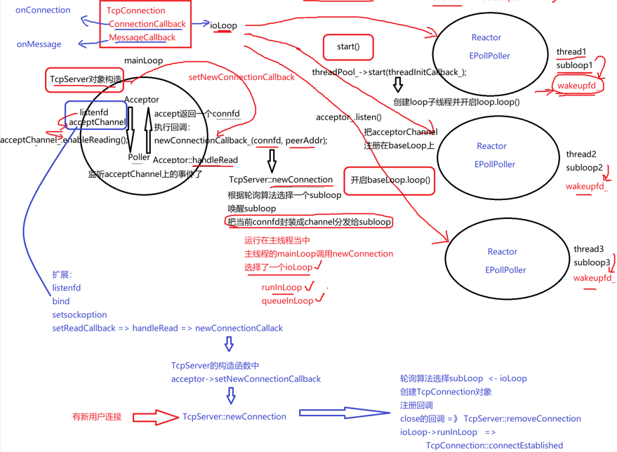

**首先，我们是怎么使用的？**

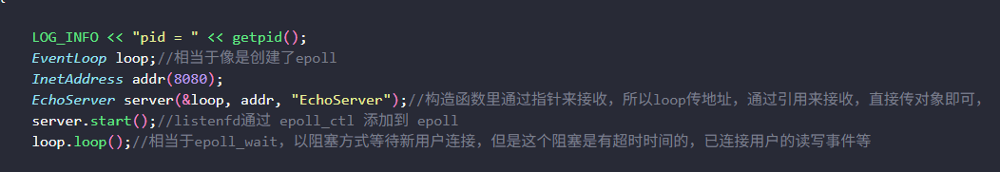

1.定义一个loop，就是baseloop
2.InetAddress打包了IP地址和端口号
3.创建server对象，给到EchoServer的构造函数，通过其参数进行初始化底层的TCPserver对象，保留了loop
4.设置了2个回调
5.设置了底层的loop线程的数量（这个数量不包括baseloop）
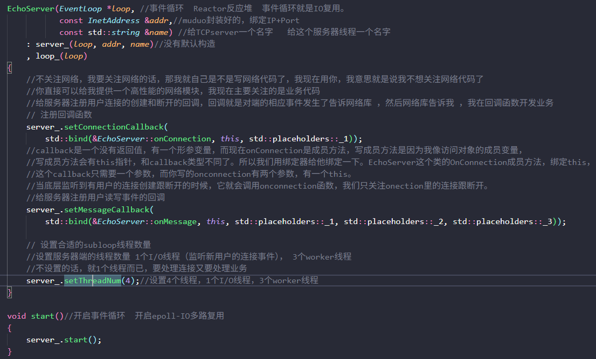

很好的把网络代码和业务代码分离了，我们只需要做开发者需要关注的：
**6.我们用户作为开发者只需要关注下面的2个方法：**

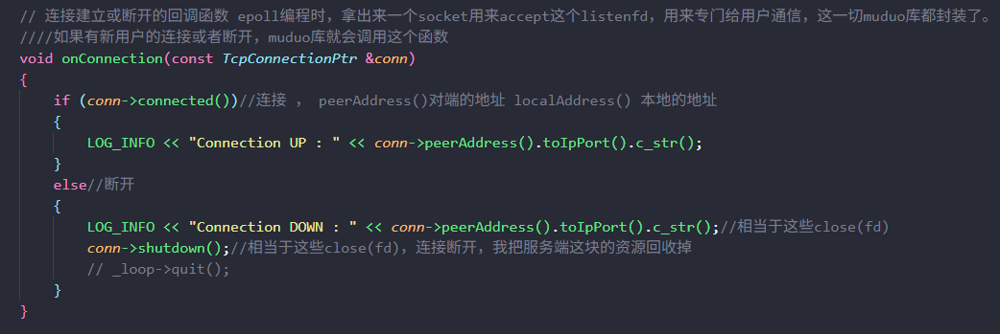

响应连接的建立和断开

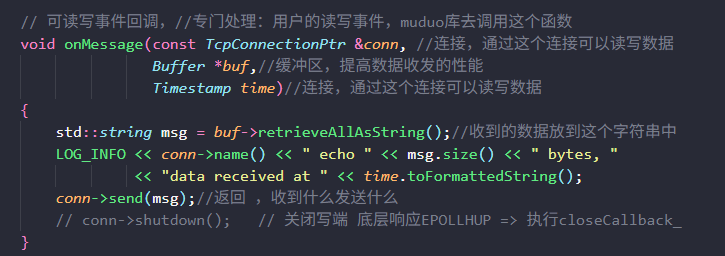

响应读写事件
设置完之后
7.server.start();启动loop
loop.loop()

**总结而来就是：首先构建tcpserver对象，设置回调方法，然后设置底层的loop线程的数量，然后调用start方法，最后开启主线程的loop**

#### 我们看看TcpServer的构造都做了什么？

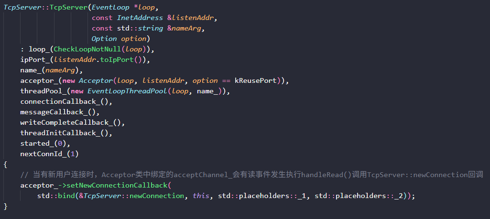

**创建了Acceptor，EventLoopThreadPool（还没有开启loop线程）**

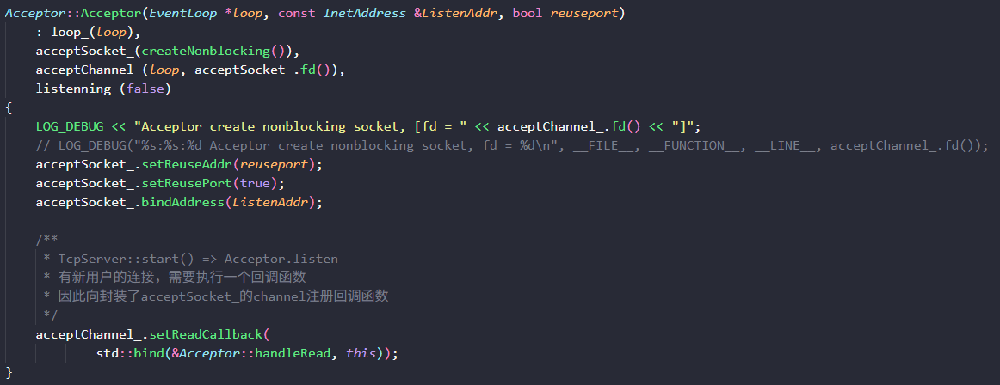

首先Acceptor创建了一个非阻塞的listenfd，然后把它打包成1个channel，准备往mainloop的poller上扔。

然后设置了一些tcp选项，创建socket，绑定bind，给channel设置回调，就是readcallback

也就是说：Acceptchannel只关心读事件。
只关心acceptchannel有新用户的连接的事件，底层的channel会去执行readcallback，对于Acceptor的readcallback执行的是handleRead

DNS域名解析、通过域名解析到相应的IP，简单的HTTP服务器，处理HTTP协议，

**作为服务器？你是如何衡量这个服务器的性能的？**

**5、服务器性能测试 - QPS 涉及linux上进程socketfd的设置相关**
QPS是多少就是每秒支持多少的查询

不是应用层服务器，是基于Tcp的传输层服务器。

压力测试工具

32位系统，8G内存， 3w个，多少核心，多少内存， 

wrk    在linux上，需要单独编译安装 直接创建线程组，发送的时间，压力测试的时间，但是只能测试http服务的性能

Jmeter 先安装JDK 再安装Jmeter
测试http服务 tcp服务 生成聚合报告（生成详细的报表，起了多少个线程来模拟客户端，总共压力测试多长时间，总共发送多长请求，总共响应多少请求，平均的请求时间，最大的请求耗费时间，最小的请求耗费时间，整个的请求，响应的成功率，QPS的值，都会详细列出来）

因为默认的情况下，linux的一个进程所能使用的这个fd文件描述符是有限的，那么要让我们这个进程能够处理更多的用户的连接，那你肯定是要去设置当前某一个当前进程，当年linux上进程所使用的描述符的一个上限，用来支持呢更大的一个连接量。

后续如果让我在实现的话，当然如果对项目进行压测，发现整个项目的瓶颈已经不在我业务上了，而是在于这个数据库。对于数据库可以进行集群部署，进行读写分离，读写分离了以后我发现我的这个某些应用访问数据库比较多，还是会产生很多的这个磁盘IO。是服务器的瓶颈，这个卡在数据库的访问上，所以它引入了一个redis。存的就是key value。

在刨析muduo网络库的时候，我也实现了一个HTTP服务器的静态网页资源获取。但是C++来实现WebSocket太复杂了。不太合适，所以我就实现了简易的基于RPC的聊天服务器开发。

### chatserver聊天服务器

集群聊天服务器遇到死锁问题怎么解决？用gdb调试，直接atach到这个正在运行的以及死锁的进程，然后我们把进程里面每一个线程栈打印出来。什么叫线程栈呢？线程栈就是这个线程在执行的时候呢？现在在哪个函数的哪一句话它不动了？

什么是nginx的反向代理，负载均衡。网络模块本身是epoll+多进程的方式来实现。

### RPC服务器开发

**简历上面2个项目：RPC通信/网络库核心**

然后我的第二个项目是刨析了muduo库的源码，从细节上学习如何设计一个高并发的网络服务器。

**为什么要学习这个项目？为什么要做这个项目？为什么实现了基于rpc的聊天服务器？**

首先因为我以前玩过python的Django来编写一个简易的网页聊天室，开发很方便，然后我的方向是基于C/C++的高性能服务器开发。所以我想写C++的一个局域网聊天，最初我实现了一个单机版本的，为了扩充聊天服务器的能力可以提供给更多用户，我又尝试了集群来做到可以横向可以扩展聊天服务，后台开发就一定涉及高并发，后面主要就是考虑网络服务高并发和分布式。

在 Linux 环境下基于 muduo 网络库 和 protobuf 通信协议实现的 RPC 分布式通信框架，同时使用了 zookeeper 中间件，实现分布式一致性协调服务(也就是注册服务和服务发现)。我通过这个框架将本地方法调用重构成基于 TCP 网络通信的 RPC 远程方法。实现了在分布式环境中的远程调用，将这个方法部署在不同服务器上，以达到分布式集群效果。从而强化了自己对网络开发的能力。

在架构设计方面，有网络层，服务层，有数据层，有中间件redis解耦了服务层和数据层。

把前面所学的知识点在实践项目的过程中得到了锻炼，真真正正了解了设计一个具体场景的应用。

**整个项目你实现了那些功能点？涉及到那些模块？你写这个项目涉及到了那些东西？**

业务模块：新用户的注册，用户登录是一个RPC服务节点，添加好友跟添加群组是一个RPC服务节点，好友聊天是一个RPC服务器节点，群组聊天是一个RPC服务器节点。

网络I/O模块：基于 C++ 实现 Reactor 模型与事件驱动 I/O的muduo网络库。

数据模块：在项目的构建过程中，使用到了数据库，因为项目的需求，立足于业务，去创建表，用户的信息，好友的列表信息，群组的列表信息都会存储在这个数据库当中。同时通过sqlite3在本地存储了客户端的发送和接收的历史消息。

项目过程中还考虑到了其他点：数据库涉及磁盘IO，服务器采用的是muduo网络库，muduo网络库本身是高性能服务器，所以当并发量上来以后，整个服务器的性能在mysql数据库，所以这里我采取的措施是：把热点数据存储在redis上，同时为了加速mysql的访问，我引入了连接池，给服务器来提高它在全局的一些性能。

 用户界面模块：使用Qt重写QPaintEvent事件构建登录、注册与聊天冒泡图界面，使用QtDesigner构建聊天ui。构建了一个简易的聊天室。

异步日志模块：   工作线程的日志打印接口负责生产日志数据（作为日志的生产者 work），而日志的实现操作则留给另一个后台进程去完成（作为日志的消费者），用一个典型的**生产者-消费者**问题就能解决。通过另外开辟一个新的线程去拿日志信息写入`log.txt` ，可以很大程度减少工作线程的时间开销。工作线程写日志到队列，队列本身使用条件变量为通知机制，当有数据入队列时就通知消费者线程去消费日志。

分布式RPC框架模块：`RpcProvider` 是一个框架专门为发布 rpc 服务的网络对象类。在服务端会用此类来注册服务，故`RpcProvider`类需要支持所有服务的发布。因此设计的 `NotifyService` 方法的参数必须要是这些服务的基类，也就是`google::protobuf::Service`。

因为 protobuf 只是提供了数据的序列化和反序列化还有RPC接口，并没有提供网络传输的相关代码。所以此项目用了 muduo 库实现网络传输。

`MprpcChannel`模块继承于`google::protobuf::RpcChannel`他是一个RPC通道的抽象接口，表示一个到服务的通信线路，这个线路用于客户端远程调用服务端的方法。我们需要继承这个类并重写他的`CallMethod`方法。

`CallMethod`方法：所有通过 stub 代理对象调用的RPC方法都走到了这里，统一做RPC方法调用的数据序列化和网络发送。

获取客户端请求的方法和序列化

1. 从`CallMethod`的参数`method`获取`service_name`和`method_name`;
2. 将获取到的参数序列化为字符串，并获取他的长度。
3. 定义RPC的请求`header`.
4. 组织待发送的RPC请求的字符串

zookeeper的使用。


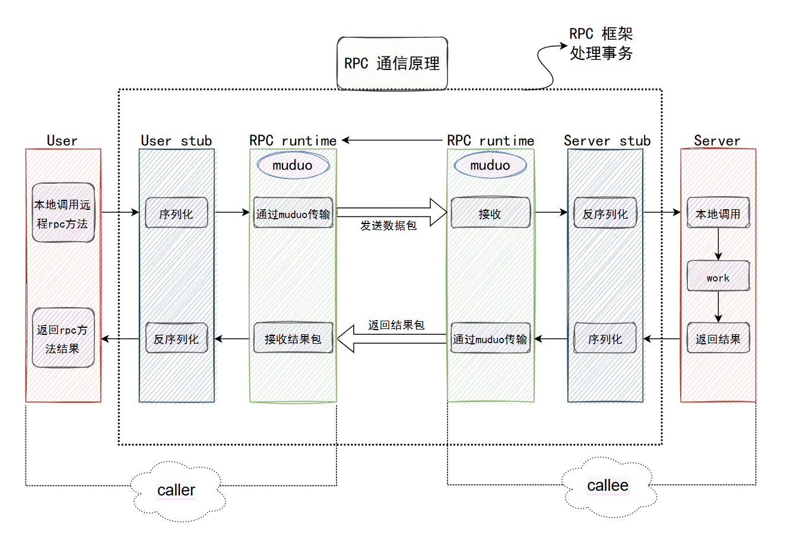**项目涉及的核心点是：**

- 通过 muduo 网络库实现高并发的网络通信模块
- 通过 protobuf 实现RPC方法调用和参数的序列化与反序列化（序列化是把对象转成这个字节流或者字符流，反序列化是把字节流字符流再还原成对象。）
- 通过 zookeeper 实现分布式一致性协调服务，由此提供服务注册和发现功能
- 实现了基于 TCP 传输的二进制协议、解决了粘包问题，并且能高效的数据传输服务器名、方法名及参数。

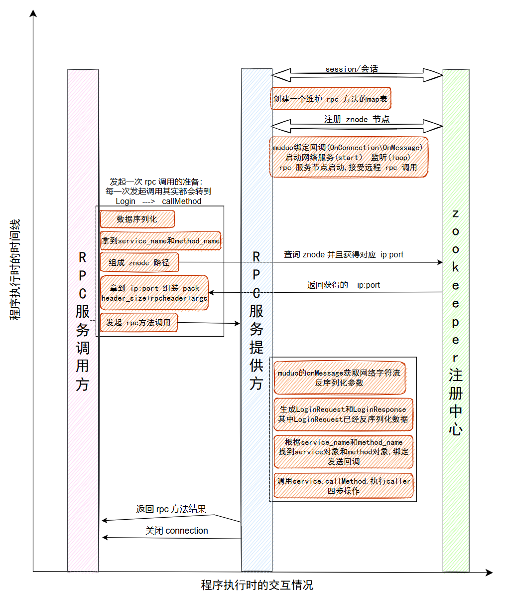

**整个RPC请求调用的执行逻辑是怎么样的？**

首先，我们在使用框架的时候，框架体现出3个模块。1个是RPC服务的调用方（mprpcchannel）。1个是RPC服务的提供方（mprpcprovider）。1个是ZooKeeper，作为服务配置中心。

提供服务的节点先启动和ZK创建会话（session），然后在里面维护了一个RPC方法的map表，想发布服务会调用notifyservice函数，把发布服务的对象和RPC方法写到map表，然后通过ZKclient把这些服务和方法都注册在ZK上，放在相应的znode节点上。
然后RPC服务的提供者就会去启动网络服务，采用的是muduo库，设置了4个线程，自动分配1个I/O线程和3个work线程，muduo绑定回调，（绑定了OnConnection和OnMessage），调用了start和loop方法，RPC服务节点就开始启动了。
然后RPC服务的调用方就发起了调用，首先通过stub代理对象调用RPC方法，最终都是调用channel的CallMethod方法，统一进行参数的打包，数据的序列化，获取ZK的服务的IP地址和端口号，发起RPC调用。
在ZK查到调用服务的IP地址和端口号以后，用header组装数据。header_size表示rpcheader的长度。rpcheader包括servicename,methodname,和args的长度（防止粘包）。
建立RPC服务方建立连接后，然后发起RPC调用请求。然后就是mprpcprovider的OnMessag做的事情。框架给业务上报了请求参数LoginRequest，应用获取相应数据做本地业务，主要是1、获取网络字符流反序列化参数；2、根据service name和method name找到service对象和method对象；3、做本地业务4、执行回调操作，进行数据响应的序列化通过网络发送到RPC服务的调用方。

当然中间涉及到的和数据库和redis和sqlite本地存储这些我就跳过了。

**zookeeper分布式锁该怎么理解？**

同一个进程里有很多线程，线程间互斥需要用锁，执行一段临界区代码段，一个临界区代码当中，能不能让多个线程同时执行。用锁来控制。每次临界区代码段只能有一个线程来进入。

假如现在是一个分布式系统，两个这个服务分别运行在两台机器上。这两台机器要竞争一个资源，这个资源是不能够同时让两个rpc节点去访问的 ，此时互斥锁，读写锁，自旋锁都不能用了。这些锁是在同一个进程里面控制线程的。现在rpc节点都运行在不同的机器上，在一个分布式环境中，我们要协调 ，不同的rpc节点不能共同去访问一个共享资源，一次只能有一个人访问，我们需要一把分布式锁。zookeeper也提供了这个功能。

**你为什么在这个项目中使用zookeeper？在这个项目中他的作用都有那些？你使用了他的那些功能？你还知道他的那些功能？什么叫服务配置中心？**

开始的时候，我发起一个RPC请求，我这个channel是直接知道它所请求的RPC服务在那一台机器上，但实际上并不是，服务都是单独部署的。当想去使用RPC服务的时候，实际上并不知道RPC服务在那一台机器上运行。

所以在分布式环境中，需要一个服务配置中心。整个分布式网络系统中，所有提供RPC服务的这个节点，都会向配置中心注册一下服务，就是IP和端口和提供什么名字的服务。一个RPC节点想去调用RPC服务的时候，去配置中心查找一下我想调用的这个服务在那一台IP和端口，就可以发起RPC远程调用了。

我这个项目使用zookeeper主要是使用它基于服务器配置中心的分布式协调服务，我想知道调用这个RPC服务到底在那一台机器上。需要在分布式环境中这么一个服务配置中心来记录所有RPC分布式节点上所有发布RPC服务的主机IP和端口。服务发布方（RpcProvider）在zookeeper发布服务，消费者在zookeeper查找服务。向rpcprovider上注册服务对象和服务方法，保存在m_serviceMap表当中，其中m_servicemap表里面记录的都是所有服务的名字，serviceInfo的第二个成员变量记录的是方法的名字，然后把当前rpc节点上要发布的服务全部注册到zk上面，让rpc client可以从zk上发现服务。

所以没有服务配置中心玩不转，完成这些功能的核心的两个点，一个是它的一个特殊的文件系统。用路径来管理这个znode的节点以及znode的节点存临时性的IP和端口，另外一个就是它的一个watcher机制。

watcher机制：当我们客户端想要去调用一个rpc服务的时候，我会拿这个rpc的这个服务的名字以及它的方法名字组成一个znode的一个节点路径。在服务配置中心上去查找一下，这个节点是否存在，如果存在的话，这个服务存在的rpc节点的IP和端口号是多少？我好发起一个rpc请求。如果这个路径的节点不存在，那就说明我想调用的这个rpc服务在整个分布式环境当中，根本就没有rpc节点去提供这个服务。那我也就不要发起rpc。

watcher机制。相当于就是一个通知回调机制。RPC提供方可以通过zk客户端编程的API。添加一个watcher，添加一个观察器，或者是监听器，监听的事件类型还是挺多的，在这主要是我监听这个节点的变化。我在客户端维护了一个map表。map表中的建就是节点的名字，值就是节点所携带的内容。

临时性节点：rpc节点超时未发送心跳消息zk会自动删除

永久性节点： rpc节点超时未发送心跳 zk不会删除这个节点

zookeeper的API客户端程序提供了三个线程：
	API调用线程 也就是当前线程 调用start也就是调用的线程 zookeeper_init
	网络I/O线程  zookeeper_init调用了pthread_create  poll专门连接网络，timeout 时间发送ping心跳消息，维护和zkserver的连接，默认的timeout session为30s
	watcher回调线程 当客户端接收到zkserver的响应，再次调用pthread_create，产生watcher回调线程

还知道分布式锁，包括它的这个主备这个集群的这个服务切换。它还有非常多的其他功能，当然对于这种优秀的中间件我只要知道它提供了那些组件，我的项目可以使用到就可以了。不需要庖丁解牛分析源码，那这样的话使用成本太高了。

**你是怎么解决TCP粘包问题的？**

**为了防止 TCP 的粘包问题**需要在自定义一个协议，此处采用了将消息分为消息头和消息体，消息头包含此消息的总长度，每次都需要先读消息头，从而得知我们这次发过来的消息要读到那里。

1. 从网络上接收远程的 RPC 调用请求的字符串。
2. 从字符串中先读取前四个字节的内容，从而得知此次消息的长度。
3. 根据 `header_size` 读取数据头的原始字符串，反序列化数据得到RPC请求的详细消息。
4. 获取 `service` 对象和 `method` 对象。
5. 生成 RPC 方法调用请求 `request` 和相应 `response` 参数。
6. 在框架上根据远端的RPC请求调用当前的RPC结点方法。

**项目过程中你遇到了那些问题？你是怎么解决的？**

1. 是zookeeper的安装，
2. 是配置文件的conf，由于 rpc 框架、zookeeper 服务会有相应监听的 port 以及对应地址 ip，如果直接将这些服务对应的 port 和 ip 写入源文件，那每当我们将框架放在不同服务器上运行，则需要直接修改源代码，这样所带来不好维护的结果，所以我们可以单独将所要用到的配置信息写入一个 `*.conf` 的配置文件中即可方便我们维护。
3. 和mysql的连接
4. 语言过程中的错误
5. 一个进程他所能用到的fd是有上线的，我们去Linux设置每一个进程所使用描述符的一个上限。
6. 设计的问题，由于性能原因，分析性能的原因，引入了redis。


**什么是gRPC？**

gRPC是一个高性能的、开源的通用的RPC框架。在gRPC中，我们称调用方为client，被调用方为server。通过某种方式来描述一个服务，这种描述方式是语言无关的。在这个"服务定义"的过程中，我们描述了我们提供的服务服务名是什么，有哪些方法可以被调用，这些方法有什么样的入参，有什么样的回参。

gRPC会屏蔽底层的细节，client只需要直接调用定义好的方法，就能拿到预期的返回结果。对于server端来说，还需要实现我们定义的方法。此外，gRPC还是语言无关的。你可以用C++作为服务端，使用Golang、java等作为客户端。

微服务处理：微服务就是把我们的服务进行小颗粒的拆分，服务与服务之间都是以独立的进程来对外提供的，有可能在一台主机上，有可能不在不在一台主机上，各个服务是通过网络进行通信的，远程过程调用。基于分布式的微服务通信。

**了解一致性哈希算法吗?描述一下**

一致性哈希算法：分布式系统负载均衡的首选算法，一个良好的分布式哈希方案应该具有良好的单调性，即服务节点的增减不会造成大量哈希的重新定位。

比如有三台服务器，当客户端连接服务器的时候会先访问代理服务器，代理服务器通过反向代理负载均衡实现请求分发到应用服务器。

普通的哈希算法存在的缺陷：解决了会话共享的问题，一个客户的请求永远落在一台服务器上。

假如说1号机器现在挂掉了，按理来说，只影响1号机器上登录成功的用户，不影响其他2台机器上登录成功的用户。但是实际上，nginx可以动态识别后端服务器的故障，现在后续所有客户端发的请求经过md5处理之后，就是模上2了！！！原来是模上3，到达0号服务器和2号服务器的用户，现在由于1号服务器挂掉了，现在那些用户再发送后续请求的话，经过md5哈希函数后模上2，到达的就不一定是原来的服务器上了。
或者是增加了1台服务器，3号服务器，可以让后续新登录的用户给这个3号服务器上负载一些。原来登录在0,1，2上的服务器的用户就不用变，后续的请求就还是登录到之前的0,1，2号服务器，那么现在不是这样，动态增加1台服务器后，nginx（lvs）会感知到，同样的客户端，同样的IP地址端口号经过md5哈希函数后模上4了！！！就全乱了！！！
所以就有了一致性哈希算法来**弥补普通哈希算法产生的问题。**

1.一致性哈希算法将整个哈希值空间理解成一个环，取值范围是0-2^32-1共4G的整数空间；2.将所有服务器进行哈希，最终落在这个一致性哈希环上。假设有A、B、C三台服务器，经过哈希后，分散在环的不同位置；3.进行负载时，先哈希输入值得到一致性哈希环上的一个哈希值，然后沿着顺时针，遇到的第一台服务器，就是最终负载到的服务器，假设现在有4个客户请求进来了，这4个客户都有自己的IP和端口，我们把IP+端口作为输入值，经过md5处理后得到4个整数，分别落在了一致性哈希环上的4个位置。**在这个一致性哈希环上，沿着顺时针，遇到的第一台服务器就是最终负载到的服务器。**

这样**假如服务器3挂了，原来工作在1或者2的服务器上的客户，依然在1或者2上。原来在服务器3上工作的客户重新分发到1或者2上就可以了。**

**另外，扩展机器的时候，又增加1台机器，原来工作在1,2或者3上的客户依然工作在原机器上，只不过后期负载均衡器把新的请求落在4上就可以了。让重新哈希的结果做到最少的改动。利于服务端业务运行的稳定。**

**你了解哪些负载均衡算法吗?**

负载均衡（Load Balancing）是一种技术，用于将网络流量或计算任务合理地分配到多个服务器、进程或资源上，以避免单一节点过载，提高系统的性能、可靠性和可用性。它通常用于分布式系统或高并发场景。

服务器负载均衡环境下，可以配置的负载均衡算法有很多。如轮询算法、哈希算法、权重比算法、最少连接算法等等
一个良好的分布式哈希方案应该具有良好的单调性，即服务节点的增减不会造成大量哈希的重新定位。

比如有三台服务器，当客户端连接服务器的时候会先访问代理服务器，代理服务器通过反向代理负载均衡实现请求分发到应用服务器。

**轮询算法：**第一个请求给server1，第二个请求给server2，第3个请求给server3，一直轮询下去。
**权重比算法：**比如说，给第1台分配1的权重，给第2台分配2的权重，给第3台分配1的权重，有4个请求到来，其中2个请求分配给第2台，其他两台各分配1个请求。
**最少连接算法：**负载均衡器要记录跟每一台服务器建立的连接，每次发请求的时候，跟哪台请求创建的连接最少就分发给哪台机器，哪台服务器连接少，说明其压力小，新来的请求就给到压力最小的服务器。
**哈希算法：**除留余数法。有3台服务器，就模上3，得到0,1，2的下标，对应哪个服务器的下标，就去哪台服务器上。

**一致性哈希算法是如何体现的？**

我开始部署了4个RPC节点，整体组成一套服务系统，但是我觉得这个chatservice这个用的比较多，所以我将这个节点部署了4份。考虑的点主要是这个服务对于CPU的硬件资源，内存资源，网络IO资源以及它对并发的要求来思考的。当有一个方法进行调用的时候，就需要进行简易版本的负载均衡。轮转算法的实现比较简单，就是用一个整数next来记录使用了那个节点，当下一次要调用的时候选择下一个节点。

而实现一致性哈希算法的时候，我用set 红黑树 存储key就可以实现这个环了，然后把4个chatservice服务器的IP地址作为输入参数，传给md5哈希函数，得出整数值，就是落在一致性哈希环上的位置。主要是有三个类，物理节点类，一致性哈希算法类，虚拟节点类，然后哈希函数我使用的是MD5哈希函数，使用MD5算法主要是他的特点：哪怕输入参数值比较近似，md5算法处理后，结果也是非常离散的。

**虚拟节点的目的就是防止物理节点过少，导致哈希处理后在一致性哈希环上挤在一起，导致某一台服务器负载太多，其他的服务器一直很空闲。**

有虚拟节点类主要是让服务器的节点尽量均衡。在一致性哈希的环上，我们都是存放机器的虚拟节点，就是把1个机器虚拟的看成200台机器，ip虽然相同，但是后面的#数字不同，我们就可以在哈希环上得到不同位置的散列值。md5算法特点：哪怕输入参数值比较近似，md5算法处理后，结果也是非常离散的。**虚拟节点保存其对应的物理节点的主机的信息，请求是落在虚拟节点对应的物理主机上**。

这样就可以实现将客户端的请求分发到不同的客户端。

用红黑树set来存储所有节点的哈希值的原因？**天然有序**：红黑树的中序遍历本身就是从小到大输出所有节点。这个“顺序”恰好就是哈希环上节点的顺时针顺序。我们不需要手动维护排序。

**你了解过MD5哈希加密算法吗？**

**md5算法可以用于加密，哈希，验证，云盘项目-大文件传输-秒传**

我在GitHub上面下载了一个md5算法的实现，主要有三个方法可以指定一个文件的路径，根据文件内容计算出一个md5加密串，也可以给他输入字符串，他返回加密后的值，还有一个把32位的md5串处理成 无符号整数。

ecret.dat文件从fileclient传送到fileserver，怎么保证这个文件没有在网络的中间节点上被人拦截，并且文件内容被修改，或者被嵌入恶意的程序？

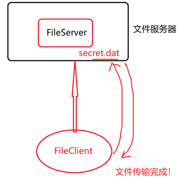

我们用md5来防止
在fileclient还没有传送文件之前，先在本地计算出这个文件的md5值
然后等服务器同意，可以上传，就传输文件。服务器接收完文件以后，服务端也计算该文件的md5，如果文件内容和原始的一样，那么就是fileserver接收完计算这个文件的md5值和fileclient传输文件前计算的文件的md5值要相同。
如果值不相等，就证明文件的内容有问题了。
上传的文件的md5值都可以存储下来，
如果后续fileclient又发送secret.dat的文件请求，它的处理是先发送updatefile的消息，然后服务器发现你想上传的文件的md5值库里都有，就给客户端直接响应一下你要上传的文件已经有了，不用上传了，**实际上没有传输，只是做了一个md5值的验证**

**为什么要使用数据库？聊索引，聊索引的底层数据结构。**

我这个项目，涉及的表并不多。

**稳定性与安全性你有没有考虑？**

涉及到内存泄漏，就往智能指针上靠。

### 数据结构与算法

**线性表（数组（双指针），链表（求环，相交，合并），栈（顺序栈，链式栈，递归转非递归，） ，队列：双指针，两个栈实现队列，两个队列实现栈，单调栈，链表的常见题目）**

**排序算法（快排，堆排）**

**二叉树（BST树，AVL树，红黑树（特点：左旋右旋，涂色如何更改），B树，B+树）**

**哈希表：链式哈希，哈希冲突，常见的哈希函数，哈希冲突如何解决，位图法，布隆过滤器（redis）。**

**排序算法：冒泡，选择，插入，希尔，堆排，快排，归并排1.是稳定性，2是时间复杂度，3.是空间复杂度**

**算法：分治，回溯，动态规划，贪心**

**谈谈你对哈希表的理解**

**定义：**哈希表（hash table），又称散列表，它通过哈希函数建立键 `key` 与值 `value` 之间的映射，实现高效的元素查询。具体而言，我们向哈希表中输入一个键 `key` ，则可以在 **O(1)**时间内获取对应的值 `value` 。

C++中的无序关联容器 unordered_set 和 unordered_map **哈希表增删查效率非常高，趋近于O(1)。**

**哈希冲突：**哈希函数的作用是将所有 `key` 构成的输入空间映射到哈希桶中所有索引构成的输出空间，而输入空间往往远大于输出空间。因此，**理论上一定存在“多个输入对应相同输出”的情况**。

**哈希表什么时候用到？在进行大量的查询时会用到，只要是有速度快的查询的需求，都会想到哈希表**

**优点：**适用于快速的查找，时间复杂度O(1)。  

**缺点：**占用内存空间比较大。 100M整数 哈希表 100M*2 = 200M ，空间换时间  。

常见的哈希函数有：

除留余数法：不仅可以对关键字直接取模，也可以折叠、平方取中法等运算之后取模。p的取值很重要，一般取素数，否则冲突的概率会比较大。

直接定址法：取关键字或关键字得某个线性函数值为散列地址。例如：f（key） = a \* key + b（a、b为常数）  

md5、sha加密hash算法等  

常见的哈希冲突处理有：线性探测法；链地址法；二次探测

二次探测：比如说插入78，发现发生哈希冲突了，就在它的右边找一次，然后左边找一次，然后右边找一次，然后左边找一次…是对线性探测的优化

**装载因子 = 已存储键值对数量 / 哈希表数组的长度**

当装载因子过高（比如 0.75），意味着数组快满了，冲突会非常频繁，性能会急剧下降。此时需要**动态扩容（Resize）**。

**如何实现哈希表？如何解决哈希冲突的问题？** 

实现哈希表有种方式，有线性探测哈希和链式哈希。首先谈一谈如何实现线性探测哈希。

通过哈希函数计算数据存放的位置，该位置空闲，直接存储元素，完成，该位置被占用，从当前位置向后找空闲的位置，存放该元素

**降低哈希冲突的概率**

**方法1：我们在哈希函数上去想办法**

对于除留余数法，哈希表的长度（哈希桶的长度）取素数，这样哈希表在扩容的时候，取的下一个长度就是在素数表里面的下一个素数

**方法2**：**哈希表的装载因子 loadfactor**
装载因子：以占用位置（桶）的个数除以桶的总个数。C++链式哈希表实现的容器或者集合，装载因子值取的默认值是0.75。

线性探测需要定义一个枚举状态：

```C++
//桶的状态
enum State
{
	STATE_UNUSE, //从未使用过的桶
	STATE_USING, //正在使用的桶 放着是一个有效的元素，没有被删过 
	STATE_DEL,  //元素被删除了的桶，认为桶里的元素无效了 
};
//我们删除桶里的元素，并不是真正把值删除掉，而是把桶的状态置为STATE_DEL就认为桶里的元素无效了 
```

线性探测哈希表，缺陷是：
**1、发生哈希冲突时，需要从当前发生哈希冲突的位置向后不断的去找，找到第一个空闲的位置把元素放上，这个过程的时间复杂度就趋近于O(n)了**，存储变慢了，查询和删除也变慢，哈希冲突的发生越严重，就越靠近O(n)的[时间复杂度]

**2、在多核盛行的情况下，非常方便的使用并发程序（多线程，多进程），在多线程环境中，有线程安全的问题**，多个线程不能同时在一个数组中进行数据的增删查。**在多线程环境中，线性探测所用到的基于数组实现的哈希表只能给全局的表用互斥锁来保证哈希表的原子操作，保证线程安全。**

**链式哈希表实现**

**unordered_set和unordered_map底层是用链式哈希表实现的，用链地址法解决哈希冲突**

**我们使用的哈希函数还是除留余数法，解决哈希冲突的方法是链地址法。首先构建素数个哈希桶**

发生哈希冲突的时候，不会像线性哈希表那样往其他桶跑，通过哈希函数算出在哪个桶，就是在哪个桶，这个桶放的是链表，采用尾插或者头插把这个元素插进链表里，这个链表的节点存储的是元素值和next指针，把发生哈希冲突的元素都串在一个链表上。

**链式哈希表也有装载因子。**已占用桶的个数如果达到占总的桶个数的0.75，哈希表就要进行扩容了

优化一:当链表长度大于桶的个数时，把桶里面的这个链表转化成红黑树 O(logn)

优化二：在多线程环境中，我们在每个桶添加一把锁就可以保证线程安全，（分段锁），每把锁控制各自桶的链表的多线程下的并发操作就可以，**这样不同桶里的链表可以并发操作。同一个桶里的链表不能并发操作，因为有锁。**

我自己实现的时候用的vector<list<int>> 来作为哈希表的数据结构，然后扩容的时候直接使用泛型算法swap，因为它只是交换了两个容器的成员变量，没有交换堆内存和表数据。如果两个容器使用的空间配置器allocator是一样的，那么直接交换两个容器的成员变量即可，效率高。

**在哈希表中，如果要查询一个元素，你会如何实现哈希表，使得查询的时间复杂度最低，都会用到什么数据结构？** 

首先在链式哈希的基础上，使得查询的时间复杂度最低我会考虑的点有：哈希函数的优化，我们一般把除留余数法，桶的个数取成素数，这样才会让散列的结果产生最少的冲突，所有的数据不会集中在一个或者几个桶中，而是离散开来，提高了整体哈希表的效率。所以需要维护一个素数数组。

然后数据结构上的优化：我自己实现的时候用的vector<list<int>> 来作为哈希表的数据结构，然后扩容的时候直接使用泛型算法swap交换堆内存。如果两个容器使用的空间配置器allocator是一样的，那么直接交换两个容器的成员变量即可，效率高!

当同一个桶中的冲突元素数量**超过某个阈值**，将链表**转换为红黑树**。在红黑树中进行查找的时间复杂度也能保持在**O(log n)**，避免了链表最坏情况下的O(n)。

#### 数组刷题记录：

双指针技巧，同向（删除重复元素，删除指定元素，移动0），双向，


### Linux内核


### 同学们的面试感受

情绪控制，心理素质，沟通能力占50%，技术占40%，运气占10%。围绕你的简历，把相关的知识点吃透。

- 自信心不够，容易受面试官打击，情绪波动大 （要自信，语言组织，逻辑思维要缜密）
- 脑子有些空白，对于问题，面试时想不出来，面完全想起来了 （准备好，全面复习）
- 对于简单的问题，回答的比较少，面试官不满意；对于复杂的问题，没有思路，不知道怎么说 （简单题注意角度，复杂的问题能说则说，没有接触过，直接告诉面试官，这个问题暂时没有接触过。但我以前浏览技术网站的时候看见过，但是后来没怎么研究了，忘记了）数据库的底层数据结构是B+树，红黑树，跳跃表。
- 面试官问我问的越来越多，各种开源组件、中间件、redis、nginx、mysql甚至异步消息队列，面试造火箭，工作拧螺丝 （比如nginx为什么能做到高并发？你不会，但是你可以从影响高并发的条件去分析一下，Linux的进程，多线程，epoll，从reactor模型，从进程的资源，对fd的限制。一个socket就是一个fd。
- 博客、github、知乎、segmentfault、stackoverflow、各大开源组件官网文档等

经过几次面试洗礼，上面的问题都会解决！

## 2020年校招面经讲解

面试注意事项：给自己一些思考时间，想想回答问题的角度，组织好答案的角度。面试官和你是对等的，不要有压力。

面试官提问：是在你的简历和你回答问题的基础上所提到的进行一个提问。

第一点：以聊天的方式，最好是自己在学习过程中碰到的跟这个问题相关的一个实践性的东西，以这个为引入点跟面试官聊起来。

第二点：在回答问题所涉及的实践相关的问题的时候，不要仅仅着眼于眼前这一亩三分地，把实践相关的，能够涉及的其他的，

并且是我熟悉的，我也都给它带出来了。

### 百度

（一个半小时） 
（项目相关） 

**逻辑+知识点有深度和广度+角度**

1. **脑子里被问到这样的问题的时候，怎么去思考？怎么去组织逻辑表达。怎么样去选回答问题的角度。针对问题的结果表现会好一点。**
2. **我写代码的时候，针对这个问题，我是具体怎么写的？怎么用的？通过实践。这是一个最好的回答问题的方式了。从实践得出一些经常用的场景**
3. **回答问题，从实践性的角度去回答问题，第二点就是不要只是立足于问题本身；第三点就是在回答一个问题的时候，把跟这个问题相关联的内容给他说出来。**

比如：问map和unordered_map，就谈到底层是数据结构红黑树和哈希表，此外还有AVL树，B/B+树。

问数组和链表，就要想到STL容器中的vector和list，往这上面去靠。数据结构之间的区别，就是数据容器之间的区别。从一个方向去问到相应的知识点，延伸到另外一些方向。

容器相关的：迭代器，空间配置器。

空间配置器默认的C++标准库用的是malloc和free，管理内存。那你可以延伸到内存池来管理，nginx内存池以及SGI STL2级空间配置器的内存池。

**1.如何保证发送数据不丢且不重，IT技能的每一个描述点，能够从项目中的什么地方引入进去**

协议，三方库，自己的应用。
muduo库已经实现高并发了。阐述muduo库。
TCP协议，协议保证了。

TCP是基于连接的流式协议，UDP是不基于连接的它是一个用户数据报协议。现在带宽资源丰富了，不用考虑TCP占带宽资源。基本上传音频或者传视频之类的，可以用UDP，除此之外，基本上都是用TCP来设计。要的是可靠性。

协议和应用；超时重传；序号和确认应答机制；滑动窗口；拥塞控制；tcp和udp协议， http和https协议，arp和rarp协议

**用到了网络回顾一下传输层TCP协议的三次握手，四次挥手，握手跟挥手每发一个包以后client和server进入的每一个状态代表什么意思？为什么是三次，不能是两次？四次挥手的时候time_wait和close ack状态代表什么意思？超时重传？超时重传时间？**

聊天过程中也可以在业务上保证。a给服务器发送数据，服务器给a回一个ack，客户端a来重新启动一个超时重传的一个机制来把数据放到服务器上。相当于把TCP协议上传输在应用层上再来一遍。

**2.线程池的线程为什么要动态扩容 进程池/线程池/内存池/连接池/协程池**

**为什么要做成动态扩容的？**
当有一个发送文件的请求到达服务器的时候，服务器在epoll的一个工作线程里真的去给这个同学转发文件吗？会造成其他线程通信的操作没办法做。
这个文件很大，耗时，耗时的I/O操作需要有其他线程去做的。
数据库连接池就是动态扩容的

线程的上下文切换开销很大；所以要线程池；业务并发量无法预估的情况下；可以保证系统资源消耗小，性能得到保证

线程开销： 32位linux下    4G   3G   pthread_create  380 + 3G / 8M = 380+

1.线程的创建开销和进程的创建开销一样，都是很大的

2.线程太多，线程本身占用的内存比较大，业务可以使用的内存就少了  ulimit -s

3.线程的上下文切换

4.造成服务器锯齿状负载

**3.假设与数据库交互出现问题，线程在和数据库交互时产生阻塞，线程挂掉，会产生什么问题？**

我们聊天项目采用的是reactor模型一个lO线程，专门监听新连接，然后剩下的线程是属于工作线程。一个线程监听了很多的客户端的套接字， 接收到一个用户的这个请求就开始进行做业务。业务的过程中会涉及数据库的curd。工作线程和数据库交互时产生阻塞，会导致注册在这个工作线程一上的所有的套接字，后边发生的这个读写事件，当前这个线程就无法处理了。  

给出一种场景解答，逐渐明确问题     落实到怎么找代码上造成线程阻塞的地方  gdb调试多线程程序  csdn 大秦坑王   从连接池取连接

**4.如何解决上一个问题？（基础知识）** 
**5 . C++ 中引用和指针的概念和区别？**

我第一次接触引用跟指针的时候，我记得是在学C++加的时候，我记得有一个swap函数。那么，原来在C里边用swap来交换两个变量的值的话，如果是实参到形参，如果是传值，我发现是根本无法交换的。最终在C语言里边要通过一个swap函数来交换两个变量的值，必须传变量的指针。最后在C++里边，我再去做同样的事情的话，我发现不仅可以通过传实参的指针来在swap函数里边来交换两个变量的值，我发现还可以传引用。最后，我把这两个函数都摆到那。然后直接打了个断点调试，在windows上我右键直接跳到汇编，在linux下，  通过g++ -g得到带调试信息的可执行程序，然后通过gdb启动调试通过dsamble，用swap函数交换两个实参变量的值，传指针跟传引用，虽然在C++层面好像不一样，指针有取地址，星号解引用，引用只是在定义引用变量的时候前面加一个取地址的符号。使用的时候会自动去解引用。语言层面看起来使用不一样，到那时发现在汇编指令上他们是一模一样的。定义一个指针，底层要开辟4个字节，然后把它所指向的变量的内存地址放到这四个字节里面，定义一个引用实际上也是在栈上开辟4个字节的内存， 然后把它所引用的变量的地址放到这4个字节里面。当我通过指针解引用的时候，实际上是从指针的这4个字节里面取出它所指向的内存的地址，然后去访问它所指向的内存，当通过引用变量来引用它所指向的内存的时候，实际上，汇编也是先从之前底层开辟好的那4个字节的内存里面拿出来地址然后自动做了一个解引用的操作。区别主要体现在语言层面而不是汇编层面。所以 **引用是一种更安全的指针**，语言层面：引用是 **必须初始化** 的，指针可以不初始化或者指向`nullptr`。引用可以保证引用一块内存（所以更安全），但是指针不是必须初始化，所以可能是一个野指针或者`nullptr`指针（所以不安全）；引用 **只有一级引用** ，没有多级引用；指针可以有一级指针，也可以有多级指针

作为开发者，尽量还是要引用，引用必须初始化，相对于指针而言，使用起来安全一点。指针加加减减，可以在内存上进行偏移，引用不能偏移，只要使用引用变量，就自动解引用了，永远访问的是它所引用内存的值。

提到了gdb调试，还要注意常用的指令，gcc的编译和g++的区别，gdb调试怎么打断点？gdb怎么调试多进程，多线程。

**6.地址传递和引用传递区别？参数传递用引用接收参数和用指针接收参数的区别是什么？** 

**引用**：现有对象的**别名**。引用**必须**立即初始化；指针可以晚点再赋值；也能放进容器，有一级指针二级指针。

所谓“地址传递”只是**把一个地址值（指针）当作实参**传进去；而“引用传递”是让形参变成实参的**别名**。

地址传递的时候函数接收的是一个指针，转移到引用和指针的区别上去，从汇编上讲。

**7.实际应用中传递一个很大的数组，不想去改变它，但是还不想让他拷贝，怎么做？**

```C++
float array_sum(float *values, size_t length);
float array_sum(float values[], size_t length);
```

首先传递数组根本不会发生拷贝，传递数组名永远传递的是数组起始地址，传递主要是函数调用中传递，在函数中传递数组的时候，在使用C++的时候，正确使用数组传递的时候，还应该把数组元素的长度传到函数里面去。不然光知道数组的起始地址，不知道元素的个数，不知道操作多少数据，除非字符串数组可以遇到\0，不是字符串数组就得知道数组长度。

不想去改变他，因为传的是数组的首地址，在被调用函数中还是可以通过这个地址解引用来来修改数组内容的，如果我想控制只使用数组而不想去改变它的话，那我就可以把形参的这个接收数组首地址的这个指针变成一个const*指针。

**怎么理解数组名？**

数组名：数组名不是一个变量，不能重新赋值或修改。数组的内存是在编译时分配的，大小固定，数组名代表了这块内存区域的起始地址。&arr 的类型是 int (*)[5]，表示指向包含 5 个整数的数组的指针。它是一个标识符，用于表示整个数组。在函数中作为参数传递数组名退化为指针，赋值给指针变量的时候也会赋值给指针。

实际使用我一般使用vector，和数组的区别是什么？答出来。容器不用自己管理数组的内存，不够了自动扩容，那当我去传递一个容器的时候。实参到形参，因为容器跟数组不一样，容器属于对象，如果实参到形参，它是一个拷贝构造的过程。如果我函数中传递一个容器，那就性能就降大发，那它要通过拷贝构造函数。它要根据实参的vector容器底层的这个内存的尺寸，要给形参要拷贝内存，这就涉及拷贝了。此时，我应该引用传递。按引用来接收实参的这么一个容器，那通过引用也可以修改容器，形参用const常引用。

我在学C++的时候，发现const在C和C++里面它有不同的表现，面试官我需不需要给你把这个const在C和C++里面不同的表现在给您说一下。从C和C++的角度：在C中，const是常变量；C++中，const是常量。

**8.const A * p  和A * const p的区别?**

**看const修饰的是指针本身还是指针指向！**
第1个式子：const修饰的是* p，* p不能改，但是p可以改。
第2个式子：const修饰的是p，p不能改，但是 * p可以改

从实践上看，第1个式子是应用在调用一个函数的时候，实参是通过指针传递实参的地址，形参是通过指针来接收的，在形参里面，我们只想访问实参，不想修改实参，所以我们形参采用的是const A * p ，这样一来我们可以读p，但是不能改p，有效的保护了在函数调用过程中只使用实参的值而不会去修改实参的值，这是非常重要的。
第2个式子表示，* p是可以修改的，但是p不能改，能通过p修改它指向的东西，但是不能修改p本身让p指向别的变量，这就是C++类成员方法的this指针的应用场景，我们不能给this赋值！！！this指针永远指向调用方法的对象的！！！this可以通过this指向修改它所指向对象的值，成员变量的值。
C++里面的成员方法都得通过对象来进行调用。对象一调用就转成了普通方法的调用并把对象的地址当作实参传递进去，所以形参会生成this指针。

**const int a=10; const修饰的常量不能被修改 如何改a的值？**

```C++
int *p = (int*)&a;
```

通过*p把a的改了。
const修饰的常量不能被修改，只是在编译阶段，语法级别上能识别出来，实际上，在真真正正的汇编上没有说是const修饰的内存，然后把内存属性改了，从原来的可读可写改成只能读不能写？不可能的。const只立足于语法层面，编译阶段编译器可以检测出来你对一个const关键字修饰的常量赋值了，但是经过编译以后，产生的汇编指令上，实际上我们在操作栈或者堆的时候，包括数据段，都是可读可写的，因为那时候没有const了，可以针对const修饰的量修改。
可以在C/C++代码中切入汇编代码：函数栈上的变量都是通过ebp栈底指针偏移，把20放在ebp-4开始的4个字节里面就把a覆盖了。

```C++
const int a = 10 asm {mov dword ptr[ebp-4],14h}
```

const并没有修改a内存的属性。

从C和C++的角度：在C中，const是常变量；C++中，const是常量。
**对象调用成员方法跟C里面调用方法的区别？C++this指针是干什么用的？为什么每一个普通成员方法一编译都会生成一个this指针？this指针有什么作用？**

**记得复习C++ this指针，C++类的编译原理。**

你能够通过指针解引用来修改数组的内容吗？不行，因为const修饰*p ， 但是p可以改，你可以用p来在数组的每一个元素位上进行偏移，你可以读取，但是你不能修改。

**9.成员函数后加const是什么意思？会有什么样的限制？** 

当我去定义一个常对象的时候，用常对象去调用一个普通方法的时候，发现是调用不了的，为什么调用不了？因为C++用一个对象调用一个方法，实际上汇编以后，调用的过程还是C函数的调用，只是把调用的这个方法的地址当做实参传递进去，所以，在成员方法编译的时候都会加一个形参：object* this，但是this是一个普通的指针，而常对象是object * const this指针，一个普通指针怎么可以接受一个实参的const常指针？类型转换失败！ 
所以当常对象调用成员方法的时候，这个成员方法要加const，加到函数的后面，让这个方法的普通的this指针变成const *this，这样形参的const * this就可以接收实参的const this了。这样常对象就可以调用常成员方法了，在这个常方法里面，只能访问对象的成员变量而不能修改，因为const修饰的是*this了，不能通过this指针修改它指向的东西了。

如果给成员变量修饰一个mutable，那么在常方法里面依然是可以修改成员变量的。  

**10.拷贝构造初始化（构造函数的大括号的初始化）和列表初始化（构造函数后面跟着：）区别？类中const成员如何初始化？**

初始化列表相当于指定初始化如果有成员对象的话，初始化列表指定对象构造的方式
构造函数的初始化：就是构造函数的大{}，说明成员变量或者成员对象都构造过了，在{}之间只是做了赋值操作
所以，像定义变量必须初始化的那些东西，必须放在初始化列表（构造函数后的冒号：）进行初始化，比如说const常成员变量，在C++中，const和引用成员变量必须初始化，必须初始化的都要放到初始化列表上。
如果想指定vector初始化的时候，包含10个元素，初始化就要放在初始化列表：vec(10)

成员对象先构造，再做赋值操作；初始化列表直接指定成员对象构造方式

**11.vector如何管理内存？注意发散思路**

当我们想用一个顺序数组的时候，我们就可以用vector，vector相当于把数组封装起来了，而且提供了带[]的运算符重载函数，可以像使用数组一样去访问容器的下标，相当于数组来说，有一个好处：在我们实际编写程序的时候，如果是使用的是数组的话，它的内存是否足够，这是一个问题，内存定义太小了，不够用，定义太大了，浪费空间，有的时候我们可能用指针动态开辟内存数组，但是当内存满了，我又得自己去写内存扩容的代码。
vector底层是动态开辟内存的数组。
在windows下是1.5倍扩容，在linux下是2倍扩容。
vector有2个方法，一个是返回底层数据结构的容量：capacity
还有一个是size方法，返回底层数据结构的真真正正有效元素的个数。
我们构造一个vector，然后给vector循环去添加值，每一次循环的时候打印它的size和capacity，就能知道往vector里面放内容，它的扩容是怎样进行的。
所有C++的STL容器在去管理底层对象内存的时候，不会直接用new和delete的**（这里引出了这个问题，下来温习一下）**，vector只负责对象的构造、析构（construct，destroy），内存管理都是靠allocator空间配置器来管理的（内存的开辟和释放：allocate，deallocate）

在vector管理内存的时候一定要把new操作的内存开辟和对象构造分开，把内存释放和对象析构分开，否则在初始化vector的时候，如果用new，不仅仅会开辟内存，还会构造一大堆无用的对象，不符合我们的逻辑。
allocator在C++库中提供一个默认的allocator，它的allocate和deallocate的管理方式用的是默认的C库的malloc和free
如果我们使用vector比较频繁的话，而且是小块内存，我们可以采用内存池来替换allocator原本的malloc和free。然后讲内存池。

T \*ptr; int index; int size;   0 - 1 - 2 - 4 - 8 2倍扩容   vs下是1.5倍扩容；vector只负责对象的构造、析构，内存管理都是靠allocator空间配置器来管理的

vector作为C++的容器对象，功能非常强大，有很多方法…
C++11提供的带右值引用的拷贝构造函数和赋值重载函数，很大程度上提高了vector的拷贝构造和赋值的性能。

话说到这就完了，因为我们刚才说的这个跟这个问题本身是不相关的，但是跟vector相关，跟内存管理是不相关的，我说的还是vector，我虽然没说内存管理，刚刚说的那个是vector应用的时候的一个性能的优化的这么一个点。

**12.vector什么时候会发生迭代器失效？（从编程习惯考虑如何避免）**

当我们用vector去解决问题的时候，有可能涉及到去遍历1个vector，如果只是读取它的话，通过for或者foreach，迭代器就不会发生失效。
但是，当我们通过一个循环去不断的通过迭代器给vector进行添加或者删除操作，就有可能出现迭代器失效。
vector中的insert方法和erase方法，接收的都是迭代器，实际上，相关的容器的成员方法接收的都是迭代器。
迭代器本质上是对指针的封装，迭代器底层的指针指向的是容器底层的数据结构，就是vector底层的数组，迭代器通过运算符的重载函数，以相同的方式可以遍历不同的容器，因为不同容器的遍历方式都被封装在迭代器的++，–运算符函数里面了。
如果在for循环中，多次给vector进行insert，甚至1个insert就导致vector扩容的位置都变了，迭代器就失效了，迭代器底层是指针，指针指向的地址（老内存）就失效了。
容器从底层实现的时候就有去判断，迭代器迭代的过程中，容器的元素有没有变化，如果变化了，不是增加就是删除，当前这个迭代器就要失效，怎么处理？insert或者erase处理完，返回的是新位置的迭代器，我们需要把这个迭代器循环变量更新一下。
insert时都失效；
erase时，从开头最开始首元素迭代器到当前删除位置的迭代器还是有效的，因为这块没有变。删除后，后面的所有元素都要向前挪动，此时从删除位置到末尾元素的迭代器都失效了，因为元素的位置都挪动了；
怎么办？？？及时更新迭代器
插入1次或者删除1次，就不用考虑，当前的迭代器失效了就失效了，反正不会再去用它，如果多次插入或者多次删除，一定用它的返回值把迭代器的循环变量更新一下。
迭代器对容器是非常重要的，迭代器不是所有迭代器所共享的，每种容器都有自己的迭代器，因为每个容器的底层数据结构是不一样的，但是实际上，用迭代器去写代码都是一样的。因为都封装在迭代器的++，–-运算符的重载函数。用迭代器操作不同的容器的代码是一模一样的。
泛型算法应用于所有容器，泛型算法的参数也是迭代器。

**迭代器失效的问题本质归纳起来就两点：**

**1>不同容器的迭代器是不能进行比较的
2>容器的元素进行增加、删除操作后，原来的迭代器就全部失效了**

这个从源码上能够清晰的看出来，**在两个迭代器iterator进行operator!=比较操作的时候**，**都会进行_Compat这样的一个判断**：

用迭代器遍历容器的时候，每一次都会判断当前迭代器it != container.end()是否已经到达容器的末尾迭代器，当上面两个条件发生以后，这里_STL_VERIFY(this->_Getcont() == _Right._Getcont(), “vector iterators incompatible”);这个判断就失败了，程序运行报错，提示迭代器不匹配，意思就是迭代器失效了！

那迭代器失效怎么办？**答案就是要对迭代器进行实时更新**。

insert时都失效；erase时删除位置到末尾元素的迭代器都失效；调用相关update方法时，及时更新迭代器

**13.用拷贝构造给一个复杂vector赋值不太好，如何解决？ **

记得复习一下C++笔记，里面有这个题的解答。

意思就是vector里面装的是大对象，vector的拷贝构造会造成很多大对象的拷贝构造（拷贝构造，赋值）；视情况采用std::move调用vector的右值引用拷贝构造

**14.map/multimap区别**

两个都是映射表，处理有关联关系的键值对。比如说用学生的学号对应学生的数据，通过快速查找学生的学号，来得到学生的数据。
map：key不能重复。底层是红黑树，增删查的时间复杂度是O(logn)，效率非常快的
multimap：key可以重复。底层是红黑树，增删查的时间复杂度是O(logn)，效率非常快的。
它们是应用在对key有排序要求的场景下。
但是我们大部分场景对key的有序性是没有要求的，所以我们一般使用的，或者是一些开源的库，C++标准库的源代码，是unordered_map或者unordered_set，使用的比较多，底层是哈希表，增删查的时间复杂度是O(1)
红黑树的应用场景很多：linux的虚拟内存vm管理，用的是红黑树，效率很高（早期是使用的是AVL树）。
AVL：基于内存的平衡树
B/B+树：基于I/O操作的平衡树，数据库的索引使用的。

key是可以重复的；红黑树的insert，一般把相等情况过滤掉了；可以把相等的情况归到>=或者 <= ；linux的虚拟内存vm管理； B+树

**15.智能指针**

**问你资源泄露如何防止？马上想到智能指针。问你智能指针，马上想到资源的自动释放。把话题切到智能指针开始你的表演**

一般为了自动释放资源，某些资源用完了可以自动释放，防止资源泄漏。
智能指针：利用栈上的对象出作用域自动析构的特点，释放的代码写到智能指针的析构函数里面
在C语言中，使用堆内存，malloc和free
在C++中，使用堆内存，new和delete
但是这样去手动开辟和释放内存，有可能把free或者delete忘写了，或者文件资源忘记关闭了，或者在中间执行代码的时候提前return 走了。

带引用计数和不带引用计数的智能指针介绍，见我的博客《C++》
shared_ptr底层通过CAS操作，保证原子性，可以使用在多线程环境中。
强弱智能指针防止交叉引用问题。
enable_shared_from_this和shared_from_this获取当前对象的一个智能指针；
shared_from_this在当前对象的成员方法如何获取当前的shared_ptr智能指针。
不能通过当前成员方法的this指针直接创建一个shared_ptr！！！如果这样创建的话，两个shared_ptr都认为只有自己持有了资源，释放资源的时候释放了多次。
C++11提供了make_shared：补充shared_ptr的坑，因为shared_ptr存在1个问题：它的操作分成2步：第一步，在构造一个shared_ptr的时候会给它传入一个new的一块内存，实际上shared_ptr底层还要去new一个控制资源的控制块，相当于内存块，记录资源的地址，资源的引用计数。现在假设：当我们去构造一个shared_ptr的时候，我们让它管理外部的资源，new成功了，但是它底层的控制块new失败的话，怎么办？相当于shared_ptr本身没有创建起来，最后那个资源就不会帮我们自动释放了！！！相当于智能指针本身的创建就有问题了。C++11以后给我们提供了make_shared，获取一个指向资源的shared_ptr，它是非常安全的。
C++14以后提供了一个make_unique，补的是unique_ptr的坑。

一般为了自动释放资源；带引用计数和不带引用计数；shared_ptr和weak_ptr着重介绍；enable_shared_from_this和shared_from_this获取当前对象的一个智能指针；make_shared

**16.设计：10万个正整数，取值范围0到100w，互不重复，给定一个数字判断是否在这些数中出现过？**

**查重想到哈希表，位图法，布隆过滤器**

哈希表空间换时间也就意味着它占内存是比较大的，常见的这个链式哈希表，发生哈希冲突的元素是放在一个桶中用一个结点来表示一个元素，一个结点包含了这个元素以及下一个结点的一个地址。如果拿我们正整数占四个字节的正整数来说的话，我有十万个正整数，意味着构建一张哈希表。光存储元素是不是就得十万乘以四四十万个字节。地址也是4个字节。最终需要内存80w字节。

位图法就是用一个位，来表示一个数字是否存在。因为一个位要么是零，要么是一，因为查重一般都是它到底有没有出现过？没有出现就是相应的位就是零出现过相应的位就是一，那位图法的好处是什么？好处是用一个位可以记录一个数字，一个位可以记录一个数字，那么相当于一个字节就可以，一个字节是八个位，那一个字节就可以记录八个数字。 

布隆过滤器。  在缓存里边去，命中一个k的话，我们可以允许一定程度上误判来提高我们整体的缓存的这个查询的一个效率。

这就是在查重啊
哈希表可以查重：这10万个正整数构建1个哈希表，然后拿给定的数字在哈希表查，哈希表的增删查的时间复杂度是O(1)
哈希表解决这个问题的缺陷：哈希表都是空间换时间，占内存是非常大的，链式哈希表，发生冲突的元素是放在一个桶中，用一个节点表示1个元素，一个节点包含的是这个元素，和下一个元素的地址，如果拿4字节的正整数来说，如果有10万个正整数，意味着构建一张哈希表光存储元素就要10万乘以4=40万个字节，这只是放元素的，每一个元素的节点还包含下一个元素的地址，地址也是4字节，如果哈希表存放这10万个正整数，最终需要的内存字节是80万个字节，内存占用太大了啊，典型的空间换时间啊。

有个数，还有数字范围，省内存就位图法；哈希表；布隆过滤器，如果是找出现过几次的话，位图法就用不了了

**17.两个有序数组取交集？代码层面优化？n个数组取交集？**

方法1：先用一个数组的元素构建一个哈希表，然后在用另一个数组的元素在这个哈希表里去查，可以取交集了。但是没有用到题目中的：有序数组的”有序“，不是最优方案，哈希表(O(m) * O(1))，哈希表占空间！
方法2：二分查找，遍历第1个数组的每个元素，拿第一个数组的每个元素在第二个数组里进行二分搜索，(O(m) * O(lgn) =O(mlgn))，不占额外的内存空间，而且效率高，但是还是没有把两个有序数组的“有序”都用上
方法3：二路归并的思想，双指针的思想，两个指针分别指向两个数组的首位置。如果这2个指针指向的元素是一样的，说明是交集的元素，一一比较，谁小谁往后挪动，(O(m)+O(n) = O(m+n))；
如果两个数组的元素个数差不多的话，比如说m=n=1万，二路归并的时间复杂度就是O(2万)
二分查找的时间复杂度是O(1万·log1万）=O(1万·13）=O(12万）
此时，选择二路归并算法效率是高的。
如果两个数组的元素的个数差别特别大，选择二分查找算法。

n个数组取交集：把n个数组划分成两两数组取交集，然后再分为两两数组取交集。
或者n路归并。n个指针，每个指针指向一个数组的首位置，谁小谁往后挪动。

二路归并；哈希表 ；二分查找

这么一个时间复杂度。一般算法题都是会让你去分析一下，时间复杂度，无非就是线性，长量，对数，指数时间。

数据结构和算法：


### 百度

递归代码转成非递归代码，什么叫递归函数？自己调自己，它有一个递归结束的条件，当递归结束条件达到以后，相当于就出栈的过程。递归的时候相当于是入栈的过程，递归终止条件达成以后，相当于就是函数要回溯了，也相当于出栈的过程。

**1.两个栈实现一个队列，栈的特性、队列的特性    链表   数组 线性表     排序算法    哈希表    二叉树    五大算法**

**2.BST树的第K大的节点，BST树的结构和特性 BST  AVL   RB   B-树  B+ 树**

**3.vector底层数据结构，为什么是二倍扩容  size  compacity   扩容的均摊时间  倍数   1.5**

0  1  2  4  8  16  32  64   2倍扩容 malloc  - ptmalloc   bin和chunk malloc按照页面 - 内核分配brk    mmap

0  1  2  3  4 6   9 1.5倍扩容    利于内存的复用 内存碎片的复用

安装了gcc （编译器，编译的工具链，现在可以编译C/C++/JAVA等很多语言）后，

glibc中的libc.so中提供了malloc和free库方法，库方法是运行在用户空间的，malloc是库函数给我们提供的一个API接口，malloc底层使用的是ptmalloc，（glibc也是工作在用户空间。）

malloc - ptmalloc基于bin和chunk的内存，真真正正的内存都是在内核上由操作系统管理的。
malloc第一次申请内存的时候，向内核申请的，内核都是以页面为单位的，一页给你，在ptmalloc管理起来，你malloc要4字节，就给你4字节，其他的分成块。

第一次调用malloc的时候，用户空间里的glibc根本都没有。malloc按照页面 - 内核分配，在内核上分配内存是通过brk（分配小块内存，通过指针偏移分配，是连续的内存） mmap（分配大块内存）这两个重要的函数来进行管理的。
扩容是重新分配内存，把旧内存释放掉。
当我们以二倍扩容的话，当我们要扩容新申请内存的时候，之前的已经被释放的内存是永远不会被复用起来了，新申请的内存的大小比之前释放的所有的内存的总和还要大。而1.5倍扩容，可以把之前的释放的内存复用。
顺序容器扩容的方式：1.5倍扩容是最多应用的。

**4.map->红黑树和哈希表 关联容器  set和map   unordered_set和unordered_map**

map:排序的，应用于通讯录。   

**5.gcc是什么工具，编译链接原理** 

gnu（开源计划，包含很多有用的根据，包括linux）
gcc （编译器，编译的工具链，现在可以编译C/C++/JAVA等很多语言）
g++ （编译C++的）
gdb （调试）—coredump（核心的堆转储文件，作用：记录的是程序挂掉的时候内存的一个详细信息，以及各个线程的函数调用堆栈信息，可以帮助我们去定位程序为什么coredump挂掉了，我们用gdb直接调试coredump

我们用gcc编译cpp。gcc *.cpp
如果cpp代码中使用到C++IO流或者STL
则gcc 会产生链接错误！
因为gcc默认链接的是 libc.so
而不是libc++.so
g++默认链接的是libc++.so

**6.linux下的进程状态，如何查看进程的状态   Linux的进程和线程    怎么解决进程和线程   R   S   D   TZ**

R ：就绪和运行两个状态，不管是正在享受CPU的时间片，正在被调度，还是可以被调度，调度中，都属于R状态
S：sleeping睡眠状态，可中断的睡眠状态
D：不可中断状态，只能通过I/O事件唤醒
T ：调试程序，程序进入stop状态
Z：僵尸态，进程结束了，内核PCB还没有被回收wait，占用内核资源，导致当前系统所能创建进程线程的数量变少
**如何查看？**
**ps aux |less**
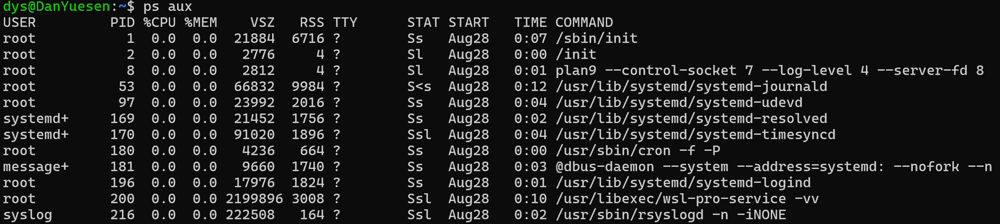

Ss：当前进程包含子进程
S<：高优先级
SN：低优先级
Ssl：l表示是多线程程序
我们还可以进入proc文件系统，可以让我在shell上查看内核相关的东西。

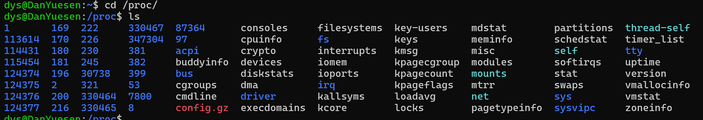

每一个当前系统运行的这个进程，以PID号命名的这个文件夹，你可以进入一下。

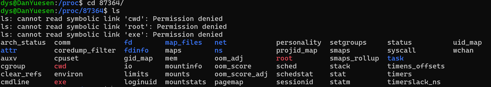

进入到这个进程目录去查看一下status

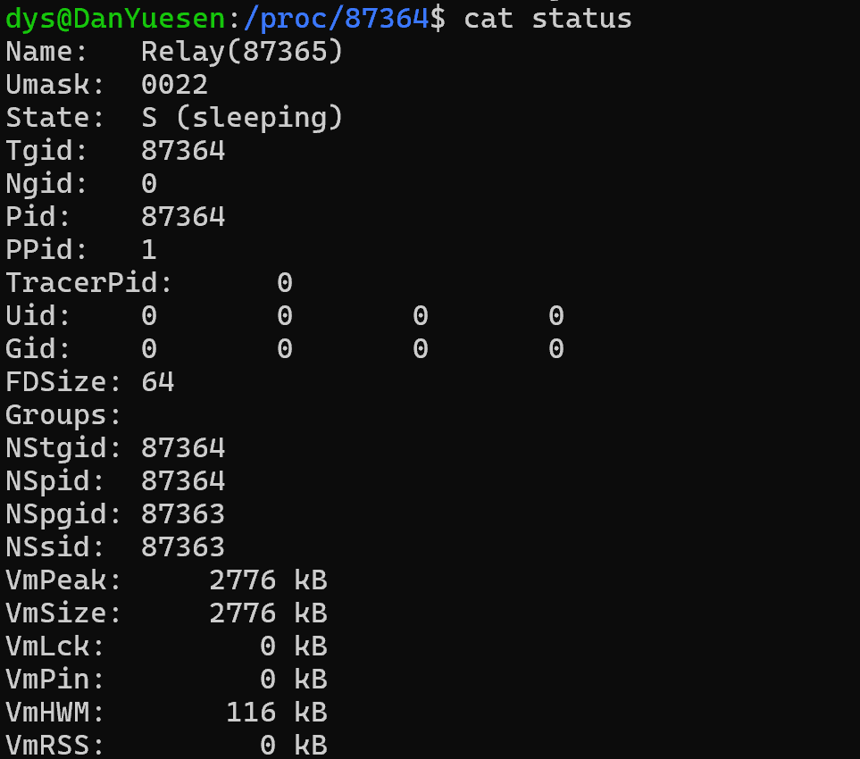

查看某一个TCP服务。

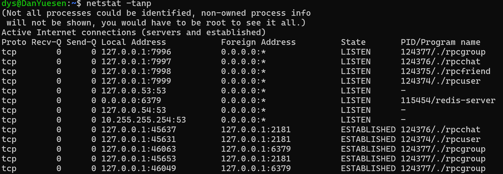

看它所监听的这个端口号，以及当前这个服务的这个进程ID。

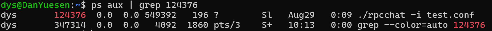

得到这个状态在sleeping状态。拿到PID可以定位到进程。定位到进程就可以知道进程的状态信息。包括进程启动的命令和可执行程序所在路径。

本地进程间通信：信号量，管道，共享内存，消息队列
分布式：分布在不同机器的进程，同一台机器的进程的通信：RPC
线程通信：共享地址空间，通过共享数据段，堆，二元信号量

互斥：互斥锁，自旋锁，读写锁。互斥还可以用CAS对于简单的++ -- 进行操作。 条件变量和信号量做线程间的通信。 

**7.HTTP数据包组成，如何解析HTTP数据包 http 和  https（http + ssl    加密认证过程   签名   CA认证   对称加密和非对称加密）**

f12打开浏览器的调试工具来查看

**8.传输层采用TCP协议，在应用层读取数据时，如何判断是否读完，如果没读完，如何计算还剩下多少**一是从解决TCP粘包问题角度回答    二是从类似传输文件业务角度回答      秒传    filesize  md5值

TCP的粘包问题（流式服务）
在缓存满了，去发送。
如果是一发一应答，就没问题
如果是连续发多次，对方一次就收了：解决方法：给数据加数据头

一是从解决TCP粘包问题角度回答 二是从类似传输文件业务角度回答
秒传 filesize，md5值发送到服务端，服务端记录了已存储的所有的文件的md5值，如果匹配，则秒传OK

如果是一新文件的话，那就表示服务端就返回OK已准备好，可以传输，而且服务端也记录了。这个文件的大小了，那么在服务端接收的时候呢？那是不是就可以根据你最开始协商的这个feel size来不断的检测？现在已经读了多少啦？还剩下多少？在服务端或者在客户端跟客户端之间进行传输的话，可以去得到这些拿这些信息。进行一个进度条的这么一个显示

### 阿里

4.谈谈你对归并排序的理解，归并排序的时间复杂度，是否稳定
5.如果现在有一个数组，在这个数组中寻找逆序对（两个数为一对）的个数，谈谈你的思路（面试官最后提示说用归并的思想） 
6.如果现在有一个数组，给你一个指定的值，判断数组中是否存在两个数的和等于所给定的值。7.谈谈你对栈和队列的理解，栈和队列最显著的区别以及队列的经典操作是什么？ 
8.如何使用两个栈实现一个队列，从实现的流程和代码（提供伪代码）分别阐述

9.谈谈你对动态规划算法的理解

网络：

1.网络中的五层模型，传输层主要功能以及经典的协议。

2.tcp和udp的编写流程。

3.tcp中请求连接的过程；如果连接断开，会发生什么（请分别从流程和代码层面进行描述）？

Linux：

1.谈谈线程和进程的区别。

2.进程间的通信方式，线程间的通信方式。

3.互斥锁的必要条件，每一个必要条件都是指什么。

### 快手

1.HTTP数据报包含哪些信息，有哪些请求方法，头部都有哪些字段？

2.输入URL，到网页显示在显示屏，这个过程都发生了什么？

3.HTTP和HTTPS的区别，HTTPS的加密过程？

4.TCP三次握手，为什么是三次握手？

5.数组和链表的区别？

6.讲讲哈希表的底层数据结构，插入方法的实现？

7 C++ 内存管理，什么情况下会导致内存泄漏，内存泄漏发生在哪个段，如何解决内存泄漏问题？

8.野指针是什么，什么情况下会造成野指针，野指针发生在哪个段？

9.虚拟地址空间和物理内存之间的关系，虚拟地址空间的目的是什么？

10.CPU运行一个程序时，CPU，进程，虚拟地址空间，物理内存，硬盘之间的执行过程？

11.生产者与消费者的实现，有什么优势和缺点，主要是解决什么问题？

12.有没有了解过负载均衡， 主要是做什么的？

13.二叉树的中序遍历（递归和非递归）？

### 网易互娱

1.先做题 半个小时

2.自我介绍 
3.问项目 
4.const说一下 尽可能全面 没const行吗 
5.假如你设计 $^ { - } \mathsf { C } ^ { + + }$ 一方支持有const 一方不支持你选择哪个 如何说服对面 
$6 . { \mathsf { c } } ^ { + + 1 1 } { \mathsf { 1 } }$ 新特性 匿名表达式用过吗 哪里用的 
7.move()转移语义了解吗 
8.运算符重载 说下 
9.可不可以没有运算符重载 为什么 
10.给你一个map里面存的自定义对象 需不需要运算符重载 需要的话 重载哪些 
11.了解哪些设计模式 单例模式哪里用过 
12.红黑树为什么尽可能多的说 
13.为什么需要红黑树 
14.平衡二叉树 
15.红黑树这么多优点 为什么还需要平衡二叉树 
16.红黑树比平衡二叉树好在哪里 
17.左旋右旋 
18.进程和线程的区别 
19.说一下进程 尽可能多的说 
20.虚拟地址空间 
21.为什么需要虚拟地址空间 
22.虚拟地址到物理地址的映射方式 
23.如果让你设计操作系统 如何设计这种映射关系 
24.网络相关 
25.ping命令以及原理 
26.如果是不可达的情况 ping如何知道 
27.让你设计ping命令的话 如何设计这种不可达的情况 
28.ping命令的时间是如何计算的 
29.图形学(不会) 
30.向量点乘和叉乘的区别

# 百度安全提前批

百度安全提前批：

一面：因为面试后有一个笔试，没及时总结，不全。

1、自我介绍。

2、tcp和udp区别，tcp三次握手。

3、http和https，及https 密钥协商过程

4、进程和线程的区别

5、什么是死锁，在mysql中遇到死锁了吗（没遇到），问了一下存储过程在项目中用到了吗？（好像听谁说过尽量不要用，不好控制（印象不深，就没敢说，说在学校的写小程序时用过，然后他就说尽量不要用这个，因为不好控制，类似的业务在代码中做）。

6、redis中值的赋值和获取。（可能是看我会不会用，就简单问了一下）

7、问了冯诺依曼计算机结构（这个彻底没印象了）。

8、素数查找。

9、找连续数中缺少的那个数（13456 --》输出2）

二面：1、十分钟介绍（好像没到十分钟就打断了，让介绍最熟悉的项目）

2、介绍了二十分钟的项目（实现功能，采用的设计模式，数据存放，检测用户在线（心跳机制），视频播放模块，推荐算法模块））。因为面试官对推荐算法不了解，问了基本的实现就不再问了。

3、tcp三次握手四次挥手自己的理解，然后问了三次握手各个阶段四次挥手各个阶段的包没到达会发生什么情况。

4、如果用户点赞的时候按下次数多了，你的服务器会发生什么。（按包到达的顺序来回答，看反应应该对回答还算满意）。

5、分布式方面：先挖了个坑，说按你的服务器和数据库在一台主机上，如果不同网络包发送到不同的服务器，你将对数据怎末处理（我开始有点懵），然后就说将数据库放在其他主机上，不同的服务器就去连接这一台数据库，然后对数据进行修改。 
然后问如果数据量非常大呢，比如你的视频点赞数（我开始时说视频点赞数是放在mysql表中），最后说用redis做暂存。定时更新视频点赞量。（这才放过我）

6、字符串匹配：

输入字符串str，和字符串key，key中的字符在str中的出现顺序可以不同，但必须连续才能输出true， 
否则输出false 
不如：str：afdgacb  key：abc 输出truestr：afdc key：acd 输出false

7、求字符串的子串（去重）。 
8、1000瓶药10只小鼠喝，找毒药问题。


## 面试记录

同花顺：你的第一个项目，请你详细解释一下。

你阅读过那些开源的代码。

gdb如何调试？那几种调试方式。

不一定限于目标检测，还有实例分割，人流量统计，人体姿态估计，车牌识别，人员检测。

书籍的阅读，你读了那些有意义的程序设计书：

**语言类：**1、C++ Primer 6 2、STL源码解析 3、Effective C++

**计算机网络：**计算机网络、 UNIX网络编程、Linux高性能服务器编程

**数据结构与算法：**算法导论，我买了一个课程，配合课程学习的，看书太枯燥了。

**操作系统：**操作系统概念、深入理解计算机系统、程序员的自我修养

**数据库：**高性能MySQL（看了索引、和数据结构）

你有哪些收获：语言类的收获：往智能指针、OpenCV源码、STL上面靠，多线程、多进程编程上靠。计算机网络往：Linux网络编程上靠。操作系统往内存管理上靠。数据结构自由发挥。数据库往索引和数据结构上靠。

以前我遇到问题喜欢上知乎、stackoverflow、github、CSDN上面去解决问题，现在我主要是GPT先解决，解决不了在看网上有没有类似的问题出现。

常见的汇编：lea是移动地址的，mov是移值的，

mov add sub ret push pop call 一个函数的栈是如何进来，如何出去，中间的代码的指令是如何执行的。

### Linux命令

tail用来查日志，cat用来查看小文件，ps用来查看进程，pwd查看当前目录，grep 用来过滤，top用来查看cpu的使用率，chomd用来修改权限，ash用来远程登陆。

如top查看cpu使用率，free查看内存的使用率， df 查看磁盘的使用率。   

telenet 起一个TCP客户端

nestat

muduo库本身是静态库，

**HTTP网页实时聊天有那些局限性？**

HTTP协议本质是**请求-响应**（Request-Response）模式的。它的工作流程是：

1. 浏览器发起一个请求。
2. 服务器处理并返回一个响应。
3. **连接结束或挂起（keep-alive）等待下一个请求。**

**服务器无法主动向浏览器推送消息**。

在纯HTTP下，要实现类似聊天的功能，只能用**轮询**：

1. **长轮询**：客户端发送一个请求，服务器如果没新消息，就把这个连接挂起一段时间。一旦有消息，就立即返回响应。客户端收到响应后，立刻再发一个新的请求。这比短轮询高效，但依然有延迟和大量请求开销。
2. **短轮询**：客户端每隔几秒就向服务器发一个请求问：“有新消息吗？”。这种方式延迟高，而且绝大部分请求是无效的，浪费服务器和网络资源。

首先muduo是高性能网络库，protobuf是序列化工具，我看到muduo库中实现了protorpc，基于muduo库同时利用protobuf来实现RPC分布式框架，有了这个框架我在实现了简易的聊天通信。

文件以及目录管理命令：cd、mkdir、rm、cp、mov

文本处理命令：grep、sed、awk
磁盘管理命令df，du
进程管理命令ps，kil，top，lsof
性能监控命令vmstat，iostat
网络管理命令nc，netstat，telnet,tcpdump，curl，wget

用户管理命令useradd，passwd，chmod，chown
资源管理命令ulimit，crontab

linux查看uname –a查看系统信息   cat /proc/cpuinfo 查看cpu型号  cat /proc/meminfo 查看内存 cat /etc/issue查看版本  df –h查看文件信息 用top查看正在运行的程序 按1就可以看到cpu的占用率


